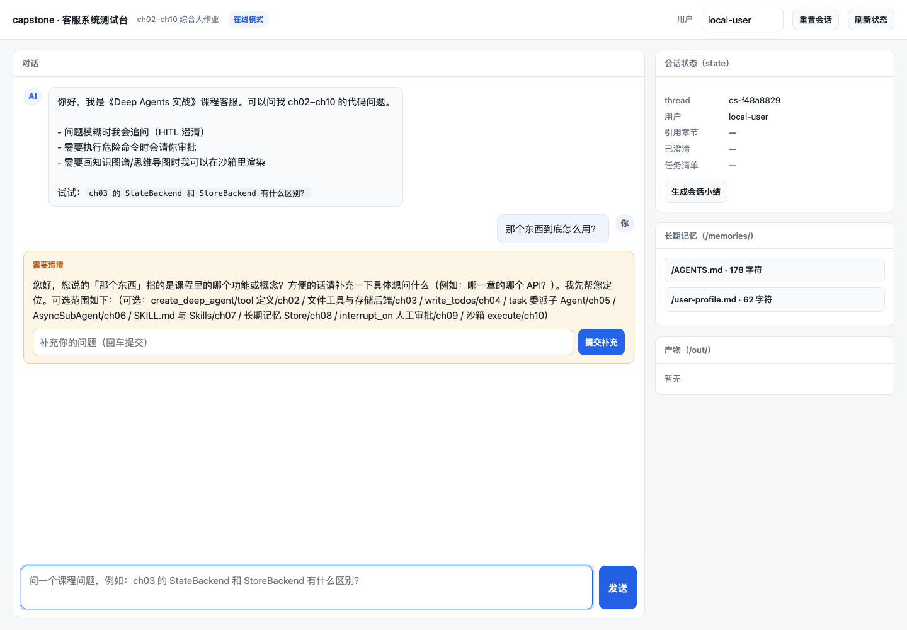
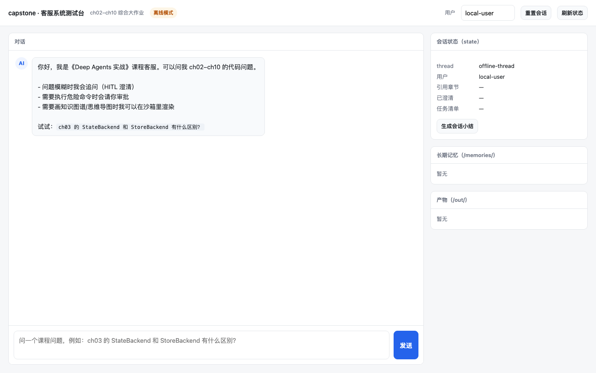
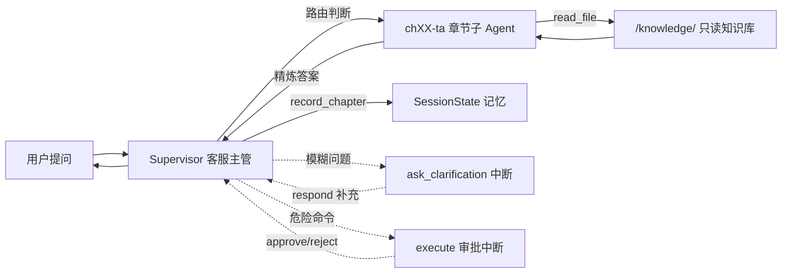
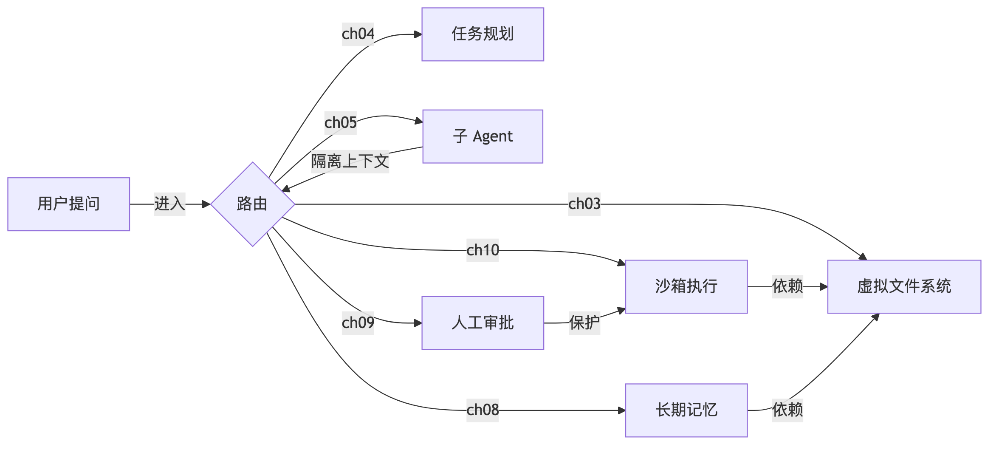
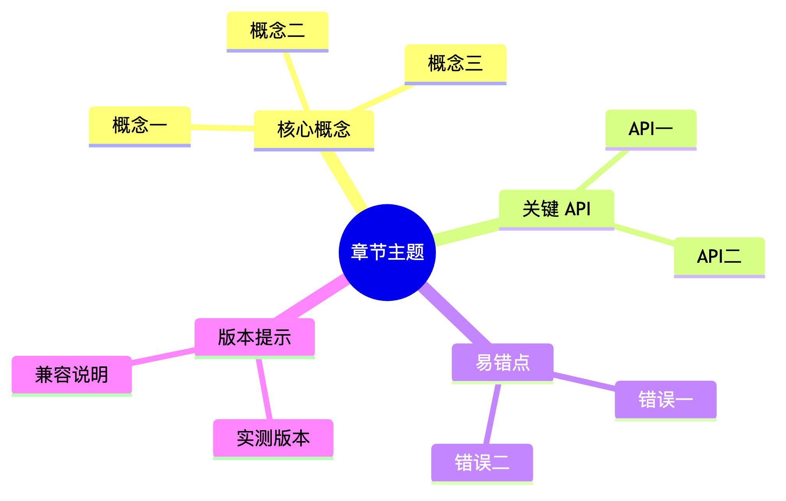

# capstone · 带沙箱的 Agent 客服管理系统

> 阶段性综合作业：把 **ch02–ch10** 的能力装成一个可运行的**课程答疑客服系统**。
> 版本基线：`deepagents 0.7.13` · `langchain 1.4.0` · `langgraph 1.x` · DeepSeek（OpenAI 兼容接口）。

---

## 这个系统能做什么

学员用自然语言提问课程代码问题，系统作为「客服主管」：

1. **判断章节并委派**：问题属于 ch02–ch10 哪一章，就交给对应的章节答疑子 Agent（每章一个）。
2. **子 Agent 只读答疑**：只依据该章知识库文件回答，标注来源，不臆造 API。
3. **不清晰就追问**：模糊问题先用 `ask_clarification` 让用户补充，不猜测。
4. **沙箱内干活**：需要跑命令、画知识图谱/思维导图时，在沙箱里执行，产物写到 `/out/`。
5. **危险操作要审批**：`execute` 命中危险命令模式时暂停，等人工 approve / reject。
6. **跨会话记忆**：用户偏好写进 `/memories/`，换会话仍然记得。

### 作业要求 → 落地位置

| 作业要求 | 落地位置 | 章节依据 |
|---|---|---|
| 每个章节配一个 subagent | `subagents.py`（9 个 `chXX-ta`） | ch05 |
| HITL 对不清晰问题让用户补充 | `hitl.py` 的 `ask_clarification` + `respond` | ch09 |
| 使用 state 做记忆管理 | `memory.SessionState` + `tools.py` | ch04 / ch08 |
| 沙箱管理学习内容存储 | `sandbox.py`（播种 / 只读 / 执行 / 回收） | ch03 / ch10 |
| 使用技能启动 skill | `skills=["/skills/"]` + `knowledge-map` | ch07 |
| 新建绘图 skill 辅助学习 | `skills/knowledge-map/`（知识图谱 + 思维导图） | ch07 / ch10 |
| 跨会话长期记忆 | `/memories/` 路由到 `StoreBackend` | ch08 |
| 学习内容只读 | `sandbox_permissions()` 三条 `deny` | ch03 |

---

## 快速开始

```bash
cd capstone
uv sync

# 1. 离线自检（不调用模型，验证各层都装好了）
uv run cli.py --demo

# 2. 测试用 Web UI（推荐：图形界面，方便点按测试 HITL）
uv run ui.py                 # 打开 http://127.0.0.1:7860
uv run ui.py --offline       # 无 API Key 时也能跑通 UI 骨架

# 3. 交互式答疑（命令行，需要 DEEPSEEK_API_KEY）
uv run cli.py
#   对话中：/summary 看会话记忆  /memories 看长期记忆
#           /collect 收产物      /approve  /reject [原因] 处理审批

# 4. 端到端六场景演示
uv run demo.py              # 全部场景（需模型）
uv run demo.py --offline    # 只跑离线部分

# 5. 回归测试
uv run pytest -q                      # 56 passed, 7 skipped
RUN_LLM_TESTS=1 uv run pytest -q      # 额外启用真实模型用例

# 6. 渲染技能自带的两张示例图
uv run cli.py --render-assets
```

---

## 测试用 Web UI

零额外依赖（仅 Python 标准库 + 现有 venv），一个页面覆盖全部测试场景：



**能做什么**：

| 功能 | 说明 |
|---|---|
| 对话提问 | 输入问题 → 看流式「思考中」→ 回复渲染 Markdown（代码块/表格/行内代码） |
| HITL 澄清 | 问题模糊时页面弹出澄清卡片，填入补充后点「提交补充」继续 |
| HITL 审批 | 危险命令弹出审批卡片，可填原因后「批准执行」或「拒绝」 |
| 会话状态 | 右侧实时显示 thread / 引用章节 / 已澄清问题 / 任务清单 |
| 长期记忆 | 折叠查看 `/memories/` 下的记忆文件内容 |
| 产物预览 | 自动回收 `/out/` 产物，图片直接内嵌显示 + 审查结论 |
| 会话小结 | 一键生成「涉及章节 + 已澄清问题」的学习小结 |
| 切换用户 / 重置 | 改用户测记忆隔离，重置按钮清空当前会话 |

**离线模式**：没有 API Key 也能启动（`--offline`），UI 用桩实现模拟澄清/审批分支，
方便只验证前端与接口。离线模式截图：



**接口一览**（都是 JSON）：

```
GET  /api/health            健康检查 + 当前模式
GET  /api/state             会话 state + 长期记忆 + /out/ 产物
GET  /api/artifact?path=…   读取 /out/ 下的产物（限 /out/，防穿越）
GET  /api/check             离线自检（等同 cli.py --demo）
POST /api/ask               提问 {question, user_id}
POST /api/answer            回答澄清 {message}
POST /api/decide            审批 {approve, message}
POST /api/summary           生成会话小结
POST /api/reset             重置会话 {user_id, thread_id}
```

> ⚠️ 这是**测试工具**，不是生产服务：单实例、无鉴权、模型调用串行化（`ThreadingHTTPServer`
> + 全局锁，避免并发 invoke 同一 agent）。生产部署请换 ASGI 框架并加鉴权。

离线自检的真实输出：

```
章节子 Agent 数量: 9
子 Agent 名称: ['ch02-ta', 'ch03-ta', 'ch04-ta', 'ch05-ta', 'ch06-ta',
                'ch07-ta', 'ch08-ta', 'ch09-ta', 'ch10-ta']
沙箱知识库文件: 10
沙箱技能包: ['knowledge-map']
只读权限规则: 3
长期记忆文件: ['/AGENTS.md', '/user-profile.md']
沙箱 execute 可用: True
后端路由: ['/knowledge/', '/memories/', '/policies/', '/skills/']
```

---

## 目录结构

```
capstone/
├── config.py              目录布局 + 章节元数据 + TaContext + 沙箱策略常量
├── common.py              .env 自动加载 + DeepSeek 模型工厂 + 文本预览
├── sandbox.py             播种、LocalShellBackend、组合后端、只读权限、危险谓词、产物回收审查
├── memory.py              SessionState、Store、预填、/memories/ 读写、会话小结
├── hitl.py                澄清工具、HITL 配置合并、中断载荷解析、恢复辅助
├── subagents.py           9 个章节子 Agent + 路由提示词
├── tools.py               record_chapter / record_clarification（写 state）
├── service.py             总装 create_deep_agent + CustomerService + 离线自检
├── cli.py                 交互答疑、/approve /reject、/collect /summary
├── ui.py                  测试用 Web UI（标准库 HTTP 服务 + JSON API）
├── ui/index.html          单页前端（对话 + HITL 卡片 + 状态面板）
├── demo.py                六场景端到端演示
├── knowledge/             ch02-ch10 章节答疑知识库（沙箱只读区的事实来源）
├── skills/knowledge-map/  新建绘图技能（SKILL.md + 规范 + 模板 + 渲染脚本）
├── tests/                 56 个确定性用例 + 7 个 LLM 集成用例
├── imgs/                  示例图与 UI 截图
└── 设计思路与架构.md       架构解读（含 9 张 Mermaid 图，已实测渲染通过）
```

`.sandbox/` 与 `out/` 是运行时目录，已在 `.gitignore` 中忽略。

---

## 架构一览

**核心决策：用虚拟文件系统（VFS）做唯一集成点。** 九章能力全部映射成虚拟路径，由一个 `CompositeBackend` 按前缀路由：

| 虚拟路径 | 后端 | 语义 |
|---|---|---|
| `/knowledge/` | `FilesystemBackend`（只读） | 课程答疑知识库，事实来源 |
| `/skills/` | `FilesystemBackend`（只读） | 技能包，含 `knowledge-map` |
| `/policies/` | `StoreBackend`（组织级，只读） | 全用户共享的教学政策 |
| `/memories/` | `StoreBackend`（用户级） | 跨会话长期记忆 |
| `/workspace/`、`/out/` | `LocalShellBackend` | 草稿区、产物区，带 `execute` |

一次答疑的链路：



更详细的架构解读见 [`设计思路与架构.md`](./设计思路与架构.md)。

---

## 关键设计点

### 1. 每章一个子 Agent（ch05）

`subagents.py` 为 ch02–ch10 各生成一个 `chXX-ta`：

- `description` 含**章节号 + 标题 + 能力摘要**，是主 Agent 路由的锚点（ch05：description 决定路由）；
- 子 Agent **不指定 `tools`**，继承主 Agent 的文件工具，能读 `/knowledge/` 却改不了（ch05 继承语义）；
- 主提示词里还有一张**主动路由表**，与 description 兜底互补，降低误派。

### 2. State 做记忆管理（ch04 / ch08）

`SessionState` 继承 `DeepAgentState`，新增两个字段，各带一个去重 reducer：

- `cited_chapters`：本次会话引用过的章节（`record_chapter` 写入）；
- `clarified_questions`：已经澄清过的问题（`record_clarification` 写入）。

两个工具都返回 `Command(update=...)` 并附一条匹配 `tool_call_id` 的 `ToolMessage`（langgraph 1.x 的硬性要求）。会话结束可用 `svc.summary(...)` 生成学习小结。

### 3. HITL 澄清 + 审批（ch09）

- **澄清**：`ask_clarification` 只允许 `respond` 决策——用户补充的信息直接成为工具返回值；
- **审批**：`execute` 只允许 `approve` / `reject`，且用 `when` 谓词过滤，**只有命中危险模式才中断**，避免审批噪音；
- **子 Agent 独立配置**：`interrupt_on` 不继承主 Agent，`subagents.py` 单独挂了一份。

### 4. 沙箱：学习内容存储 + 执行 + 安全闭环（ch03 / ch10）

- **播种**：`seed_sandbox()` 把 `knowledge/` 与 `skills/` 复制进沙箱，准备可写工作区；
- **只读**：`/knowledge/**`、`/skills/**`、`/policies/**` 三条 `deny` 规则（ch03 声明式权限）；
- **执行**：`LocalShellBackend` 实现 `SandboxBackendProtocol`，模型才看得到 `execute`（ch10）；
- **回收审查**：宿主 `collect_artifacts()` 取回 `/out/` 产物并做关键词审查。

### 5. knowledge-map 技能（ch07）

新建的绘图技能，支持两类图：

| 产物 | 语法 | 适用 |
|---|---|---|
| 知识图谱 | Mermaid `flowchart` | 概念关系、依赖、层级 |
| 思维导图 | Mermaid `mindmap` | 单章知识点发散 |

渲染脚本 `render_mmd.py` 两级引擎：`mmdc`（功能最全，需 Node + Chrome）→ 内置纯 Python 解析器（支持 `flowchart` / `mindmap` 子集，生成 SVG 后交给 Chrome headless 或 macOS `qlmanage` 转 PNG）。**无法识别语法时如实报错，绝不假装成功。**

示例产物：





---

## 端到端演示（真实运行输出）

`uv run demo.py` 的六个场景（完整输出见运行日志）：

| 场景 | 验证点 | 结果 |
|---|---|---|
| 1. 单章答疑路由 | ch03 问题 → `ch03-ta` | ✅ 正确路由，结论与知识库一致 |
| 2. 跨章对比 + state | ch03/ch08 关系 + `record_chapter` | ✅ `cited_chapters=['ch03','ch08']` |
| 3. 模糊问题澄清 | 「那个后端怎么选？」 | ✅ 触发 `respond` 中断，补充后给出 4 问选型决策树 |
| 4. 危险命令审批 | `curl` 命中危险模式 | ✅ 触发审批，reject 后未执行 |
| 5. 技能绘图 | knowledge-map 画 ch03 思维导图 | ✅ 产出 `/out/ch03_mindmap.png`（24 节点，审查通过） |
| 6. 跨会话记忆 | 写入 `/memories/` → 新会话读取 | ✅ 复用 store 后新会话仍读到偏好 |

---

## 已知边界（诚实声明）

| 取舍 | 说明 |
|---|---|
| **不是容器级隔离** | `LocalShellBackend` 的命令仍在本机执行；`virtual_mode` 只约束文件工具，不限制 Shell 绝对路径。真实隔离需远程 Provider（Daytona / Modal / E2B）。 |
| **黑名单不是安全边界** | 危险命令识别是字符串匹配，变量拼接、脚本文件、编码都能绕过。 |
| **关键词审查不保证安全** | 产物审查未命中已知模式 ≠ 安全；命中后应停止采用并人工审查。 |
| **记忆是内存版** | `InMemoryStore` 进程重启即丢失；生产应换持久化 Store。 |
| **ch06 未本地运行** | 异步子 Agent 需要 LangGraph Server 部署环境；`ch06-ta` 子 Agent 仍覆盖其知识。 |

这套设计的价值，是把「沙箱作为 Backend 的接口、两个平面、声明式权限、HITL 审批、产物审查」这五件事端到端跑通，而不是宣称本地进程等于沙箱。

---

## 与课程章节的对应

| 章节 | 在本项目中的作用 |
|---|---|
| ch02 | `create_deep_agent` 三件套、自定义工具、DeepSeek 接入 |
| ch03 | VFS 与组合后端、五种存储后端、声明式权限、上下文自动管理 |
| ch04 | `TodoListMiddleware` 任务规划、state 持久化 |
| ch05 | 9 个章节子 Agent、Context Quarantine、description 路由、tools 继承 |
| ch06 | 异步子 Agent 知识（未本地运行，见边界说明） |
| ch07 | Skills 规范、三级加载、`knowledge-map` 技能、Skill 权限 |
| ch08 | 短期 vs 长期记忆、`/memories/` 路由、用户级/组织级作用域、自我改进 |
| ch09 | `interrupt_on` 四种决策、`when` 谓词、子 Agent 独立审批、`Command` 恢复 |
| ch10 | 沙箱 Backend、`execute`、两平面、危险命令审批、产物审查、作用域与清理 |
