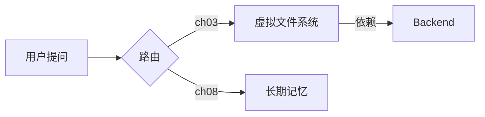
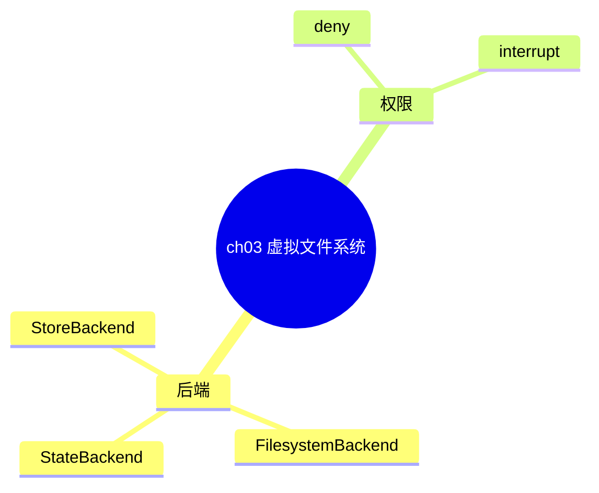

# 知识图谱与思维导图设计规范

## 一、两种图的语义边界

| 维度 | 知识图谱（flowchart） | 思维导图（mindmap） |
|---|---|---|
| 表达 | 概念之间的**有向关系** | 一个中心主题的**层级发散** |
| 边 | 必须有语义标签 | 只表达「属于/包含」 |
| 适合 | 跨章依赖、机制链路、架构 | 单章知识点梳理、复习大纲 |
| 节点上限 | 25 | 30（分支配 3 层） |

## 二、节点命名

- **显示文案**：中文，≤12 汉字。如「虚拟文件系统」而不是「Deep Agents 的虚拟文件系统后端抽象层」。
- **节点 id**：英文/数字，稳定且唯一。如 `VFS`、`CH03`、`N1`。
- 同一概念在不同图中复用同一 id，便于合并。

## 三、关系边的写法

用**动词**做边标签，避免无标签的裸箭头（裸箭头在多关系图里无法区分语义）。

| 关系 | 边标签示例 |
|---|---|
| 路由 | `路由到` |
| 继承 | `继承自` |
| 保护 | `保护` |
| 依赖 | `依赖` |
| 持久化 | `持久化到` |
| 替代/对比 | `对比` |

## 四、Mermaid 语法要点

### flowchart


- `-->|标签|` 是带标签的有向边。
- `{}` 是菱形（判断），`[]` 是矩形（概念），`()` 是圆角。
- 中文标签**不要包含** `[]{}()|` 等语法字符，否则解析失败；需要时用引号包裹 `["含(括号)"]`。

### mindmap


- `mindmap` 用**缩进**表达层级（2 空格一级）。
- 根节点用 `(( ))`，分支直接写文字。
- 节点文案同样避免语法字符。

## 五、常见语法错误

| 错误 | 现象 | 修法 |
|---|---|---|
| 中文标签含括号 | 解析报错 | 用引号包裹或去掉括号 |
| 缩进用 Tab | mindmap 层级错乱 | 统一用空格 |
| 节点 id 含空格 | 解析失败 | id 用英文数字下划线 |
| 边标签含 `|` | 提前截断 | 改用文字描述 |
| 忘写 `graph LR` | 渲染空白 | 首行写图类型 |

## 六、渲染

```bash
python3 skills/knowledge-map/scripts/render_mmd.py <input.mmd> <output.png> --scale 3
```

- 优先 `mmdc`（需 Node + Chrome）；不可用时回退到内置 SVG 渲染器。
- 产物写 `/out/`，由宿主回收。
- 渲染失败要**如实返回错误**，不要声称成功。
