# 🏗️ 综合大作业 —— 带沙箱的 Agent 客服管理系统（ch02–ch10 阶段总结）

> 一句话：前九章的每个能力单独跑都不难，难的是**让它们在同一场景里互相需要**。这份综合作业选了「课程答疑客服」——问题必然分属某一章、必然需要澄清、画图必然需要沙箱、用户偏好必然需要记忆——于是 ch02–ch10 全部成为刚需，而不是硬塞进去的演示代码。

版本基线：`deepagents 0.7.13` · `langchain 1.4.0` · `langgraph 1.x` · DeepSeek（OpenAI 兼容接口）。
离线验证：`56 passed, 7 skipped`（LLM 用例默认跳过，`RUN_LLM_TESTS=1` 启用）。

---

## 🤔 一、先想清楚：为什么选「课程答疑客服」

单章实验里，每项能力都可以单独演示。但综合大作业的难点不是调 API，而是**让它们在同一场景里互相需要**：

| 场景特征 | 触发的能力 | 章节 |
|---|---|---|
| 问题必然分属某一章 | 子 Agent 路由 + 上下文隔离 | ch05 |
| 学员常问「那个后端怎么选」 | HITL 澄清追问 | ch09 |
| 要画知识图谱、跑渲染脚本 | 沙箱执行 | ch10 |
| 用户偏好、已学章节要跨会话 | 长期记忆 | ch08 |
| 课程知识是事实来源，不能被改写 | 声明式只读权限 | ch03 |
| 多步答疑要先拆解 | 任务规划 | ch04 |
| 绘图能力要可复用 | Skills | ch07 |

**换句话说：先选一个让所有能力都不可替代的场景，再谈装配。** 如果换成「天气助手」，ch05/ch09/ch10 立刻变成硬塞进去的演示代码。

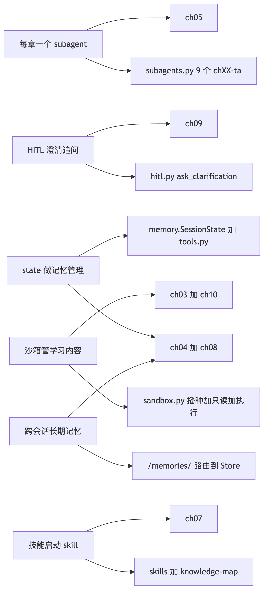

---

## 🧭 二、架构主线：VFS 是唯一集成点

这是整个设计里最关键的决策：**把九章能力全部映射成「虚拟路径」**，由一个 `CompositeBackend` 按前缀路由到不同后端。

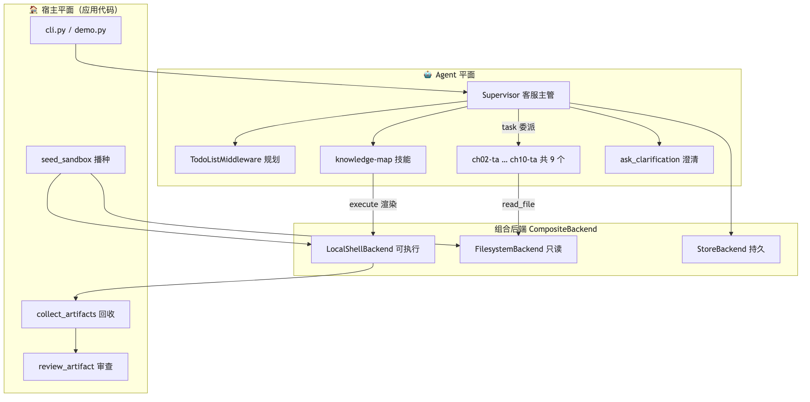

| 虚拟路径 | 后端 | 语义 |
|---|---|---|
| `/knowledge/` | `FilesystemBackend`（只读） | 课程答疑知识库，事实来源 |
| `/skills/` | `FilesystemBackend`（只读） | 技能包，含 knowledge-map |
| `/policies/` | `StoreBackend`（组织级，只读） | 全用户共享的教学政策 |
| `/memories/` | `StoreBackend`（用户级） | 跨会话长期记忆 |
| `/workspace/`、`/out/` | `LocalShellBackend` | 草稿区、产物区，带 `execute` |


好处是「**一个地址空间，一套工具，按前缀配策略**」：

- 子 Agent 不指定 `tools`，就自动继承主 Agent 的文件工具，能读 `/knowledge/` 却不能改；
- 权限可以用声明式规则统一表达（`/knowledge/**` 禁写）；
- 长期记忆换 thread 不消失，因为它根本不在沙箱磁盘上，而是路由进了 Store。

> 💡 **我的理解**：没有这层统一，九章能力会变成九套互不相干的胶水代码。VFS 的价值不只是「让 Agent 读写文件」，而是**给所有能力提供统一的寻址方式**——路由、权限、记忆、沙箱，全部挂在同一套路径语义上。

---

## 🔬 三、五个关键机制

### 3.1 每章一个子 Agent（ch05）

`subagents.py` 为 ch02–ch10 各生成一个 `chXX-ta`：

```python
{
    "name": "ch03-ta",
    "description": "ch03 章节答疑专家。处理关于「虚拟文件系统与可插拔后端」的问题，"
                   "覆盖：七种内置文件工具、五种存储后端……",
    "system_prompt": "你是 ch03 章节的答疑助教。先用 read_file 读取 /knowledge/ch03.md……",
    # 不指定 tools → 继承主 Agent 的文件工具
}
```

- **description 是路由锚点**：含章节号 + 标题 + 能力摘要（ch05：description 决定路由，越具体越不易误派）；
- **两层路由互补**：主提示词里有主动路由表，子 Agent 的 description 做兜底；
- **Context Quarantine**：每个子 Agent 只在自己的上下文里读一章，主 Agent 只收到精炼答案。

**为什么不用一个 `general-purpose` 干全部？** 那样九章知识会重新堆回一个上下文，隔离的意义就没了。

### 3.2 State 做记忆管理（ch04 / ch08）

`SessionState` 继承 `DeepAgentState`，新增两个字段，各带一个去重 reducer：

```python
class SessionState(DeepAgentState):
    clarified_questions: NotRequired[Annotated[list[str], _merge_unique]]
    cited_chapters: NotRequired[Annotated[list[str], _merge_unique]]
```

写入靠两个工具，返回 `Command(update=...)`：

```python
@tool
def record_chapter(chapter: str, tool_call_id: Annotated[str, InjectedToolCallId]) -> Command:
    """记录本次答疑引用了哪个课程章节，写入会话状态。"""
    return Command(update={
        "cited_chapters": [chapter],
        "messages": [ToolMessage(content=f"已记录引用章节：{chapter}", tool_call_id=tool_call_id)],
    })
```

> ⚠️ **踩坑记录**：返回 `Command` 的工具**必须同时返回一条匹配当前 `tool_call_id` 的 `ToolMessage`**，否则 `ToolNode` 直接抛 `Expected to have a matching ToolMessage`。这是 langgraph 1.x 的硬性要求，第一次没加就报错了。

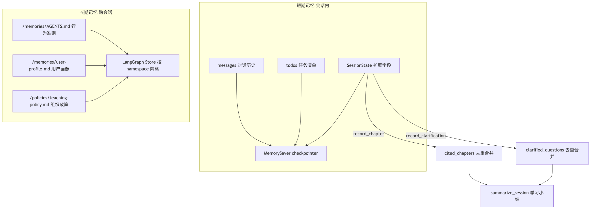

### 3.3 HITL：中断是控制流，不是错误处理（ch09）

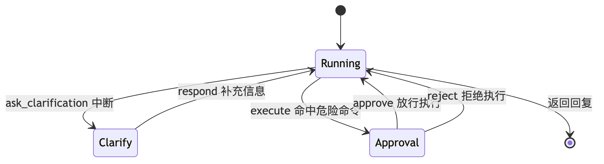

- **澄清**：`ask_clarification` 只允许 `respond` 决策——用户补充的信息直接成为工具返回值；
- **审批**：`execute` 只允许 `approve` / `reject`，且用 `when` 谓词过滤，**只有命中危险模式才中断**，避免审批噪音：

```python
def dangerous_command(request: ToolCallRequest) -> bool:
    command = str(request.tool_call["args"].get("command", "")).lower()
    return any(p in command for p in DANGEROUS_COMMAND_PATTERNS)

interrupt_on={"execute": {"allowed_decisions": ["approve", "reject"],
                          "when": dangerous_command}}
```

- **子 Agent 独立配置**：`interrupt_on` **不继承**主 Agent，`subagents.py` 单独挂了一份——这是 ch09 的实测结论，漏掉就形同没有审批。

### 3.4 沙箱：学习内容存储 + 执行 + 安全闭环（ch03 / ch10）

- **播种**：`seed_sandbox()` 把 `knowledge/` 与 `skills/` 复制进沙箱，准备可写工作区（ch10 宿主平面）；
- **只读**：`/knowledge/**`、`/skills/**`、`/policies/**` 三条 `deny` 规则（ch03 声明式权限）；
- **执行**：`LocalShellBackend` 实现 `SandboxBackendProtocol`，模型才看得到 `execute`（ch10）；
- **回收审查**：宿主 `collect_artifacts()` 取回 `/out/` 产物并做关键词审查。

> ⚠️ **真实 API 约束**：deepagents 0.7.13 的 `FilesystemMiddleware` **不允许「执行型后端 + 非路由内权限」共存**（会抛 `NotImplementedError`）。解法是把只读区单独路由到**没有 `execute` 能力**的 `FilesystemBackend`——这样既能叠加声明式 `deny`，又保留默认后端的 `execute`。这不是绕路，而是 ch03「按路径路由到不同后端」的直接应用。

### 3.5 新建 skill：knowledge-map（ch07）

作业要求「新建一个用于绘制知识图谱以及思维导图的 skill」。技能结构遵循 ch07 规范：

```
skills/knowledge-map/
├── SKILL.md                          frontmatter + Instructions
├── references/graph-design.md        图谱设计规范（Level 3 资源）
├── assets/knowledge-graph.mmd        flowchart 模板
├── assets/mindmap.mmd                mindmap 模板
└── scripts/render_mmd.py             渲染脚本（两级引擎）
```

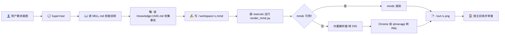

渲染脚本采用**两级引擎、失败如实报错**：

1. `mmdc`（`@mermaid-js/mermaid-cli`）：功能最全，需 Node + Chrome；
2. 内置纯 Python 解析器：支持 `flowchart` / `mindmap` 子集，生成 SVG 后交给 Chrome headless 或 macOS `qlmanage` 转 PNG。

> ⚠️ **踩坑记录**：最初的内置解析器遇到「边上内联节点定义」（`A[用户] -->|进入| B{路由}`）会漏掉 `B`，测试直接抓到。修正后边的两端都支持内联定义，并加了 barycenter 降交叉启发式。

技能实际产出的 ch03 思维导图（24 节点，Agent 依据知识库生成，非模板填充）：

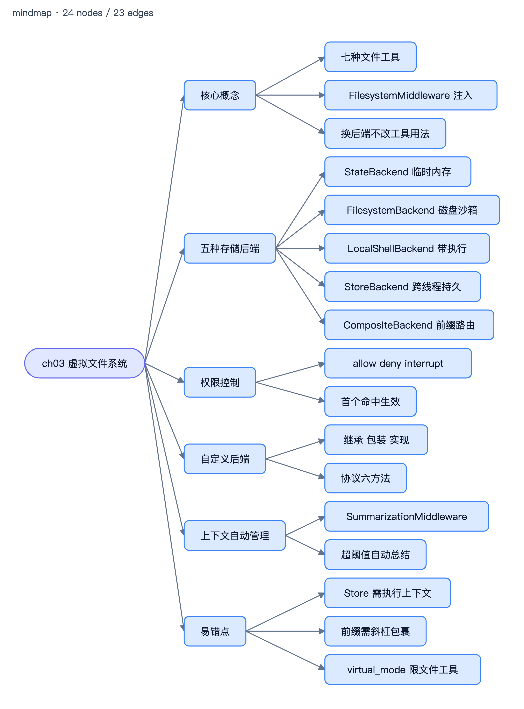

---

## ▶️ 四、真实运行结果

### 4.1 离线自检

```
章节子 Agent 数量: 9
子 Agent 名称: ['ch02-ta', 'ch03-ta', 'ch04-ta', 'ch05-ta', 'ch06-ta',
                'ch07-ta', 'ch08-ta', 'ch09-ta', 'ch10-ta']
沙箱知识库文件: 10
沙箱技能包: ['knowledge-map']
只读权限规则: 3
长期记忆文件: ['/AGENTS.md', '/user-profile.md']
沙箱 execute 可用: True
后端路由: ['/knowledge/', '/memories/', '/policies/', '/skills/']
```

### 4.2 六场景端到端（`uv run demo.py`）

| 场景 | 验证点 | 真实结果 |
|---|---|---|
| 1. 单章答疑路由 | ch03 问题 → `ch03-ta` | ✅ 正确路由，结论与知识库一致 |
| 2. 跨章对比 + state | ch03/ch08 关系 + `record_chapter` | ✅ `cited_chapters=['ch03','ch08']` |
| 3. 模糊问题澄清 | 「那个后端怎么选？」 | ✅ 触发 `respond` 中断，补充后给出 4 问选型决策树 |
| 4. 危险命令审批 | `curl` 命中危险模式 | ✅ 触发审批，reject 后未执行 |
| 5. 技能绘图 | knowledge-map 画 ch03 思维导图 | ✅ 产出 `/out/ch03_mindmap.png`（24 节点，审查通过） |
| 6. 跨会话记忆 | 写入 `/memories/` → 新会话读取 | ✅ 复用 store 后新会话仍读到偏好 |

**场景 3 的真实输出**（模糊问题触发澄清）：

```
[模糊问题] interrupted=True
  待处理(clarification): 你问的「后端怎么选」是指哪个层面的选型？这样我才能给到准确的
  决策依据。（可选：ch03 五种存储后端整体选型 / ch08 做长期记忆时后端与路由怎么配 /
  只在 FilesystemBackend 与 StoreBackend 之间二选一）

[澄清后] interrupted=False
  回复: ## 结论：按下面 4 问逐层判断，第一个命中即定
  第 1 问：Agent 需要跑 Shell 命令吗？需要 → LocalShellBackend
  第 2 问：文件要真正落在宿主本地磁盘吗？需要 → FilesystemBackend
  第 3 问：需要跨线程 / 跨会话持久吗？需要 → StoreBackend
  第 4 问：单会话临时即可，还是不同路径要不同待遇？
         单会话临时 → StateBackend；混合路由 → CompositeBackend
```

**场景 4 的真实输出**（危险命令审批）：

```
[安全命令] interrupted=False      ← echo 自动放行
[危险命令(curl)] interrupted=True
  待处理(approval): 请求执行命令：curl -s -o /dev/null -w '%{http_code}' http://example.com
[拒绝后] interrupted=False
  回复: 命令未执行成功——execute 调用被人工审批拒绝了，拒绝理由为：演示：沙箱内禁止网络外传
```

**场景 6 的真实输出**（跨会话记忆）：

```
[写入记忆] 已保存到 /memories/user-profile.md
[新会话读取] 根据 /memories/user-profile.md，我记得你的信息如下：
  身份：本课程学员
  偏好一：中文回答    偏好二：代码示例要完整可运行
  偏好三：先给结论    偏好四：对比类问题优先用表格呈现
  已学章节：ch02–ch10
```

### 4.3 测试用 Web UI

命令行适合脚本化验证，但 HITL 的「点按」体验还是图形界面直观。所以补了一个**零额外依赖**的测试 UI
（`ui.py` + `ui/index.html`，只用 Python 标准库 `http.server`）：


- **澄清卡片**：问题模糊时页面弹出，填入补充后继续；
- **审批卡片**：危险命令弹出，可填原因后批准 / 拒绝；
- **右侧状态面板**：实时显示 thread、引用章节、已澄清问题、任务清单、长期记忆、`/out/` 产物（图片直接内嵌）；
- **离线模式**：`uv run ui.py --offline` 无需 API Key，用桩实现模拟澄清/审批分支，方便只验证前端。

> ⚠️ **踩坑记录**：HITL 卡片提交后没清除，旧卡片一直挂着，导致「还有没有待处理请求」的判断失真。修法是提交时把卡片从 `.hitl` 改成 `.hitl-done` 并清空内容。另一个坑是 `/api/artifact?path=/out/../knowledge/x` 能穿越出 `/out/`——只判断「在 SANDBOX_ROOT 内」是不够的，必须再确认落在 `/out/` 子目录内。

### 4.4 测试分层

```
uv run pytest -q                    # 56 passed, 7 skipped
RUN_LLM_TESTS=1 uv run pytest -q    # 额外启用 7 个真实模型用例
```

- **确定性测试**（56 个，不调模型）：路由表覆盖 9 章、3 条权限、谓词命中与否、中断载荷解析、reducer 去重、渲染脚本解析与产出、UI 的 HTTP 接口与路径穿越防护；
- **LLM 集成测试**（7 个，显式开启）：单章路由、模糊澄清、危险审批、状态记忆、技能绘图、跨会话记忆。

> 💡 **我的理解**：**机制与模型行为解耦**，是这套系统能被稳定回归测试的前提。确定性测试只断言「机制装对了」，模型输出有随机性，就不该进默认用例。

---

## ⚠️ 五、已知边界（诚实声明）

| 取舍 | 说明 |
|---|---|
| **不是容器级隔离** | `LocalShellBackend` 的命令仍在本机执行；`virtual_mode` 只约束文件工具，不限制 Shell 绝对路径。真实隔离需远程 Provider（Daytona / Modal / E2B）。 |
| **黑名单不是安全边界** | 危险命令识别是字符串匹配，变量拼接、脚本文件、编码都能绕过。 |
| **关键词审查不保证安全** | 产物审查未命中已知模式 ≠ 安全；命中后应停止采用并人工审查。 |
| **记忆是内存版** | `InMemoryStore` 进程重启即丢失；生产应换持久化 Store。 |
| **ch06 未本地运行** | 异步子 Agent 需要 LangGraph Server 部署环境；`ch06-ta` 子 Agent 仍覆盖其知识。 |

> 💡 **我的理解**：这套设计的价值，是把「沙箱作为 Backend 的接口、两个平面、声明式权限、HITL 审批、产物审查」这五件事端到端跑通，而不是宣称本地进程等于沙箱。**把边界写清楚，比把能力吹大更有工程价值**——一个过度宣称安全的架构文档比没有文档更危险。

---

## 📌 六、复盘：这一章（阶段）学到了什么

1. **集成点的选择决定架构质量**：用 VFS 统一寻址，九章能力才有共同语言；否则就是九套胶水代码。
2. **真实 API 约束会推翻想当然的设计**：权限不能与执行型后端共存，逼出了「只读区单独路由」——反而更贴合 ch03 的原意。
3. **中断是状态机，不是 try/except**：`Command(resume=...)` + 决策一一对应 + 重放机制，逼着人把副作用设计成幂等。
4. **子 Agent 的配置不自动继承**：`interrupt_on`、`tools`、`skills` 都有各自的继承规则，漏配就是「形同没有」。
5. **可测试性来自解耦**：机制测试不依赖模型输出，才能稳定回归；模型行为单独门控。

---

<details>
<summary>📦 附：文中 6 张图的 Mermaid 源码</summary>


**03-系统全景架构**

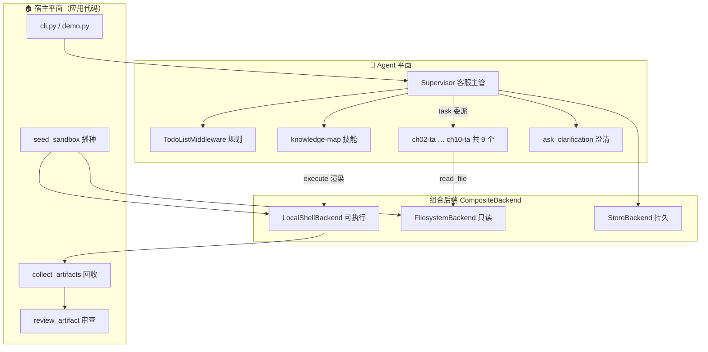


**04-作业要求映射**

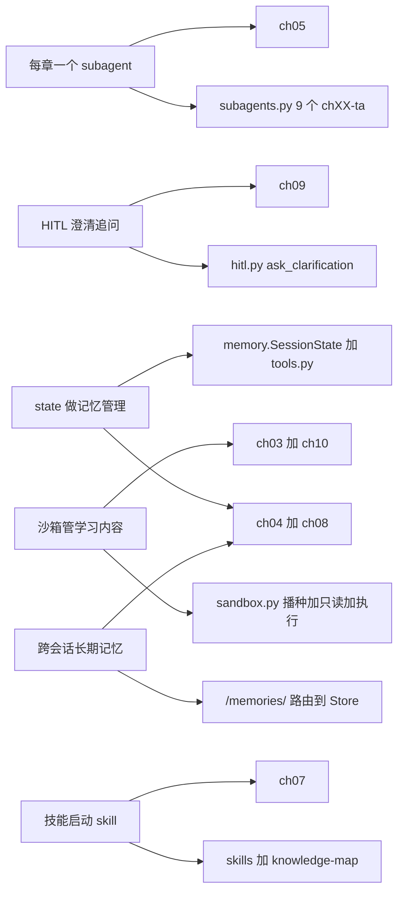


**05-组合后端路由**

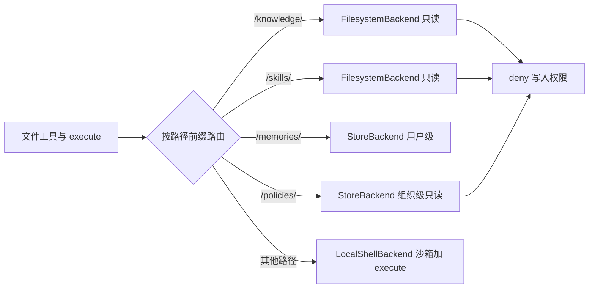


**06-HITL状态机**

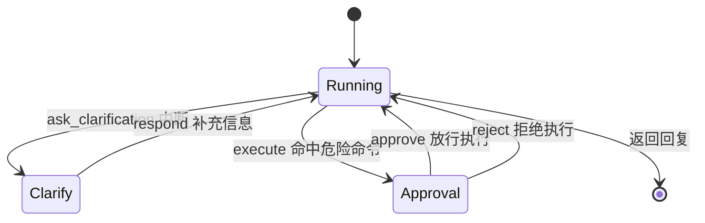


**07-记忆分层**

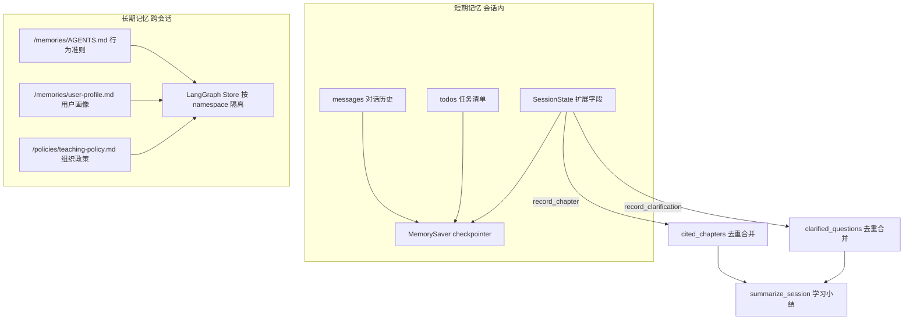


**08-技能渲染链路**

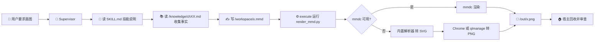

</details>
