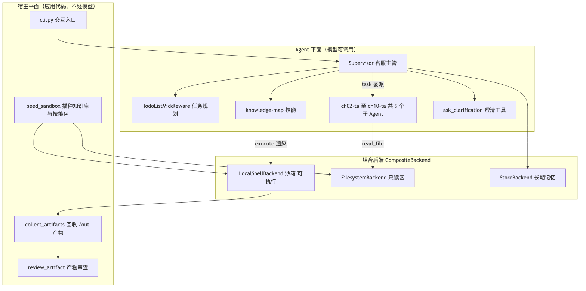
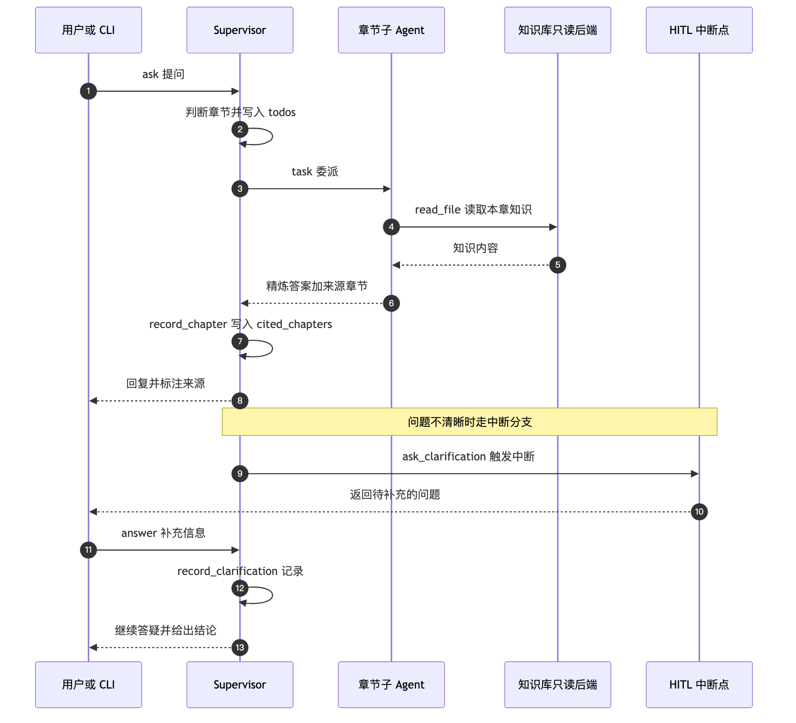
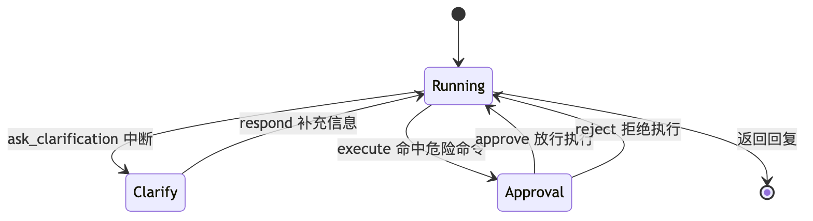
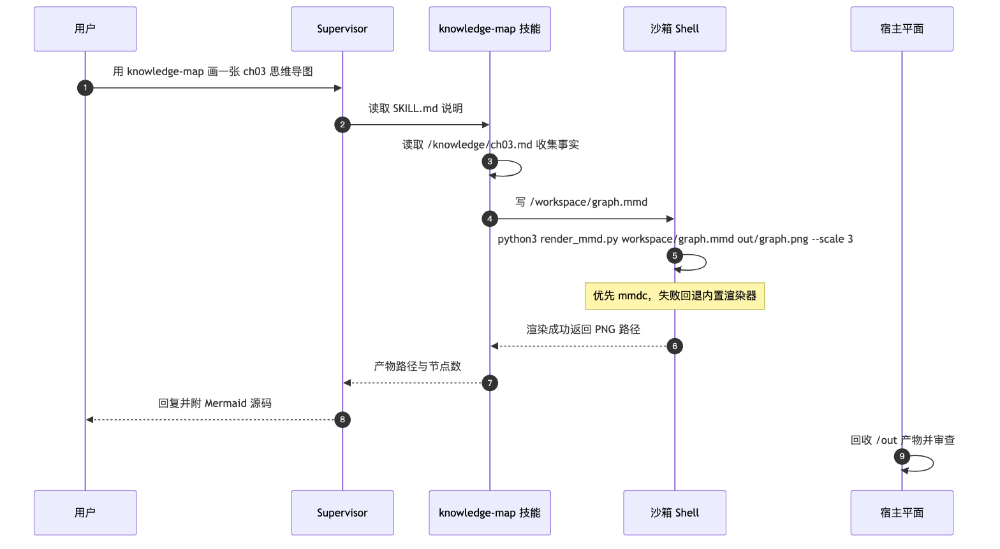
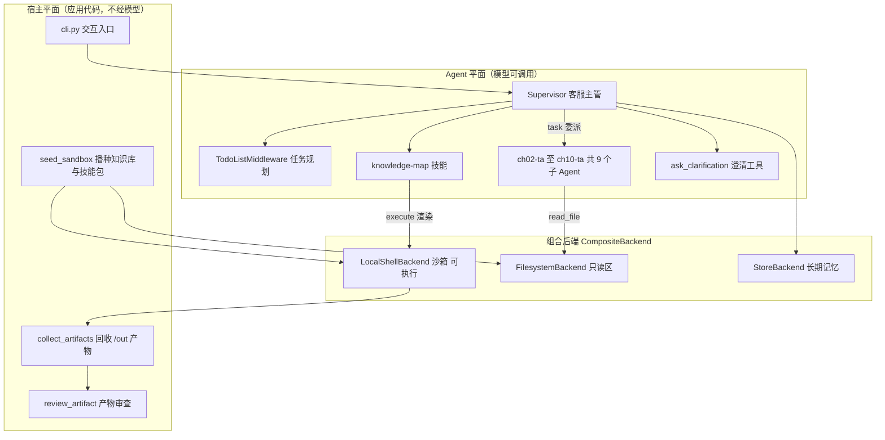
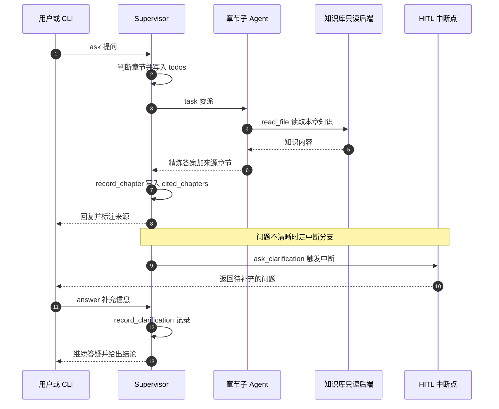
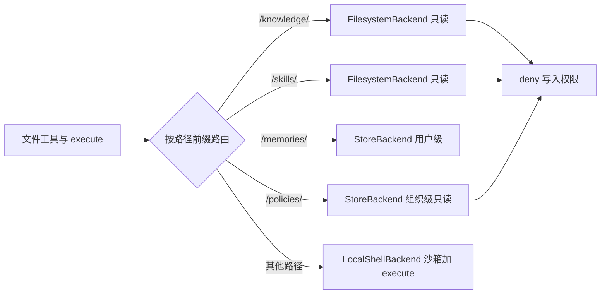
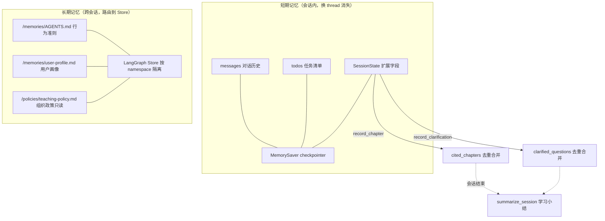
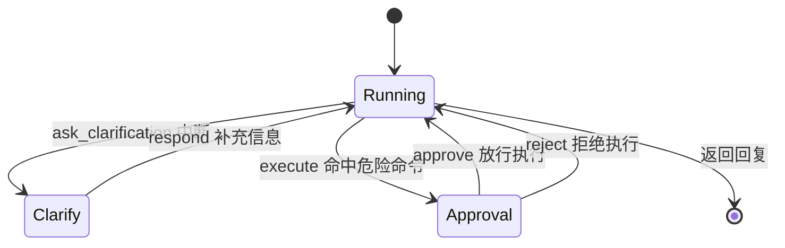
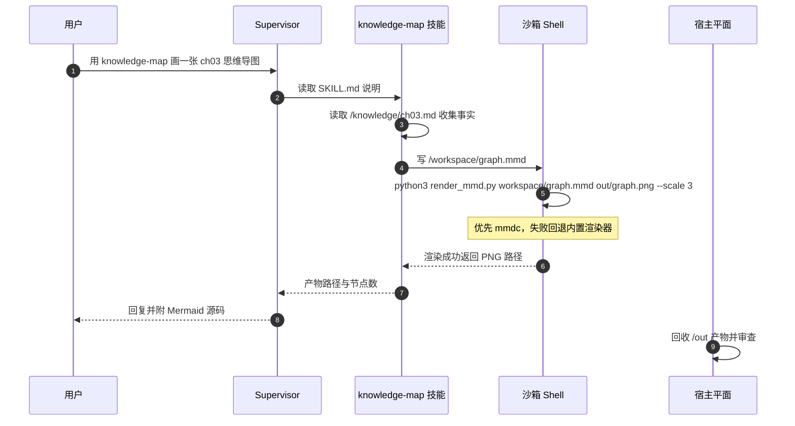

# 🎓 阶段综合大作业：用 Deep Agents 造一个「带沙箱的课程客服系统」

> 一句话：前九章每项能力单独跑都不难，难的是**让它们在同一场景里互相需要**。这次综合作业选了「课程答疑客服」——问题必然分属某一章、必然需要澄清、画图必然需要沙箱、用户偏好必然需要记忆——于是 ch02–ch10 全部成了刚需，而不是硬塞进去的演示代码。

版本基线：`deepagents 0.7.13` · `langchain 1.4.0` · `langgraph 1.x` · DeepSeek（OpenAI 兼容接口）。
离线验证：`56 passed, 7 skipped`（LLM 用例默认跳过，`RUN_LLM_TESTS=1` 启用）。

---

## 🤔 一、为什么作业要选「客服系统」

课程最后布置了一个综合大作业：**给大模型一个提示词，让它先按 ch02 搭出基础 Agent，再按 ch03–ch10 逐步长成一个带沙箱的客服系统。**

一开始我以为这只是在「把 API 都调一遍」。真正动手才发现：**综合大作业的难点不是调用 API，而是让九章能力在同一个场景里互相需要。**

而「课程答疑客服」这个场景刚好天然满足：

| 场景天然需要 | 对应章节能力 |
|---|---|
| 问题必然分属某一章 → 要路由 | ch05 子 Agent + 上下文隔离 |
| 学员常问得含糊（「那个后端怎么选」）→ 要追问 | ch09 Human-in-the-Loop |
| 要画知识图谱、跑渲染脚本 → 要执行 | ch10 沙箱 |
| 用户偏好、已学章节要跨会话保留 → 要记忆 | ch08 长期记忆 |
| 课程知识是事实来源，不能被 Agent 改写 → 要边界 | ch03 声明式权限 |
| 多步问题要先列清单 | ch04 任务规划 |
| 绘图能力要可复用 | ch07 Skills |

换成「天气助手」，ch05/ch09/ch10 立刻变成硬塞进去的演示代码。**先选一个让所有能力都不可替代的场景，再谈装配**——这是这次作业最大的收获。

> 💡 顺便纠正几个容易听混的说法：作业里说的「loop 模块」其实是 **HITL（Human-in-the-Loop）**；「set books / sbook」是 **skills（技能包）**；「place / poli」是 **`/policies/` 组织政策路由**。

---

## 🏗️ 二、系统长什么样

整体架构**按功能模块拆分**。每次问答时：主 Agent 先判断章节 → 路由到对应子 Agent → 子 Agent 读该章知识库 → 给出带来源的答案。



最关键的设计决策是：**把九章能力全部映射成「虚拟路径」**，由一个 `CompositeBackend` 按前缀路由到不同后端。这是整个系统的集成点。

### 一次答疑的完整链路



---

## 🚀 三、先跑起来：离线自检 + 回归测试

项目用 DeepSeek（OpenAI 兼容接口），装好依赖后先做一次**不调用模型**的离线自检：

```bash
cd capstone
uv sync
uv run cli.py --demo
```

输出确认了每一层都装好了：

```text
============================================================
离线自检（不调用模型）
============================================================
  章节子 Agent 数量: 9
  子 Agent 名称: ['ch02-ta', 'ch03-ta', 'ch04-ta', 'ch05-ta', 'ch06-ta',
                  'ch07-ta', 'ch08-ta', 'ch09-ta', 'ch10-ta']
  沙箱知识库文件: 10
  沙箱技能包: ['knowledge-map']
  只读权限规则: 3
  长期记忆文件: ['/AGENTS.md', '/user-profile.md']
  沙箱 execute 可用: True
  后端路由: ['/knowledge/', '/memories/', '/policies/', '/skills/']
```

对应作业要求：**9 个章节子 Agent**（每章一个）、**10 个沙箱知识库文件**、**1 个知识图谱技能包**、**3 条只读规则**、**长期记忆文件**、**沙箱 execute 可用**、**4 条后端路由**。

回归测试以确定性用例为主，不依赖模型输出：

```bash
uv run pytest -q                    # 56 passed, 7 skipped
RUN_LLM_TESTS=1 uv run pytest -q    # 额外启用真实模型用例
```

**机制与模型行为解耦**，是这个项目能被稳定回归的前提。

> ⚠️ 小坑：如果终端出现 `VIRTUAL_ENV=.../ch02/.venv does not match the project environment path .venv`，说明你之前激活过 ch02 的虚拟环境。用 `uv run --active` 或重新 `source .venv/bin/activate` 即可，不影响运行。

---

## 🔬 四、实测：和客服聊几句

我拿课程学习内容自己测了一轮。

**开场**——它会主动说明能力边界和提问示例：

```text
你> 你好
客服> 你好！我是《Deep Agents 实战》课程的客服答疑助手，负责解答 ch02–ch10 的代码与实战问题。
      你可以直接问我，例如：
      - ch02：create_deep_agent 三件套怎么写？
      - ch03：七种文件工具、五种存储后端怎么选？
      - ch04：write_todos 任务清单、TodoListMiddleware 中间件怎么注入？
      ...
      也支持多章对比，或让我把某章内容画成知识图谱/思维导图。
```

**问 ch04 中间件**——它给出的答案结构清晰，而且直接定位到课程源码文件：

```text
你> 04 中间件有哪些 都是干嘛的？
客服> ## 结论先行
      ch04 不是"逐个讲所有中间件"，而是围绕任务规划展开：主角是 TodoListMiddleware……
      ## 三个中间件各自干嘛
      | 中间件 | 作用 | 适用场景 |
      | TodoListMiddleware | 注入 write_todos 工具…… | 多步骤、可分解的规划类任务 |
      | FilesystemMiddleware | 提供虚拟文件系统读写能力 | 把总结/清单/结果落盘存档 |
      | SummarizationMiddleware | 对话过长时压缩历史 | 防止上下文过长把任务清单"冲掉" |
      ## 课程代码对应文件
      - 01_write_todos_basics.py ……
      来源：[ch04]
```

**问沙箱怎么用**——它读出的内容很精准，而且会调用工具去完成任务。这背后就是**子 Agent 在独立上下文里读自己那一章**，主 Agent 只收精炼答案。

---

## 🧩 五、逐层拆解代码

### 5.1 总装：`service.py`

总装函数把九章能力一次性接上，每一行都对应一个章节：

```python
agent = create_deep_agent(
    model=model or make_model(),                        # ch02 模型
    tools=[ask_clarification, *state_memory_tools()],   # ch09 澄清 + state 记忆
    subagents=build_all_subagents(),                    # ch05 每章一个子 Agent
    middleware=[TodoListMiddleware()],                  # ch04 任务规划
    skills=["/skills/"] if with_skills else None,       # ch07 技能包
    memory=memory_paths(),                              # ch08 启动注入长期记忆
    permissions=sandbox_permissions(),                  # ch03 只读边界
    interrupt_on=hitl_config(),                         # ch09 审批
    state_schema=SessionState,                          # ch08 扩展 state
    context_schema=TaContext,
    checkpointer=MemorySaver(),                         # ch08 短期记忆
    store=store,                                        # ch08 长期记忆
    backend=backend,                                    # ch03/ch10 组合后端
    system_prompt=supervisor_prompt(),
)
```

### 5.2 子 Agent：9 个章节助教（ch05）

用**批量方式**为 ch02–ch10 各生成一个答疑子 Agent，每个都是字典定义：

```python
spec = {
    "name": f"{chapter.key}-ta",
    # description 是路由锚点：章节号 + 标题 + 能力摘要（越具体越不容易误派）
    "description": (
        f"{chapter.key} 章节答疑专家。处理关于「{chapter.title}」的问题，"
        f"覆盖：{chapter.summary}。当用户问题涉及这些主题时委派给本子 Agent。"
    ),
    "system_prompt": _TA_TEMPLATE.format(...),   # 只依据 /knowledge/<chapter>.md 回答
}
```

**为什么不用一个「万能子 Agent」干全部？** 因为那样九章知识会重新堆回一个上下文，隔离的意义就没了。每个子 Agent 在独立上下文里读自己那章（Context Quarantine），主 Agent 只收到精炼答案。

> ⚠️ 实测坑：**子 Agent 的 `interrupt_on` 不继承主 Agent**。所以代码里给每个子 Agent 单独挂了一份 HITL 配置，漏掉就形同没有审批。

### 5.3 沙箱：整个项目最难、也最值得讲的部分（ch10）

沙箱这部分把很多内容都涵盖了。代码分成三层：

**① 新建沙箱后端**——用 `LocalShellBackend` 作为基础执行环境：

```python
def make_sandbox_backend(root=None, **kwargs) -> LocalShellBackend:
    return LocalShellBackend(
        root_dir=str(root),
        virtual_mode=True,
        inherit_env=False,          # 不把宿主环境变量（含 API Key）带进子进程
        timeout=int(os.environ.get("SANDBOX_TIMEOUT", "30")),
        env={"PATH": "/usr/bin:/bin:/usr/local/bin:/opt/homebrew/bin", "HOME": str(root)},
    )
```

**② 组合后端**——用 `CompositeBackend` 按路径前缀路由，这是集成核心：


```python
routes = {
    # 只读区：独立 FilesystemBackend（无 execute）→ 可安全叠加 deny 权限
    "/knowledge/": FilesystemBackend(root_dir=str(root / "knowledge"), virtual_mode=True),
    "/skills/":    FilesystemBackend(root_dir=str(root / "skills"),    virtual_mode=True),
    # 长期记忆：路由到 Store
    "/memories/":  StoreBackend(namespace=namespace, store=store),
    "/policies/":  StoreBackend(namespace=org_namespace, store=store),
}
return CompositeBackend(default=sandbox, routes=routes)
```

**知识库和技能包都存储在沙箱里**，路由用 `/knowledge/` 和 `/skills/` 区分。

> 💡 这里有个真实的设计约束：deepagents 0.7.13 的 `FilesystemMiddleware` **不允许「执行型后端 + 非路由内权限」共存**。所以只读区被单独路由到**没有 `execute` 能力**的 `FilesystemBackend`，这样既能叠加声明式 `deny` 权限，又保留默认后端的 `execute`。这不是绕路，正是 ch03「按路径路由到不同后端」的直接应用。

**③ 权限管理**——`/knowledge/`、`/skills/`、`/policies/` 禁止写入，只读：

```python
def sandbox_permissions():
    readonly = (*READONLY_PREFIXES, "/policies/")   # /knowledge/ /skills/ /policies/
    return [
        FilesystemPermission(operations=["write"], paths=[f"{prefix}**"], mode="deny")
        for prefix in readonly
    ]
```

危险命令则交给 HITL 审批——用 `when` 谓词过滤，**只有命中危险模式才中断**，避免审批噪音：

```python
DANGEROUS_COMMAND_PATTERNS = (
    "rm ", "rm -", "sudo", "curl ", "wget ", "nc ", "ssh ",
    "chmod ", "chown ", "dd if=", "> /etc", "mkfs", "shutdown", "reboot",
)

def dangerous_command(request) -> bool:
    command = str(request.tool_call["args"].get("command", "")).lower()
    return any(pattern in command for pattern in DANGEROUS_COMMAND_PATTERNS)
```



> ⚠️ 必须记住的边界：`LocalShellBackend` 的命令**仍在本机执行，不提供容器级隔离**；`virtual_mode` 只约束文件工具，**管不住 Shell 的绝对路径**；危险命令黑名单只是**字符串匹配，不是安全边界**。真正的隔离要靠远程容器 Provider（Daytona / Modal / E2B…）。这些限制代码里写在模块头部，我认为这比宣称「本地进程等于沙箱」有价值得多。

### 5.4 技能：knowledge-map 画知识图谱与思维导图（ch07）

这是本次作业的**核心内容之一**——专门做一个画知识图谱和思维导图的 skill 辅助学习。它作为 skill 放在沙箱里，**执行环境也在沙箱里**：

```bash
python3 skills/knowledge-map/scripts/render_mmd.py workspace/graph.mmd out/graph.png --scale 3
```



渲染脚本采用**两级引擎、失败如实报错**：

1. `mmdc`（mermaid-cli，功能最全，需要 Node + Chrome）；
2. 内置纯 Python 解析器（支持 `flowchart` / `mindmap` 子集），生成 SVG 后交给 Chrome headless 或 macOS `qlmanage` 转 PNG。

无法识别语法时返回原始错误，**绝不假装成功**。实测画出来的知识图谱和思维导图效果不错，产物写到 `/out/`，由宿主回收。

### 5.5 记忆：state 做短期，Store 做长期（ch04/ch08）

作业要求「用 state 做记忆管理」，这里分两层落地：


- **会话内**：`SessionState` 继承 `DeepAgentState`，额外挂上「已澄清的问题」「已引用章节」两个字段，用 `_merge_unique` 做 reducer 去重合并；
- **跨会话**：用户偏好、答疑沉淀写入 `/memories/`，由 `CompositeBackend` 路由到 `StoreBackend`，换 thread 依然可读。

```python
class SessionState(DeepAgentState):
    # 已澄清问题：使用 reducer 去重合并，多个节点写入不冲突
    clarified_questions: NotRequired[Annotated[list[str], _merge_unique]]
    # 已引用章节：同上
    cited_chapters: NotRequired[Annotated[list[str], _merge_unique]]
```

写入靠两个工具，返回 `Command(update=...)` 由 LangGraph 的 reducer 合并进 state：

```python
@tool
def record_chapter(chapter: str, tool_call_id: Annotated[str, InjectedToolCallId]) -> Command:
    """记录本次答疑引用了哪个课程章节，写入会话状态。"""
    return Command(update={
        "cited_chapters": [key],
        "messages": [ToolMessage(content=f"已记录引用章节：{key}", tool_call_id=tool_call_id)],
    })
```

> ⚠️ 实现要点：返回 `Command` 的工具必须**同时返回一条匹配当前 `tool_call_id` 的 `ToolMessage`**，否则 `ToolNode` 会抛「Expected to have a matching ToolMessage」。

#### ❓ 一个必须澄清的误区：AGENTS.md 到底存在哪？

我测试时一度以为 `AGENTS.md`「应该也是存到沙箱里」，因为在文档结构里没看到它。**其实不是，这是设计使然**：

- `/memories/AGENTS.md` 走的是 **`StoreBackend`（长期记忆）**，**不在沙箱磁盘上**；
- 沙箱是**运行时工作区**，每次启动都会 `seed_sandbox` 清空重建；
- 如果把长期记忆存进沙箱，**换 thread 或重建沙箱就丢了**——恰恰违背了「长期记忆」的定义。

所以「沙箱里没有 AGENTS.md」是正确行为，不是 bug。沙箱磁盘只有 `/knowledge/`、`/skills/`（播种的只读源）、`/workspace/`、`/out/`。

---

## 🐛 六、一个很有意思的真实 bug：产物审查误报

测试最后，产物回收打出了这样一行：

```text
/out/ch04-mindmap.png → .../out/ch04-mindmap.png（227045B）⚠ 命中：['sk-']
```

一张**思维导图 PNG** 命中了 `sk-`（API Key 前缀）危险模式？我重新扫描同一个文件，结果是干净的：

```python
from sandbox import review_artifact
clean, hits = review_artifact(Path("out/ch04-mindmap.png").read_bytes())
# clean=True, hits=[]
```

原因在于审查器是**按 UTF-8 解码后做关键词匹配**。我实测了随机二进制的误报概率：

- 用真正的字节匹配统计 `b"sk-"`，227KB 随机数据的期望出现次数约 **0.013 次**（即约 1.3% 的文件会撞上）；
- 但审查器先 `decode("utf-8", "ignore")`——**非法字节被丢弃后，原本不相邻的 ASCII 字符会拼到一起**，于是 `b"s\xffk\xff-"` 解码出来就成了 `"sk-"`。这条路径会把误报率抬高一个数量级。

这恰好印证了代码里写的那句话：**关键词扫描未命中不代表安全，命中也不一定是真问题**。它只能当「提醒人工复核」的信号，不能当判定结论。生产环境里，二进制产物应该按类型走不同的检查策略（比如 PNG 只看文件头魔数和尺寸），而不是一律当文本扫。

---

## ✅ 七、小结：这次作业真正练到了什么

| 能力 | 落地位置 | 一句话 |
|---|---|---|
| 子 Agent 路由 | `subagents.py` | 9 个 `chXX-ta`，靠 description + 路由表两层选人 |
| 上下文隔离 | ch05 机制 | 每章独立上下文，主 Agent 只收精炼答案 |
| 任务规划 | `TodoListMiddleware` | 多步问题先列清单 |
| HITL 澄清 | `ask_clarification` | 问题不清楚就追问，不猜 |
| HITL 审批 | `dangerous_command` + `when` | 只拦危险命令，安全命令自动放行 |
| 沙箱执行 | `LocalShellBackend` | 实现协议后模型才看得到 `execute` |
| 路径路由 | `CompositeBackend` | 一个地址空间，按前缀配策略 |
| 声明式权限 | `FilesystemPermission` | 知识库/技能/政策只读 |
| 技能包 | `knowledge-map` | 知识图谱 + 思维导图，沙箱内渲染 |
| 短期记忆 | `SessionState` + checkpointer | 会话内可恢复、可审计 |
| 长期记忆 | `/memories/` → Store | 换 thread 仍记得你的偏好 |

**最重要的一条**：把所有能力映射到**一套虚拟路径**上，是这套系统能被干净组装起来的关键。没有这层统一，九章能力会变成九套互不相干的胶水代码。

至于那些「不是真隔离」「黑名单不是安全边界」「关键词扫描不是判定」——把它们**写清楚**，比把能力吹大更有工程价值。

---

> 下一篇预告：文件系统权限——权限规则怎么组合，以及为什么它约束不了自定义工具和沙箱 execute。

---

<details>
<summary>📦 附：文中 6 张图的 Mermaid 源码</summary>

**wx-01-总体架构**



**wx-02-答疑链路**



**wx-03-组合后端路由**



**wx-04-记忆分层**



**wx-05-HITL状态机**



**wx-06-技能链路**



</details>
