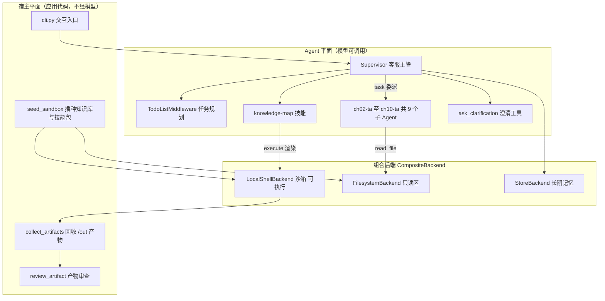
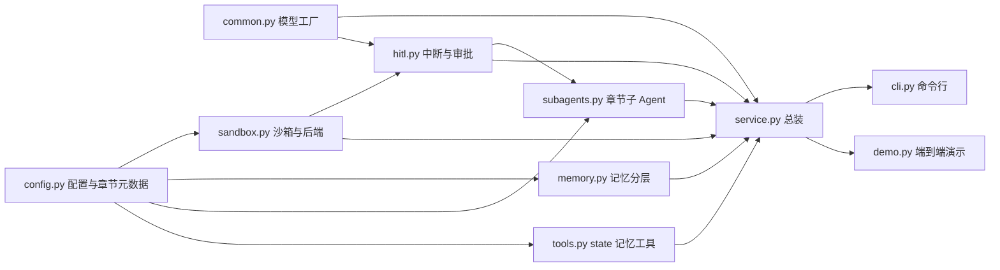
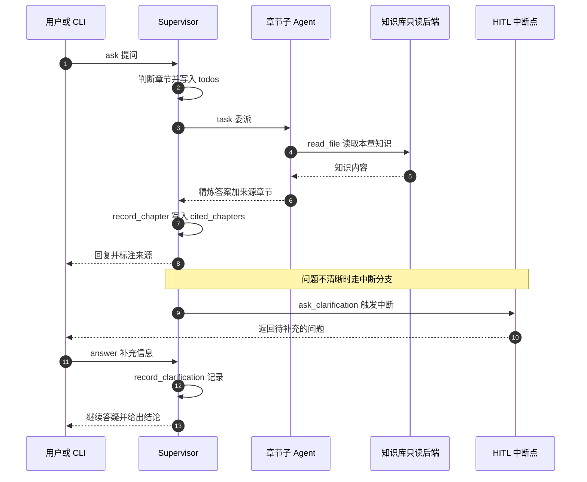
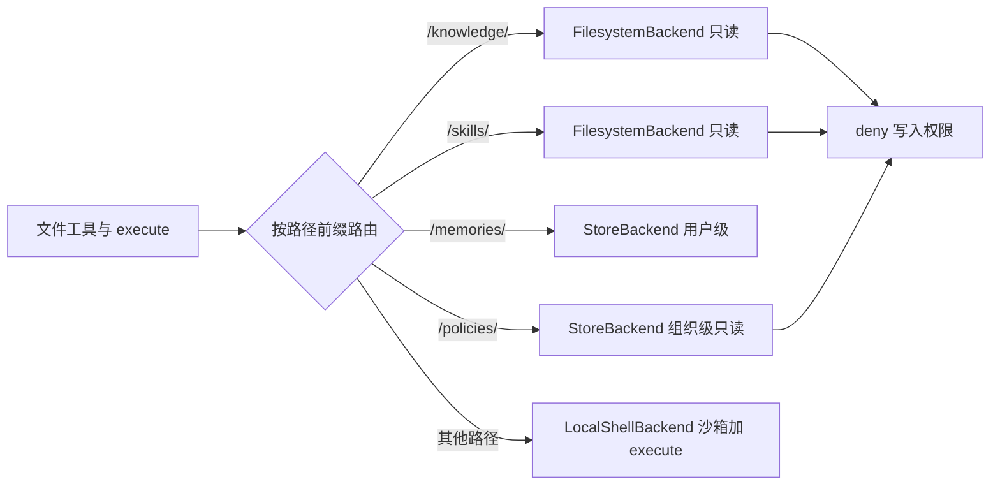
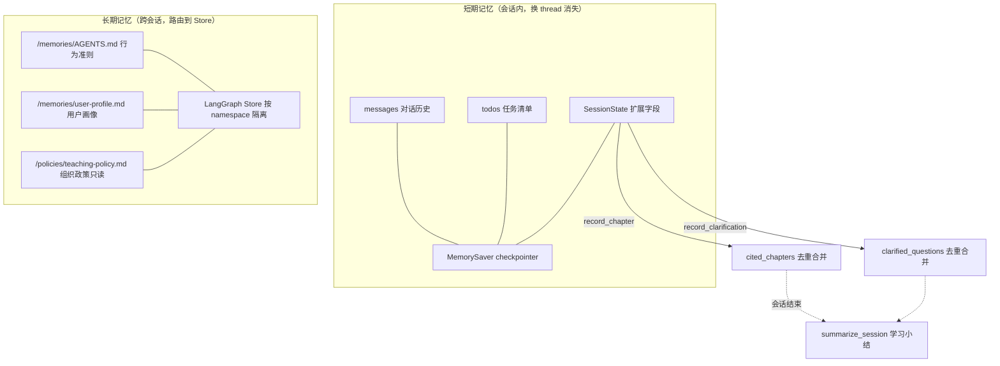
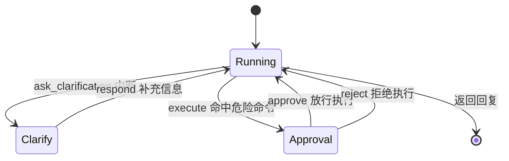
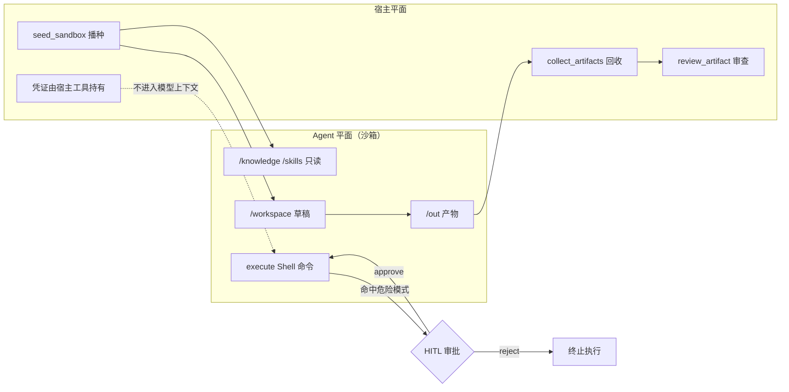
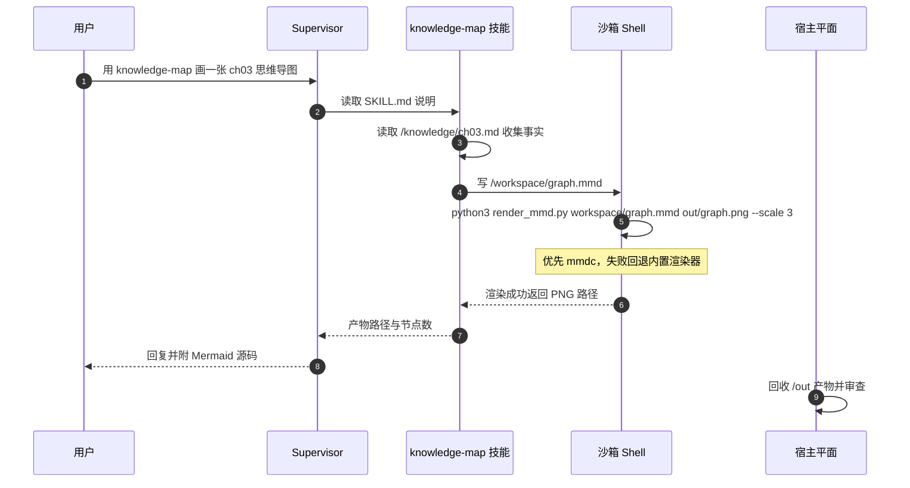
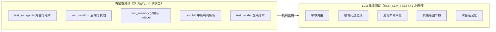

# capstone 综合大作业 · 设计思路与架构解读

> **一句话**：capstone 不是「把 ch02–ch10 的 API 都调一遍」，而是**找了一个真实场景，让九章能力同时成为刚需**，再用一套统一的地址空间（虚拟文件系统）把它们装配成一个可运行、可测试、可审计的课程答疑客服系统。
>
> 版本基线：`deepagents 0.7.13` · `langgraph 1.x` · DeepSeek（OpenAI 兼容接口）。
> 离线验证：`56 passed, 7 skipped`（LLM 用例默认跳过）。

---

## 一、先看它到底是个什么系统

用户（学员）用自然语言提问课程问题，系统作为「客服主管」：

1. 判断问题属于 ch02–ch10 的哪一章，**委派**给对应的章节答疑子 Agent；
2. 子 Agent 只读该章的知识库文件，给出带来源的答案；
3. 问题不清晰时**追问**而不是猜；
4. 需要跑命令/画图时，在**沙箱**里执行，产物写到 `/out/`；
5. 用户偏好写进**长期记忆**，跨会话仍然记得。

### 作业要求 → 落地模块对照

代码注释里逐条引用了作业要求，对应关系如下：

| 作业要求（代码注释原文） | 落地位置 | 章节依据 |
|---|---|---|
| 「subagent 可以用于不同章节，每个章节配一个 subagent」 | `subagents.py`（9 个 `chXX-ta`） | ch05 |
| 「HITL 对于不清晰的问题让用户补充提问」 | `hitl.py` 的 `ask_clarification` + `respond` | ch09 |
| 「使用 state 做记忆管理」 | `memory.SessionState` + `tools.py` | ch04 / ch08 |
| 沙箱执行代码 / 渲染产物 | `sandbox.py` 的 `LocalShellBackend` | ch10 |
| 可复用技能包 | `skills/knowledge-map/` | ch07 |
| 跨会话长期记忆 | `memory.py` 的 `/memories/` 路由 | ch08 |
| 学习内容只读、不可篡改 | `sandbox_permissions()` 三条 `deny` | ch03 |
| 多步问题先规划 | `TodoListMiddleware` | ch04 |

---

## 二、设计思路：五条主线

### 2.1 选型思路——让每章能力都成为「刚需」

单章实验里，每项能力都可以单独演示；但**综合大作业的难点不是调用 API，而是让它们在同一场景里互相需要**。选「课程答疑客服」正是因为它天然满足：

- **天然需要路由**：问题必然分属某一章 → 子 Agent + 上下文隔离（ch05）；
- **天然需要澄清**：学员常问「那个后端怎么选」→ HITL 追问（ch09）；
- **天然需要沙箱**：要画知识图谱、跑渲染脚本 → 执行后端（ch10）；
- **天然需要记忆**：用户偏好、已学章节要跨会话保留 → Store（ch08）；
- **天然需要只读边界**：课程知识是事实来源，不能被 Agent 改写 → 声明式权限（ch03）。

换句话说：**先选一个让所有能力都不可替代的场景，再谈装配**。如果换成「天气助手」，ch05/ch09/ch10 就会变成硬塞进去的演示代码。

### 2.2 架构主线——VFS 是唯一集成点

这是整个设计里最关键的决策：**把九章能力全部映射成「虚拟路径」**，由一个 `CompositeBackend` 按前缀路由到不同后端。

| 虚拟路径 | 后端 | 语义 |
|---|---|---|
| `/knowledge/` | `FilesystemBackend`（只读） | 课程答疑知识库，事实来源 |
| `/skills/` | `FilesystemBackend`（只读） | 技能包，含 knowledge-map |
| `/policies/` | `StoreBackend`（组织级，只读） | 全用户共享的教学政策 |
| `/memories/` | `StoreBackend`（用户级） | 跨会话长期记忆 |
| `/workspace/`、`/out/` | `LocalShellBackend` | 草稿区、产物区，带 `execute` |

好处是「**一个地址空间，一套工具，按前缀配策略**」：

- 子 Agent 不指定 `tools`，就自动继承主 Agent 的文件工具，能读 `/knowledge/` 却不能改；
- 权限可以用声明式规则统一表达（`/knowledge/**` 禁写）；
- 长期记忆换 thread 不消失，因为它根本不在沙箱磁盘上，而是路由进了 Store。

**没有这层统一，九章能力会变成九套互不相干的胶水代码。**

### 2.3 路由即上下文预算管理

9 个知识库文件如果全塞进一个上下文，还没开始答题预算就没了。所以用 `Supervisor + 9 个子 Agent`：

- 主 Agent 只做**调度与整合**，手里只有路由表；
- 每个子 Agent 在**独立上下文**里读自己那一章（Context Quarantine）；
- 主 Agent 只收到精炼答案。

代码注释里明确回答了这个设计问题：**为什么不用一个 `general-purpose` 子 Agent 干全部？** 因为那样九章知识会重新堆回一个上下文，隔离的意义就没了。同时，每个子 Agent 的 `description` 都带章节号和核心关键词，是**兜底路由锚点**；主提示词里的路由表则是**主动路由**，两层互补，降低误派。

### 2.4 中断是控制流，不是错误处理

HITL 被建模成**可恢复的状态机**，而不是 try/except：

- `ask_clarification` 只允许 `respond` 决策——人的回答直接成为工具返回值；
- `execute` 只允许 `approve` / `reject`，且用 `when` 谓词过滤，**只有命中危险模式才中断**，避免审批噪音；
- 子 Agent 的 `interrupt_on` **不继承主 Agent**，所以 `subagents.py` 单独给它挂了一份配置——这是 ch09 的实测结论，漏掉就形同没有审批。

### 2.5 两平面 + 可离线验证 + 诚实边界

- **两平面**：宿主平面负责「播种输入」和「回收审查产物」，Agent 平面只在自己的工作区里活动。凭证留在宿主侧工具里，不进模型上下文。
- **可离线验证**：确定性测试只断言「机制」（路由表覆盖 9 章、3 条权限、谓词命中与否、中断载荷解析），不依赖模型输出；真实模型的用例由 `RUN_LLM_TESTS=1` 显式开启。**机制与模型行为解耦**，是这个项目能被稳定回归测试的前提。
- **诚实边界**：`LocalShellBackend` 的命令仍在本机执行，**不是容器级隔离**；危险命令黑名单只是字符串匹配，**不是安全边界**；产物关键词审查未命中**不代表安全**。这些限制直接写在模块头部注释里——一个过度宣称安全的架构文档比没有文档更危险。

---

## 三、总体架构

### 3.1 分层总览



### 3.2 模块依赖

代码只有 10 个文件，职责边界和课程边界一一对应：



---

## 四、关键链路细节

### 4.1 一次答疑的完整生命周期



### 4.2 组合后端与路径路由



> **一个真实的设计约束**：deepagents 0.7.13 的 `FilesystemMiddleware` 不允许「执行型后端 + 非路由内权限」共存。所以只读区被单独路由到**没有 `execute` 能力**的 `FilesystemBackend`，这样既能叠加声明式 `deny` 权限，又保留默认后端的 `execute`。这不是绕路，而是 ch03「按路径路由到不同后端」的直接应用。

### 4.3 记忆分层

短期记忆靠 `checkpointer` 跨轮次保留，长期记忆靠 `Store` 跨会话保留，两者由 `SessionState` 的 reducer 串起来：



设计细节：

- `SessionState` 继承 `DeepAgentState`，新增两个字段都用 `_merge_unique` 作 reducer，**多节点写入不会互相覆盖**；
- `record_chapter` / `record_clarification` 返回 `Command(update=...)`，并附一条匹配 `tool_call_id` 的 `ToolMessage`（langgraph 1.x 的硬性要求，否则 `ToolNode` 会报错）；
- 演示跨会话时复用同一个 `store` 且 `seed=False`，否则会用默认内容覆盖上一会话的自我改进结果。

### 4.4 HITL 状态机



对应 ch09 的实测 API 事实：`invoke(..., version="v2")` 返回对象，中断在 `result.interrupts[0].value`，恢复用 `Command(resume={"decisions": [...]})`，且**决策数量与顺序必须和 `action_requests` 一一对应**；恢复时节点会重放，所以副作用要么幂等、要么放在 `interrupt` 之后。

### 4.5 沙箱两平面与安全闭环



沙箱的边界在代码里写得很清楚：

- `inherit_env=False` 不把宿主环境变量（含 API Key）带进子进程，**降低泄漏面但不等价于隔离**；
- `virtual_mode=True` 只约束文件工具的 `..` 穿越，**不限制 Shell 的绝对路径**；
- 真正的容器级隔离要靠远程 Provider（Daytona / Modal / E2B 等）。

### 4.6 knowledge-map 技能的端到端链路



渲染脚本采用两级引擎、**失败如实报错**：`mmdc`（功能最全，需 Node + Chrome）→ 内置纯 Python 解析器（支持 `flowchart` / `mindmap` 子集，生成 SVG 后交给 Chrome headless 或 macOS `qlmanage` 转 PNG）。无法识别语法时返回原始错误，**绝不假装成功**。

---

## 五、代码地图

| 文件 | 行数 | 职责 | 对应章节 |
|---|---:|---|---|
| `config.py` | 160 | 目录布局、章节元数据、`TaContext`、沙箱策略常量 | ch03/ch08 |
| `common.py` | 68 | `.env` 自动加载、DeepSeek 模型工厂、文本预览 | ch02 |
| `sandbox.py` | 416 | 播种、`LocalShellBackend`、组合后端、权限、危险谓词、产物回收审查 | ch03/ch07/ch10 |
| `memory.py` | 212 | `SessionState`、Store、预填、`/memories/` 读写、会话小结 | ch08 |
| `hitl.py` | 174 | 澄清工具、HITL 配置合并、中断载荷解析、恢复辅助 | ch09 |
| `subagents.py` | 93 | 9 个章节子 Agent + 路由提示词 | ch05 |
| `tools.py` | 70 | `record_chapter` / `record_clarification`（写 state） | ch04/ch08 |
| `service.py` | 300 | 总装 `create_deep_agent`、`CustomerService`、离线自检 | ch02–ch10 |
| `cli.py` | 176 | 交互答疑、`/approve` `/reject`、`/collect` `/summary` | 集成 |
| `ui.py` | 446 | 测试用 Web UI：标准库 HTTP 服务 + JSON API（含路径穿越防护） | 集成 |
| `ui/index.html` | 566 | 单页前端：对话 + HITL 卡片 + state/记忆/产物面板 | 集成 |
| `demo.py` | 155 | 六场景端到端演示 | 集成 |
| `skills/knowledge-map/` | 5 文件 | SKILL.md + 规范 + 2 模板 + 渲染脚本 | ch07 |
| `tests/` | 8 文件 | 56 个确定性用例 + 7 个 LLM 集成用例 | 回归 |

---

## 六、如何运行与验证

```bash
cd capstone
uv sync

# 1. 离线自检：不调用模型，确认各层都装好了
uv run cli.py --demo

# 2. 测试用 Web UI（图形界面，推荐用于点按测试 HITL）
uv run ui.py               # http://127.0.0.1:7860
uv run ui.py --offline     # 无 API Key 时验证 UI 骨架

# 3. 交互式答疑（需要 DEEPSEEK_API_KEY）
uv run cli.py
#   对话中可用：/summary  /memories  /collect  /approve  /reject

# 4. 端到端六场景演示
uv run demo.py            # 全部场景（需模型）
uv run demo.py --offline  # 只跑离线部分

# 5. 回归测试
uv run pytest -q                    # 56 passed, 7 skipped
RUN_LLM_TESTS=1 uv run pytest -q    # 额外启用真实模型用例

# 6. 渲染技能自带的两张示例图
uv run cli.py --render-assets
```

离线自检的真实输出：

```json
{
  "章节子 Agent 数量": 9,
  "子 Agent 名称": ["ch02-ta", "ch03-ta", "ch04-ta", "ch05-ta", "ch06-ta",
                    "ch07-ta", "ch08-ta", "ch09-ta", "ch10-ta"],
  "沙箱知识库文件": 10,
  "沙箱技能包": ["knowledge-map"],
  "只读权限规则": 3,
  "长期记忆文件": ["/AGENTS.md", "/user-profile.md"],
  "沙箱 execute 可用": true,
  "后端路由": ["/knowledge/", "/memories/", "/policies/", "/skills/"]
}
```

### 测试分层



---

## 七、设计取舍与已知边界

| 取舍 | 选择 | 代价 / 说明 |
|---|---|---|
| 本地执行 vs 容器隔离 | `LocalShellBackend` | 命令仍在本机跑，**不是真隔离**；真实隔离需远程 Provider |
| 危险命令识别 | 字符串黑名单 | 变量拼接、脚本文件、编码都能绕过，**不是安全边界** |
| 产物审查 | 关键词扫描 | 未命中已知模式 ≠ 安全；命中后应停止采用并人工审查 |
| 记忆存储 | `InMemoryStore` | 进程重启即丢失；生产应换持久化 Store |
| 子 Agent 审批 | 独立配置 | `interrupt_on` 不继承，漏配就没有审批 |
| 模型依赖 | DeepSeek 兼容接口 | 小模型可能无法稳定跑通规划与多子 Agent 编排 |

**这套设计的价值**，是把「沙箱作为 Backend 的接口、两个平面、声明式权限、HITL 审批、产物审查」这五件事端到端跑通，而不是宣称本地进程等于沙箱。把边界写清楚，比把能力吹大更有工程价值。

---

## 八、可扩展方向

1. **换成远程沙箱 Provider**：`sandbox.py` 的 `make_sandbox_backend` 换成实现 `SandboxBackendProtocol` 的容器后端，其余装配逻辑不动。
2. **持久化记忆**：把 `InMemoryStore` 换成数据库后端，长期记忆即可真正跨进程。
3. **知识库增量更新**：`config.CHAPTERS` 是唯一事实来源，新增章节只需加一条元数据 + 一个 `knowledge/chXX.md`。
4. **异步子 Agent**：把章节委派改成 ch06 的 `AsyncSubAgent`，跨章对比可以并行跑。
5. **评分量规**：接入 ch13 的 `RubricMiddleware`，让答疑答案按「是否引用来源、是否标注版本」自我迭代。

---

*本文档基于 `capstone/` 当前代码与实测输出整理。文中 9 张 Mermaid 图均已用 `@mermaid-js/mermaid-cli@11` 实际渲染验证通过（其中 6 张 flowchart 同时通过仓库内 `skills/knowledge-map/scripts/render_mmd.py` 的内置解析器校验）。*
