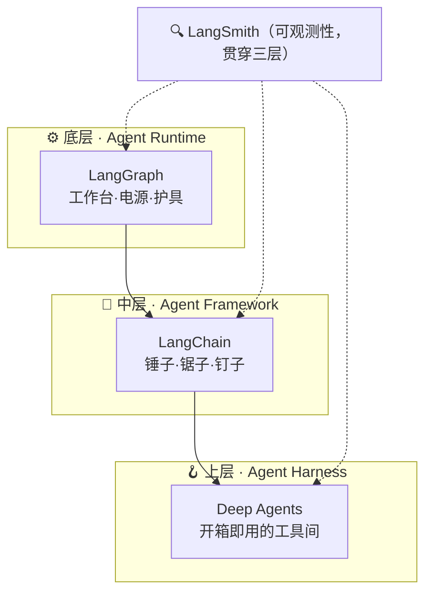
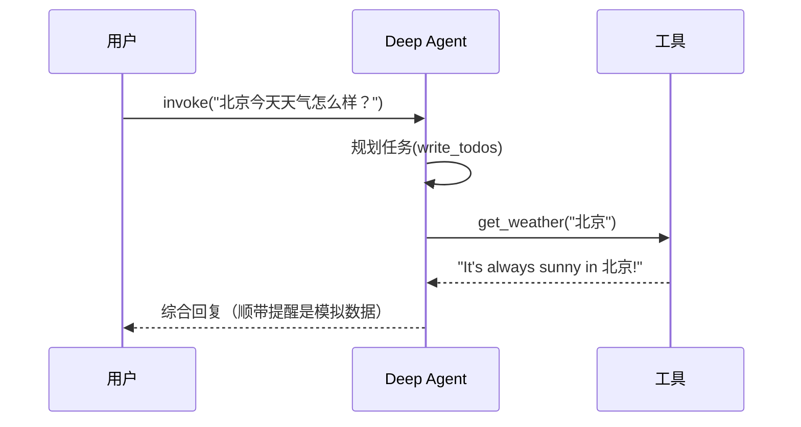

# 🧭 Deep Agents 实战学习笔记（ch01 + ch02）

> 一句话：LangChain 生态从下到上是 **LangGraph（运行时）→ LangChain（框架）→ Deep Agents（Harness）** 三层；ch02 用 5 分钟搭好环境、跑通了三个 Agent，还顺手把搜索从 Tavily 换成了免 Key 的 DuckDuckGo。
---

课程来源：https://datawhalechina.github.io/deepagents-in-action/

## 📌 第一章：从 Framework 到 Harness

### 三层架构怎么串起来的

第一章回答了一个根本问题：框架已经这么多，Deep Agents 为什么还要存在？



| 层次 | 代表 | 核心价值 | 我的理解 |
|---|---|---|---|
| ⚙️ 底层 Runtime | **LangGraph** | 持久化、流式、人机协作、状态管理 | Agent 世界的"操作系统" |
| 🧰 中层 Framework | **LangChain** | 模型抽象、工具接口、Agent 循环、中间件 | 在 LangGraph 之上包了一层，更易上手 |
| 🪝 上层 Harness | **Deep Agents** | 预置文件系统、任务规划、子 Agent、长期记忆 | 直接给你一个装好的工具间 |

### LangGraph 底层四件事

- 💾 **持久化执行**：跑到一半崩了，能从断点恢复
- 🌊 **流式输出**：实时看到 Agent 的思考和操作
- 🤝 **人机协作（Human-in-the-Loop）**：关键操作前暂停等人工审批
- 🗂️ **状态管理**：跨对话保存上下文

### Deep Agents 直接具备的能力

文件处理、命令控制、文件检索、写工具、子智能体，再加上沙箱、可编程（TS + Python）、本地 + 虚拟文件系统。

> 💡 **核心设计理念：Context Engineering（上下文工程）**
> 传统做法把 20 个文件全塞进 prompt → 上下文溢出、注意力稀释、不可扩展。
> Deep Agents 引入**虚拟文件系统**，让 Agent 像人一样按需 `read_file` / `write_file` / `grep`，上下文里只留当前步骤真正需要的信息。

### 与竞品对比

| 维度 | Deep Agents | Claude Agent SDK | Codex SDK |
|---|---|---|---|
| 模型支持 | 🔓 模型无关（100+） | 绑定 Claude | 绑定 OpenAI |
| 长期记忆 | ✅ 支持 | ❌ | ❌ |
| 虚拟文件系统 | ✅ 可插拔后端 | ❌ | ❌ |
| Sandbox-as-Tool | ✅ 独有 | ❌ | ❌ |

### 🤔 我的思考与疑问

- 中间层 **LangChain 到底是干啥的**？目前理解就是"对 LangGraph 包了一层、把一些类包装起来"，具体细节还要再看。
- 对比**缺少和当下热门 Agent（如各类 Agent SDK）的较量**；Deep Agents 对"工业化"做了强管理，但整体还是**框架式偏复杂**，希望体验下来能有改善。
- 这些能力（沙箱、虚拟文件、TS/Python 编程）感觉**偏通用**，课程里有些东西"应该还没说出来"。

---

## 📌 第二章：5 分钟上手第一个 Deep Agent

### 体验下来：和以前写法区别不大

> 结论先行：Deep Agents 把"工具"抽象出来了，但和 OpenAI Agent SDK、Codex SDK 这些**同质化比较严重**，写法像"两年前的 A 政策（Agent）"，没有特别新。

### 用 ZCode 搭环境（上下文分享）

基本没手动折腾，几句话就搭好了。课程原版用硅基流动，我按自己的需求改成了 **DeepSeek 官方接口**（课程强调的"OpenAI 兼容接口"方法，换个 URL + Key 就行）：

```python
from langchain_openai import ChatOpenAI
from deepagents import create_deep_agent

model = ChatOpenAI(
    model=os.environ.get("MODEL_NAME", "deepseek-v4-flash"),
    api_key=os.environ["DEEPSEEK_API_KEY"],
    base_url="https://api.deepseek.com/v1",   # 硅基流动则是 api.siliconflow.cn/v1
)

agent = create_deep_agent(
    model=model,
    tools=[get_weather],          # 自定义工具
    system_prompt="You are a helpful assistant.",
)

result = agent.invoke({"messages": [{"role": "user", "content": "北京今天天气怎么样？"}]})
print(result["messages"][-1].content)
```

四步结构很清晰：**注册模型 → 写工具函数 → 注册成工具 → invoke**。

> ⚠️ 小插曲：课程给的硅基流动 Key 我实测是 DeepSeek 官方平台的 Key（硅基流动返回 401），所以直接切到了 `api.deepseek.com`，`deepseek-v4-flash` 模型名验证可用。

### 三个示例都跑通了



1. ☀️ **Hello World 天气 Agent**：一开始以为是真查了服务器天气，结果发现只是写死的 `It's always sunny`，挺逗。
2. 🧮 **计算器 Agent**：`calculate` + `convert_currency`，靠提示词让模型提取要算的东西再执行——本质是"用模型的提取能力"。
3. 🔎 **研究助手**：Tavily 搜索 → 自动联网、多次检索、综合成报告。

### 🔑 自定义工具的三要素

| 要素 | 作用 |
|---|---|
| 📝 参数类型标注 | 告诉 Agent 每个参数该传什么类型 |
| 📖 Docstring | 告诉 Agent 这个工具的用途、何时调用 |
| 🎯 默认值 | 标记可选参数，减少必填、降低出错 |

### 💡 我的建议：Tavily 换 DuckDuckGo

> 如果模型能力不够，研究助手这种多步骤任务可能**还不如以前的 flow 稳定**。另外 Tavily 要申请 Key、有时还搜不到——**推荐用免 Key 的 DuckDuckGo**。

已写好对应脚本 `03b_research_assistant_ddg.py`，只换搜索工具、容错做了兜底（auto→bing→brave 三级后端 + 重试）：

```python
from ddgs import DDGS

def internet_search(query: str, max_results: int = 5):
    """Run a web search for the given query."""
    backends = ["auto", "bing", "brave"]
    for backend in backends:
        for _ in range(2):
            try:
                with DDGS(timeout=20) as ddgs:
                    raw = list(ddgs.text(query, max_results=max_results, backend=backend))
                if raw:
                    return {"query": query, "results": [
                        {"title": r.get("title"), "url": r.get("href"), "content": r.get("body")}
                        for r in raw
                    ]}
            except Exception:
                time.sleep(1)
    return {"query": query, "results": [], "error": "search failed"}
```

运行：

```bash
uv add ddgs                                   # 免 Key
uv run --env-file .env 03b_research_assistant_ddg.py
```

### 🌐 模型接口 API：老生常谈

- 课程讲的是 OpenAI 兼容接口（`base_url` 模式），国内平台通用。
- 现在 OpenAI 最新的接口写法 / 新模式课程**没展开讲**。
- 结论：**主要支持 OpenAI 协议的基本都支持**，切平台就是换 URL + Key。

---

## ✅ 小结

- 🧱 **ch01**：理解了 Runtime → Framework → Harness 三层，Deep Agents 靠虚拟文件系统做 Context Engineering，模型无关 + 长期记忆是相对竞品的差异化。
- 🚀 **ch02**：环境用 uv + ZCode 几分钟搭好，DeepSeek-V4-Flash 跑通三个示例；工具抽象清晰但同质化偏高，建议搜索用免 Key 的 DuckDuckGo。
- 📭 **待办**：LangChain 中间层具体职责、与热门 Agent 的深度对比、OpenAI 最新接口写法——后续章节继续补。

> 代码都在仓库 `ch02/` 目录，`.env` 已配好 DeepSeek + Tavily + DuckDuckGo 三种方案，直接 `uv run` 即可复现。
