# ch03 代码结构关系图（Mermaid）

> 本文档用 Mermaid 画出 ch03 每个 Python 文件的函数、类、变量之间的逻辑关系。
> 配合各文件内的逐行注释阅读效果更佳。

---

## 0. 全局总览：模块依赖关系

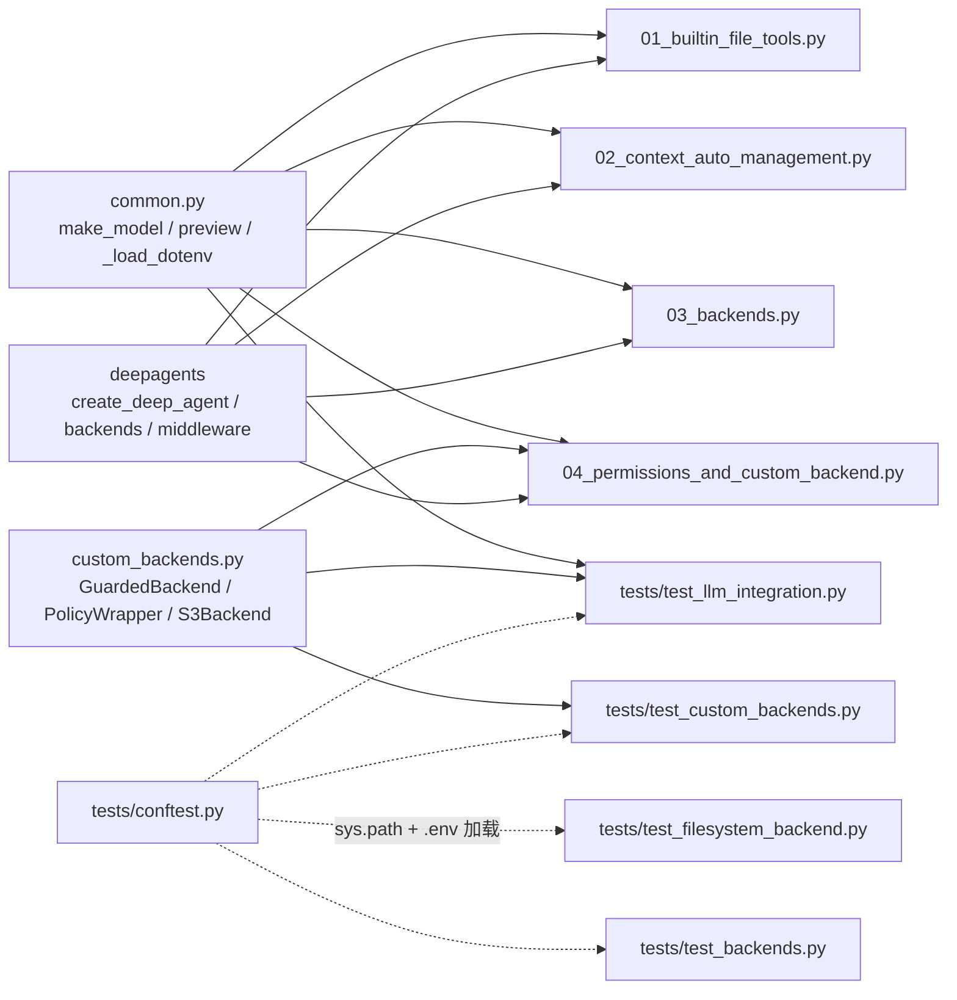

---

## 1. common.py —— 公共配置

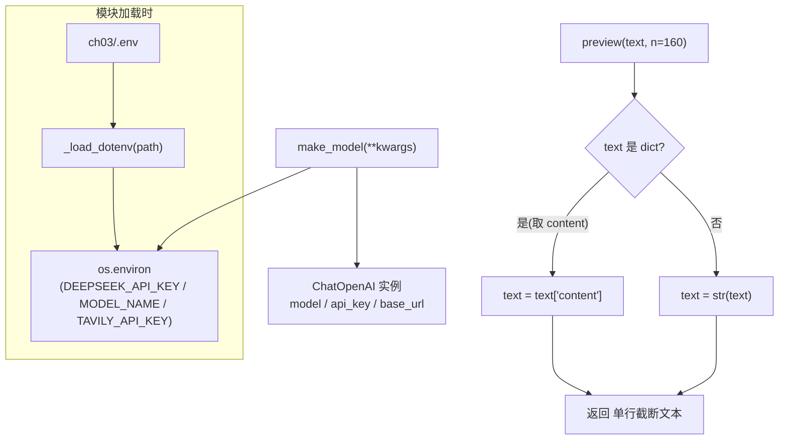

**函数清单**：`_load_dotenv`（.env 解析）、`make_model`（构建 DeepSeek）、`preview`（文本预览）。

---

## 2. custom_backends.py —— 三个自定义后端类

### 2.1 类继承 / 实现关系

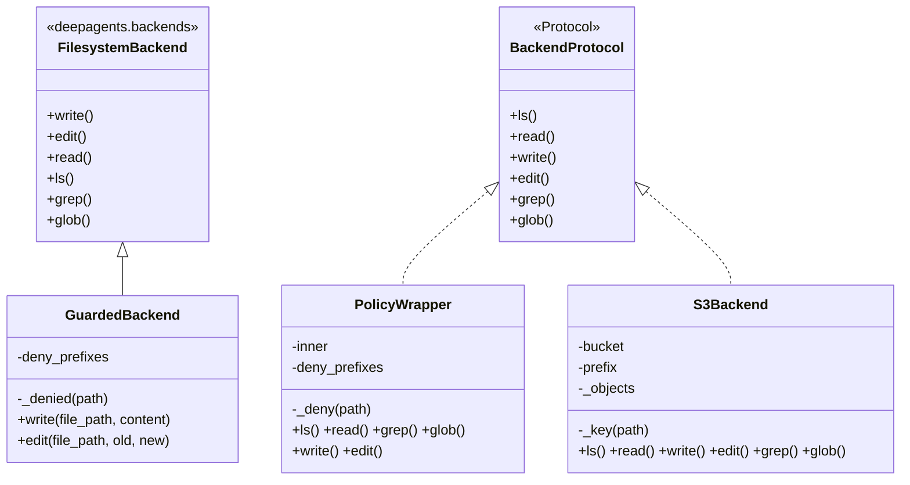

### 2.2 GuardedBackend 调用关系

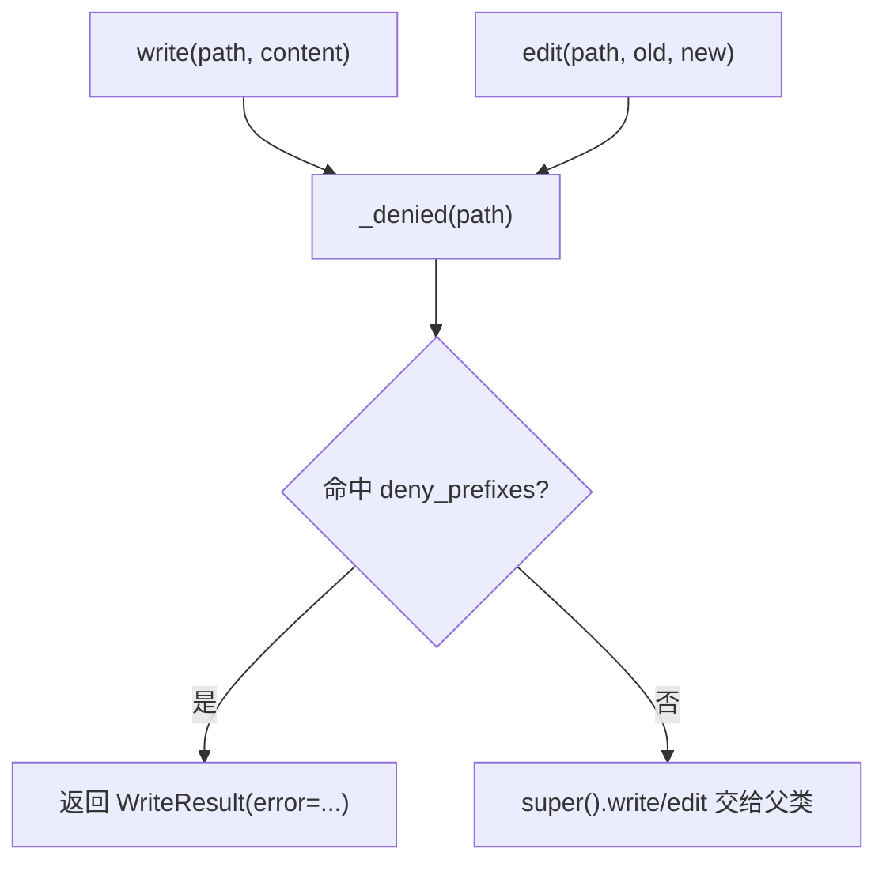

### 2.3 PolicyWrapper 调用关系

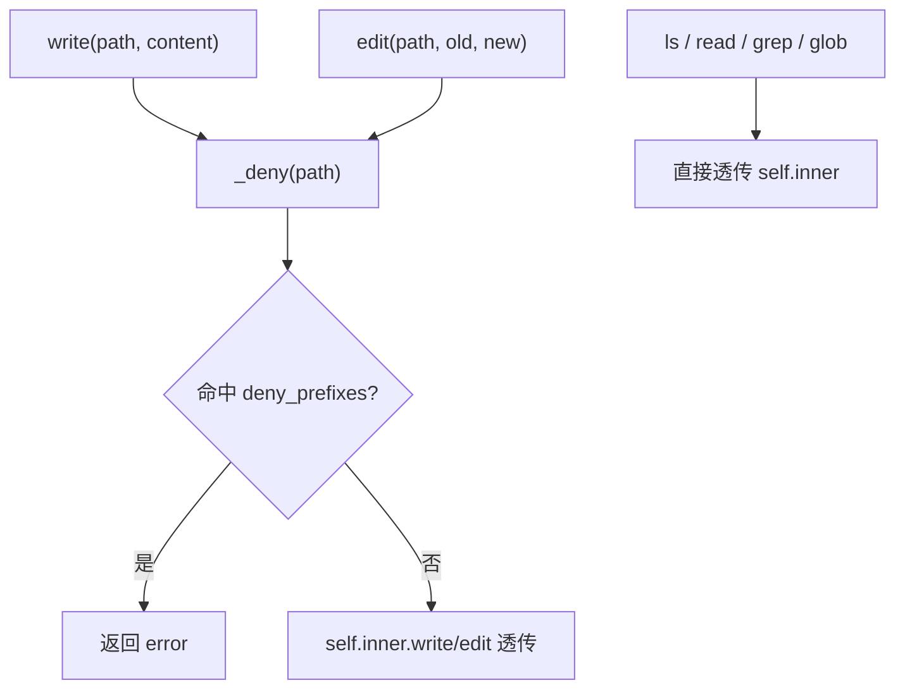

### 2.4 S3Backend 调用关系

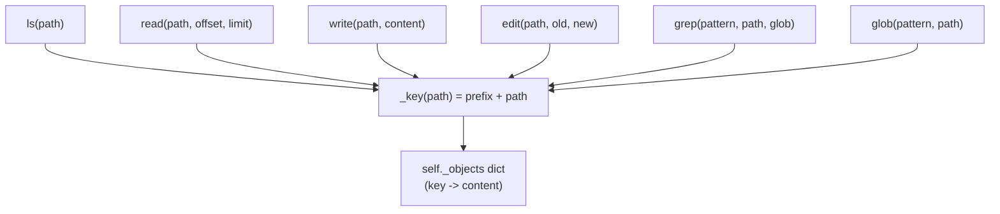

---

## 3. 01_builtin_file_tools.py —— 内置文件工具

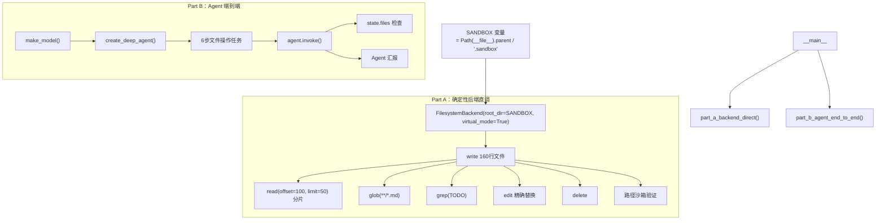

---

## 4. 02_context_auto_management.py —— 上下文自动管理

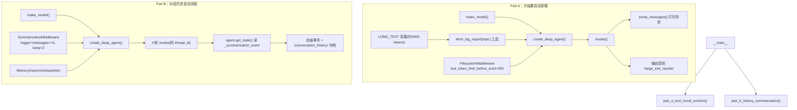

**函数清单**：`dump_messages`（打印历史）、`part_a_tool_result_eviction`、`part_b_history_summarization`。**变量**：`LONG_TEXT`。

---

## 5. 03_backends.py —— 五种存储后端

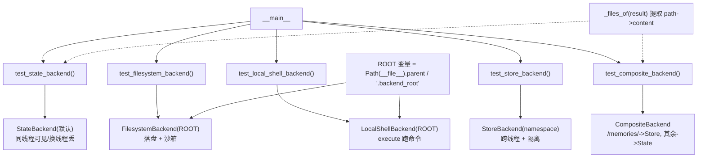

---

## 6. 04_permissions_and_custom_backend.py —— 权限与自定义后端

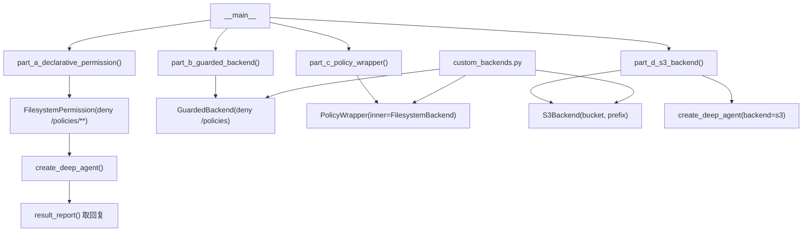

---

## 7. tests/conftest.py —— pytest 全局配置

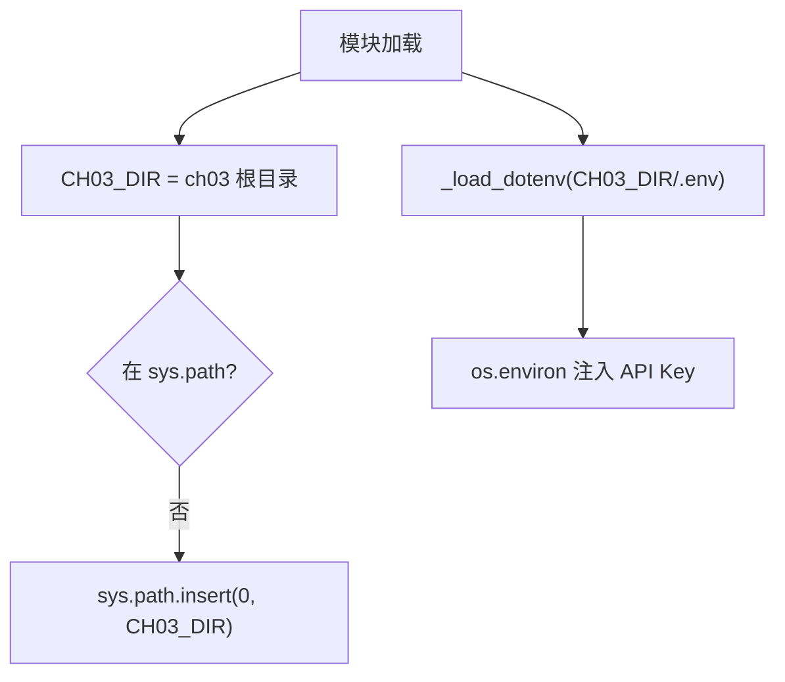

---

## 8. tests/test_filesystem_backend.py —— FilesystemBackend 单测

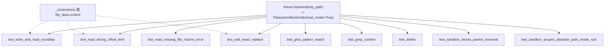

---

## 9. tests/test_backends.py —— Shell/Store/Composite 单测

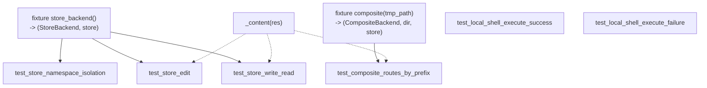

---

## 10. tests/test_custom_backends.py —— 自定义后端单测

```mermaid
flowchart TD
    helper["_content(res)"]
    fx1["fixture s3() -> S3Backend"]
    fx2["fixture guarded() -> GuardedBackend"]
    fx3["fixture wrapped() -> PolicyWrapper"]

    fx1 --> s1["test_s3_write_read"]
    fx1 --> s2["test_s3_read_missing"]
    fx1 --> s3["test_s3_ls"]
    fx1 --> s4["test_s3_glob"]
    fx1 --> s5["test_s3_grep"]
    fx1 --> s6["test_s3_edit"]
    fx1 --> s7["test_s3_edit_ambiguous"]

    fx2 --> g1["test_guarded_allows_normal"]
    fx2 --> g2["test_guarded_denies_write"]
    fx2 --> g3["test_guarded_denies_edit"]

    fx3 --> w1["test_wrapper_allows_normal"]
    fx3 --> w2["test_wrapper_denies"]
    fx3 --> w3["test_wrapper_passthrough_other_methods"]

    helper -.-> s1
    helper -.-> s6
    helper -.-> w1
```

---

## 11. tests/test_llm_integration.py —— LLM 集成测试

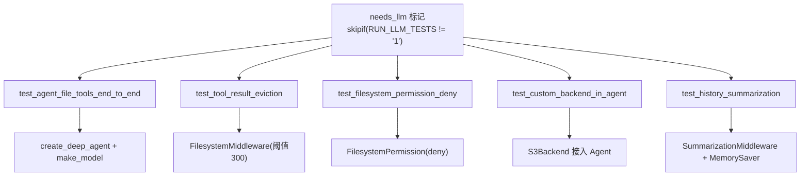

---

## 附：关系图说明

| 图元素 | 含义 |
|---|---|
| `A --> B` 实线箭头 | A 调用 / 依赖 B |
| `A -.-> B` 虚线箭头 | 间接依赖 / 配置注入 |
| `subgraph` | 逻辑分组（模块内 / 函数内） |
| `classDiagram` 空心箭头 `<|..` | 实现协议 |
| `classDiagram` 实心箭头 `<|--` | 继承父类 |
| 菱形 `{...}` | 条件判断 |
