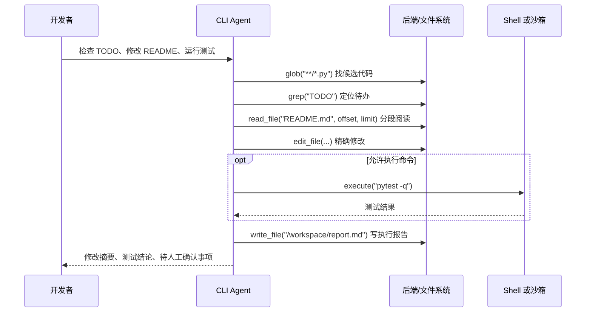
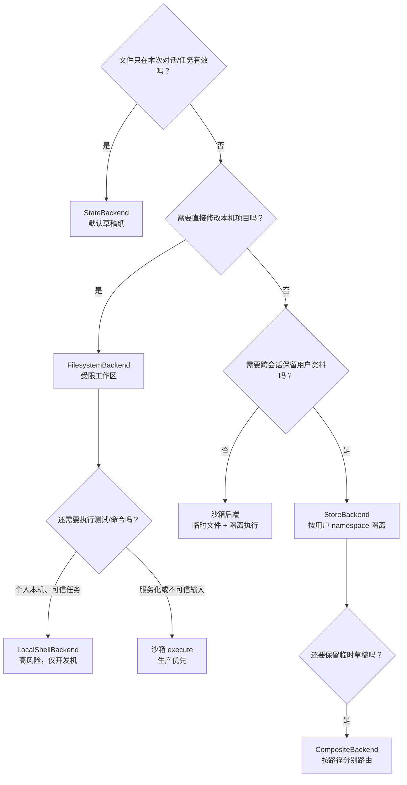
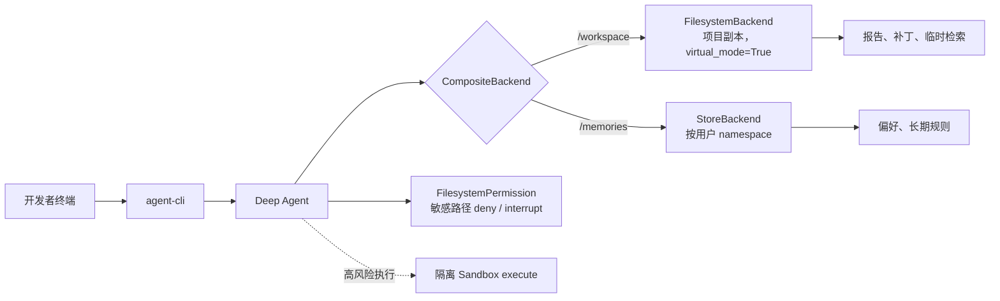
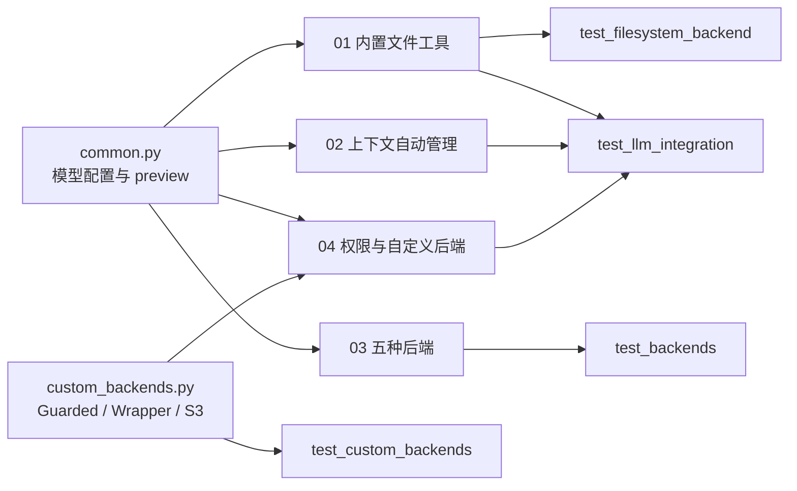

# 当 Agent 开始“管理文件”：用 CLI 实战看懂 Deep Agents 的虚拟文件系统与后端选择

> **先说结论：**虚拟文件系统不是“让 Agent 能读写文件”这么简单；它是在给 Agent 配一张可检索、可分区、可回溯的工作台。真正决定这张工作台适不适合你的，是后端：临时草稿用 `StateBackend`，本地 CLI 写项目用 `FilesystemBackend`，需要跑命令才考虑 `LocalShellBackend`，跨会话记忆用 `StoreBackend`，而一套产品里往往用 `CompositeBackend` 把它们组合起来。

这篇笔记以“做一个本地 CLI 编程助手”为主线，补上原教程中容易停留在概念层的部分：不同后端具体解决什么问题、何时不该使用、怎样从源码和测试验证它们的行为。文末把本章全部可运行案例、测试和 Mermaid 关系图汇总成一条学习路径。

本文基于《Deep Agents 实战》第 3 章“虚拟文件系统”的概念与配套案例重新组织，独立阅读无需访问原仓库。

---

## 先代入一个真实需求：做一个 CLI 编程助手

假设我们正在做 `agent-cli`。用户在终端输入：

```bash
agent-cli "检查这个 Python 项目的 TODO，修正 README 的安装步骤，最后运行测试"
```

这个任务里，Agent 并不需要把整个仓库、所有搜索结果和每一条命令输出一次性塞进 prompt。更合理的工作流是：



这里有两个很容易混在一起的概念：

| 层次 | 回答的问题 | 在 CLI 中的例子 |
|---|---|---|
| 文件工具 | Agent **能做什么**？ | 列目录、读一段文件、搜索 TODO、精确替换 |
| Backend（后端） | 文件**存在哪里、能否跨会话、是否能碰到真实磁盘**？ | 写到 Agent State、本地工作区、Store、对象存储 |
| 权限策略 | 这一次操作**是否允许**？ | 禁止写 `/policies/`；改 `package.json` 前要求人工批准 |
| 执行环境 | 命令**在哪里跑、会伤到谁**？ | 宿主机 Shell、隔离沙箱、CI Runner |

一句话记忆：**工具决定动作，后端决定落点，权限决定边界，执行环境决定风险。**

---

## 为什么不直接把内容全塞进 Prompt？

一个小脚本或许可以；一个真实仓库、研究任务或客服知识库很快就不行了。把材料全塞给模型会带来三件事：上下文成本持续上涨、关键信息被噪声稀释、超出窗口后没有可靠的回溯方式。

虚拟文件系统把资料变成“按需拿取”的外部工作记忆。Agent 可以先 `grep` 定位，再 `read_file` 分片打开，最后把中间产物写到文件中。它更像开发者的目录、检索工具和草稿，而不是一块无限长的聊天记录。

本章中还有两道自动保险：

1. 工具调用输入或输出超过阈值时，完整结果会卸载进虚拟文件；对话里只保留路径和预览。案例为了可观察，把阈值降到 `300 tokens`，实际默认阈值是 `20,000 tokens`。
2. 上下文接近模型窗口时，系统会总结较早对话，同时归档完整历史；模型继续拿“摘要 + 最近消息”工作，需要细节再读归档。

对 CLI 来说，这意味着一次 `git diff`、依赖扫描或搜索结果再大，也不必把后续推理空间全部挤掉。

---

## 七个工具：把它们当作 CLI 的“文件操作语言”

| 工具 | CLI 助手通常何时调用 | 关键实践 |
|---|---|---|
| `ls` | 用户说“看看项目有什么” | 先理解目录，再决定检索范围 |
| `glob` | 找所有 Python、测试或 Markdown 文件 | 适合“按文件名/扩展名找” |
| `grep` | 找 TODO、配置项、函数名、错误文本 | 适合“按内容找”；先文件级，再看命中行 |
| `read_file` | 阅读 README、报错日志、大文件 | 使用 `offset` / `limit` 分片，避免整文件进上下文 |
| `write_file` | 新建报告、迁移脚本、草稿文件 | 对产物写入目录做隔离 |
| `edit_file` | 精准改一处配置或文案 | 用完整旧字符串替换，匹配多处时应拒绝或显式全量替换 |
| `delete` | 删除 Agent 自己生成的临时文件 | 生产环境应纳入审批/审计 |

`glob` 和 `grep` 的差别尤其值得记住：

```text
“所有 Markdown 文件在哪里？”        → glob("**/*.md")
“哪份文件写了 TODO？”              → grep("TODO", glob="**/*.md")
“第 100 行到第 150 行是什么？”      → read_file(path, offset=100, limit=50)
```

这是一条很稳定的 Agent 检索策略：**先窄化范围（glob）→ 再定位内容（grep）→ 最后分片阅读（read）**。它比“把整个目录读出来”更省 token，也更容易做出可解释的操作记录。

---

## 选择后端，不要只看“能不能写文件”

### 一张决策图



### 五种常见后端，落到具体应用

| 后端 | 真实落点与生命周期 | 最适合的应用 | 不适合什么 | CLI 示例 |
|---|---|---|---|---|
| `StateBackend`（默认） | LangGraph Agent State；同一线程可见，换线程丢失 | 学习、一次性任务、推理草稿 | 用户长期偏好、需要交付给人类的真实文件 | 生成本次排查计划和临时检索结果 |
| `FilesystemBackend` | 本地磁盘；写入会持久保存 | 本地编程助手、受控 CI 工作区、文档批处理 | Web 服务直接暴露给外部用户 | 在仓库副本中改 README、生成报告 |
| `LocalShellBackend` | 本地磁盘 + 宿主机 `shell=True` | 个人开发机上可信的代码助手 | 生产环境、多用户系统、处理不可信输入 | `pytest -q`、格式化、Git 状态检查 |
| `StoreBackend` | LangGraph Store；跨线程持久 | 用户偏好、长期知识、跨会话任务档案 | 临时大产物、需要真实项目文件的场景 | 记住“该用户习惯使用 pytest” |
| `CompositeBackend` | 根据路径把数据路由到多个后端 | 真正的产品：临时工作区 + 长期记忆共存 | 只有一个简单生命周期的小脚本 | `/workspace/` 临时，`/memories/` 持久 |

### 1）StateBackend：最适合“先让 Agent 把事情想明白”

默认后端无需配置：

```python
from deepagents import create_deep_agent

agent = create_deep_agent(model=model)  # 默认 StateBackend
```

把它理解为**同一任务线程里的草稿纸**。例如 Agent 可以写 `/workspace/plan.md`、`/workspace/todo_hits.md`，在本轮多步推理中反复读取，但任务结束或换一个线程后不要指望它还在。

它很适合 CLI 的默认模式：先规划、搜索、归纳，不对用户仓库做永久修改。优点是零配置、默认安全性较高；代价是不能承担“长期记忆”职责。

### 2）FilesystemBackend：让 CLI 真正操作一个受控项目目录

```python
from deepagents.backends import FilesystemBackend

backend = FilesystemBackend(
    root_dir="./safe-workspace",  # 专门的工作副本，不要直接给用户主目录
    virtual_mode=True,            # 路径沙箱：必须开启
)
agent = create_deep_agent(model=model, backend=backend)
```

这是“本地编码助手”最直观的选择：文件真的落盘，测试/用户/IDE 都看得到。第一个案例直接证明了三件事：`report.md` 写入真实沙箱目录；`read(offset=100, limit=50)` 只取第 101–150 行；`../../evil.txt` 会被拒绝。

不过要注意一条反直觉的细节：只有 `root_dir` **不等于**安全沙箱。必须开启 `virtual_mode=True`，否则路径依然可能越界。即使开启了它，也不应让 Agent 可读目录中存在 `.env`、私钥和生产凭证。

### 3）LocalShellBackend：不是“更强的 Filesystem”，而是更危险的能力

```python
from deepagents.backends import LocalShellBackend

backend = LocalShellBackend(
    root_dir="./safe-workspace",
    virtual_mode=True,
    inherit_env=False,  # 尽量不继承宿主机环境变量
    env={"PATH": "/usr/bin:/bin"},
)
```

它比 `FilesystemBackend` 多出 `execute`。对 CLI 而言，这正好满足“改完代码就跑测试”的闭环；本章确定性测试覆盖了命令成功和非零退出码两种情况。

但它执行的是宿主机 Shell，不是隔离容器。`virtual_mode=True` 只约束文件工具的路径，**不能把 Shell 命令锁在根目录中**。所以它只适合个人开发机、完全可信的任务；服务化产品、用户上传代码或多租户场景，应使用后续沙箱章节的执行后端。

### 4）StoreBackend：把“记住”与“改文件”分开

```python
from deepagents.backends import StoreBackend
from langgraph.store.memory import InMemoryStore

namespace = lambda rt: (
    (rt.server_info.user.identity,)
    if getattr(rt, "server_info", None)
    else ("local-user",)  # 本地演示兜底
)
backend = StoreBackend(namespace=namespace, store=InMemoryStore())
```

它适合存“这个用户习惯什么”“上一次已确认哪些约束”“长期知识库索引”等跨会话资料。核心不是 `InMemoryStore`（它只适合本地演示），而是**namespace 必须按用户/租户隔离**。不隔离，A 用户可能读到 B 用户的记忆，这比“忘记记忆”严重得多。

### 5）CompositeBackend：产品常用的答案是“分区”，不是“二选一”

```python
from deepagents.backends import CompositeBackend, StateBackend, StoreBackend
from langgraph.store.memory import InMemoryStore

backend = CompositeBackend(
    default=StateBackend(),
    routes={
        "/memories/": StoreBackend(namespace=namespace),
    },
)

agent = create_deep_agent(model=model, backend=backend, store=InMemoryStore())
```

这样约定路径就相当于约定数据生命周期：

```text
/workspace/plan.md             → StateBackend：本轮任务的草稿
/workspace/search-results.md   → StateBackend：大结果临时卸载
/memories/style.md              → StoreBackend：跨会话的用户偏好
```

这很适合一个可持续使用的 CLI：每次命令的中间物自动消失，但用户的显式偏好、已确认规则长期保留。案例测试同时验证了默认路径会落盘（替换为 FilesystemBackend 时）而 `/mem/` 路径不会落到本地、却能从 Store 读回。

---

## 一套推荐的 CLI 分层方案

如果现在要实现前面的 `agent-cli`，我会从以下安全边界开始：



推荐的分阶段落地方式：

1. **只读诊断期**：`StateBackend`，只允许 `ls/glob/grep/read_file`，先输出“将修改哪些文件”。
2. **受控写入期**：切到工作副本上的 `FilesystemBackend`，开启 `virtual_mode=True`；敏感路径用 `FilesystemPermission(mode="interrupt")` 审批。
3. **执行验证期**：不要直接把本机 Shell 暴露给不可信请求；在隔离沙箱运行测试、格式化和依赖安装。
4. **长期使用期**：加 `StoreBackend` 记录用户明确授权保存的偏好，再用 `CompositeBackend` 将临时与长期数据分开。

---

## 从案例代码理解：不是 API 清单，而是一组可验证的行为

### 案例 01：文件工具 + 路径沙箱

对应源码文件：`01_builtin_file_tools.py`（完整代码已收录在文末）

核心的无 LLM 验证如下。它优先验证确定性行为，再让模型做端到端工具调度；这也是写 Agent 案例时很值得复用的测试分层。

```python
from pathlib import Path
from deepagents.backends import FilesystemBackend

sandbox = Path(__file__).parent / ".sandbox"
backend = FilesystemBackend(root_dir=str(sandbox), virtual_mode=True)

content = "\n".join(
    f"Line {i}: {'TODO: fix this section' if i in (30, 80, 120) else 'routine content'}"
    for i in range(1, 161)
)
assert not backend.write("/workspace/report.md", content).error

page = backend.read("/workspace/report.md", offset=100, limit=50)
assert (page.start_line, page.end_line, page.next_offset) == (101, 150, 150)

assert len(backend.grep("TODO", glob="**/*.md").matches) == 3
assert backend.edit(
    "/workspace/report.md", "Line 30: TODO: fix this section", "Line 30: DONE"
).occurrences == 1
assert len(backend.grep("TODO", glob="**/*.md").matches) == 2

try:
    backend.write("../../evil.txt", "x")
except ValueError:
    print("路径穿越已拦截")
```

### 案例 02：大结果卸载与对话总结

对应源码文件：`02_context_auto_management.py`（完整代码已收录在文末）

```python
from deepagents import create_deep_agent
from deepagents.middleware import FilesystemMiddleware, SummarizationMiddleware
from langgraph.checkpoint.memory import MemorySaver

# 为了让演示容易观察，阈值设为 300；生产中按实际模型窗口与任务调整。
eviction_agent = create_deep_agent(
    model=make_model(),
    tools=[fetch_big_report],
    middleware=[FilesystemMiddleware(tool_token_limit_before_evict=300)],
)

# 同一 thread_id 多轮调用。消息足够多时保留最近两条，其余形成摘要并归档。
summary_agent = create_deep_agent(
    model=make_model(),
    middleware=[SummarizationMiddleware(trigger={"messages": 6}, keep={"messages": 2})],
    checkpointer=MemorySaver(),
)
```

从 CLI 角度看，这两个机制可以理解为：长日志/长搜索结果写入“附件”，聊天区只留摘要；聊得太久则把前半段变成“交接笔记”，原始记录仍可追溯。

### 案例 03：五种后端逐一验证

对应源码文件：`03_backends.py`（完整代码已收录在文末）

案例验证的不是抽象定义，而是各自最关键的差异：

```python
# FilesystemBackend：文件真实落盘
FilesystemBackend(root_dir=str(ROOT), virtual_mode=True)

# LocalShellBackend：多出 execute；只适合可信本地工作区
LocalShellBackend(root_dir=str(ROOT), virtual_mode=True, inherit_env=False)

# StoreBackend：namespace 不同，不能读到彼此的数据
StoreBackend(namespace=lambda rt: ("local-user",), store=InMemoryStore())

# CompositeBackend：/memories/ 走 Store，其余走 State
CompositeBackend(
    default=StateBackend(),
    routes={"/memories/": StoreBackend(namespace=namespace)},
)
```

### 案例 04：权限规则、策略包装器与对象存储后端

对应源码文件：`04_permissions_and_custom_backend.py`；公共实现：`custom_backends.py`（均已收录在文末）

最简单的路径控制是声明式权限：

```python
from deepagents import FilesystemPermission, create_deep_agent

agent = create_deep_agent(
    model=make_model(),
    backend=backend,
    permissions=[
        FilesystemPermission(
            operations=["write"],
            paths=["/policies/**"],
            mode="deny",  # 也可用 interrupt 等待人工审批
        )
    ],
)
```

需要更复杂策略时，可以继承具体后端，或把任意后端包一层：

```python
class PolicyWrapper(BackendProtocol):
    def __init__(self, inner, deny_prefixes):
        self.inner = inner
        self.deny_prefixes = [p.rstrip("/") + "/" for p in deny_prefixes]

    def write(self, file_path, content):
        if any(file_path.startswith(p) for p in self.deny_prefixes):
            return WriteResult(error=f"写入被拒绝：{file_path}")
        return self.inner.write(file_path, content)

    # ls/read/grep/glob 透传；edit 以同样方式拦截
```

若要接 S3、数据库或企业文档库，关键是实现 `BackendProtocol` 的六个方法：`ls`、`read`、`write`、`edit`、`grep`、`glob`。本章的 `S3Backend` 用内存字典模拟对象存储，因此可在没有云凭证的情况下验证完整接口契约。

---

## Mermaid：把源码、概念与测试串起来

下面这张图是本章“从文件到测试”的最短导航。阅读顺序建议是 `common.py → 01~04 脚本 → 对应 tests`，而不是先从一堆后端名词开始背。



结合前面的后端决策图、CLI 调用时序图和这张源码—测试关系图，可以从“为什么需要文件系统”一路理解到“后端如何落地、如何验证”。

---

## 如何复现：先跑确定性测试，再跑真实模型

```bash
cd ch03

# 首次建立环境
uv sync

# 28 个确定性测试；不调用模型
uv run pytest -q

# 单独体验案例
uv run 01_builtin_file_tools.py
uv run 02_context_auto_management.py
uv run 03_backends.py
uv run 04_permissions_and_custom_backend.py

# 需要 .env 中配置 DEEPSEEK_API_KEY；会调用真实模型
RUN_LLM_TESTS=1 uv run pytest -q
```

本次整理时，确定性测试结果为：**28 passed，5 skipped**；跳过项是通过 `RUN_LLM_TESTS=1` 才启用的真实 DeepSeek 集成测试。把“后端语义是否正确”和“模型是否稳定调用工具”拆开验证，能显著减少调试 Agent 时的歧义。

---

## 完整案例源码：可脱离仓库阅读

以下收录本章的全部**可运行案例代码**（4 个案例 + 2 个公共依赖）。代码已补充中文教学注释：重点解释配置为什么这样写、每个操作在验证什么、以及安全边界在哪里；复制时按小标题保存为对应文件名即可。测试代码不重复粘贴，前文的测试命令和覆盖范围足以作为复现入口。

> 阅读顺序建议：先看案例 01 的 Part A（无 LLM）确认工具行为，再看案例 03 理解“文件落在哪里”，接着读案例 04 的安全边界，最后阅读案例 02 的上下文自动管理。

### 0. `common.py`：模型配置与输出预览

```python
import os
from pathlib import Path

from langchain_openai import ChatOpenAI


def _load_dotenv(path: Path) -> None:
    """读取简单的 KEY=VALUE .env；不覆盖已存在的环境变量。"""
    # 环境文件不存在时直接跳过，方便把 .env 排除在版本控制外。
    if not path.exists():
        return
    for raw in path.read_text().splitlines():
        line = raw.strip()
        if not line or line.startswith("#") or "=" not in line:
            continue
        # 只按第一个等号切分，避免 value 中带等号时被错误截断。
        key, _, value = line.partition("=")
        key = key.strip()
        if key:
            os.environ.setdefault(key, value.strip().strip('"').strip("'"))


# 模块加载时读取同目录 .env；已有环境变量优先，部署环境可覆盖本地配置。
_load_dotenv(Path(__file__).resolve().parent / ".env")


def make_model(**kwargs) -> ChatOpenAI:
    return ChatOpenAI(
        # 使用 DeepSeek 的 OpenAI 兼容接口；切换提供方通常只需换 URL、模型名和 Key。
        model=os.environ.get("MODEL_NAME", "deepseek-v4-flash"),
        api_key=os.environ["DEEPSEEK_API_KEY"],
        base_url="https://api.deepseek.com/v1",
        **kwargs,
    )


def preview(text, n: int = 160) -> str:
    # ReadResult.file_data 在当前版本可能是 dict，统一抽出真正的文本字段。
    if isinstance(text, dict):
        text = text.get("content", "")
    return str(text).replace("\n", "\\n")[:n]
```

### 1. `01_builtin_file_tools.py`：七个工具、分片读取与路径沙箱

```python
from pathlib import Path

from common import make_model, preview
from deepagents import create_deep_agent
from deepagents.backends import FilesystemBackend

# 所有真实落盘实验都放在专用目录，避免示例污染项目其他文件。
SANDBOX = Path(__file__).parent / ".sandbox"


def part_a_backend_direct():
    # virtual_mode=True 是路径沙箱开关：虚拟绝对路径不会直接写进宿主机根目录。
    backend = FilesystemBackend(root_dir=str(SANDBOX), virtual_mode=True)
    lines = []
    for i in range(1, 161):
        if i in (30, 80, 120):
            lines.append(f"Line {i}: TODO: fix this section")
        elif i == 55:
            lines.append("Line 55: def create_agent(model, tools):")
        else:
            lines.append(f"Line {i}: routine content of the report")

    # 先造一个 160 行文件，方便同时展示分片读取与全文检索。
    assert not backend.write("/workspace/report.md", "\n".join(lines)).error
    print("真实落盘:", (SANDBOX / "workspace" / "report.md").exists())

    # 不传参数时读取全文件；offset=100 表示跳过前 100 行，limit=50 只拿下一页。
    whole = backend.read("/workspace/report.md")
    page = backend.read("/workspace/report.md", offset=100, limit=50)
    print(f"默认读取: {whole.start_line}-{whole.end_line}, total={whole.total_lines}")
    print(f"分片读取: {page.start_line}-{page.end_line}, next={page.next_offset}")
    assert (page.start_line, page.end_line, page.next_offset) == (101, 150, 150)

    # glob 按路径模式找文件，grep 则在文件内容里找关键字。
    print("glob:", backend.glob("**/*.md", path="/").matches)
    print("TODO 命中:", len(backend.grep("TODO", glob="**/*.md").matches or []))
    edited = backend.edit(
        "/workspace/report.md",
        "Line 30: TODO: fix this section",
        "Line 30: DONE",
    )
    assert edited.occurrences == 1
    print("替换后 TODO:", len(backend.grep("TODO", glob="**/*.md").matches or []))

    # delete 演示 Agent 管理自己创建的临时产物；生产环境通常应纳入审批。
    backend.write("/workspace/tmp.txt", "temporary")
    backend.delete("/workspace/tmp.txt")
    print("删除后还在吗:", (SANDBOX / "workspace" / "tmp.txt").exists())

    # 在 virtual_mode 下，/etc/evil.txt 被映射到 SANDBOX/etc/evil.txt，而非真实 /etc。
    backend.write("/etc/evil.txt", "x")
    print("绝对路径仍落在沙箱:", (SANDBOX / "etc" / "evil.txt").exists())
    try:
        backend.write("../../evil.txt", "x")
    except ValueError as exc:
        print("路径穿越已拦截:", exc)


def part_b_agent_end_to_end():
    # 不传 backend 时默认使用 StateBackend，文件只在当前 Agent 线程内保存。
    agent = create_deep_agent(
        model=make_model(),
        system_prompt="你是文件管理助手。严格按用户指令操作，最后用中文简短汇报。",
    )
    task = (
        "请依次完成并汇报每步结果：\n"
        "1. write_file 创建 /workspace/notes.md，内容为三行："
        "'要点A：虚拟文件系统'、'要点B：分片读取'、'要点C：grep检索'\n"
        "2. ls 列出 /workspace\n"
        "3. read_file 读取 /workspace/notes.md\n"
        "4. grep 用 files_with_matches、content、count 三种模式各查一次关键词 '要点'\n"
        "5. edit_file 把 '要点C：grep检索' 改成 '要点C：grep三种模式'\n"
        "6. write_file 创建 /workspace/draft.txt，然后 delete 它"
    )
    # 让模型自己编排七个文件工具；下面直接检查 state.files 验证最终状态。
    result = agent.invoke({"messages": [{"role": "user", "content": task}]})
    for path, meta in (result.get("files") or {}).items():
        content = meta["content"] if isinstance(meta, dict) else meta
        print(path, len(content), preview(content, 60))
    print(result["messages"][-1].content)


if __name__ == "__main__":
    part_a_backend_direct()
    part_b_agent_end_to_end()
```

### 2. `02_context_auto_management.py`：大结果卸载与会话总结

```python
from common import make_model, preview
from deepagents import create_deep_agent
from deepagents.backends import StateBackend
from deepagents.middleware import FilesystemMiddleware, SummarizationMiddleware

# 约 4,000 tokens 的长结果，远超演示阈值 300，用于稳定触发“卸载到文件”。
LONG_TEXT = "\n".join(
    f"# Section {i}\n" + "The quick brown fox jumps over the lazy dog. " * 12
    for i in range(1, 61)
)


def dump_messages(result, tail: int | None = None):
    # 工具输出被卸载后，对话中只会显示路径引用与预览；用此函数观察这一变化。
    messages = result["messages"] if tail is None else result["messages"][-tail:]
    for message in messages:
        content = message.content if isinstance(message.content, str) else str(message.content)
        print(f"[{message.type:^9}] {preview(content, 110)}")


def part_a_tool_result_eviction():
    def fetch_big_report(topic: str) -> str:
        """Fetch a very long research report about the topic."""
        return LONG_TEXT

    agent = create_deep_agent(
        model=make_model(),
        tools=[fetch_big_report],
        middleware=[
            FilesystemMiddleware(
                # 大内容暂存到 StateBackend，任务结束后自然清理。
                backend=StateBackend(),
                # 生产默认阈值更高；这里降低阈值只为使演示一次触发。
                tool_token_limit_before_evict=300,
            )
        ],
    )
    result = agent.invoke({
        "messages": [{
            "role": "user",
            "content": "调用 fetch_big_report 查询 LangGraph，然后只告诉我报告第一节的标题。",
        }]
    })
    dump_messages(result)
    for path, meta in (result.get("files") or {}).items():
        content = meta["content"] if isinstance(meta, dict) else meta
        print(f"{path}: {len(content)} chars")
    print(result["messages"][-1].content)


def part_b_history_summarization():
    from langchain_core.messages import HumanMessage
    from langgraph.checkpoint.memory import MemorySaver

    # checkpointer + 固定 thread_id 才能让多轮调用共享状态并观察总结事件。
    agent = create_deep_agent(
        model=make_model(),
        system_prompt="你是文件助手，严格按指令操作，少说废话。",
        middleware=[
            SummarizationMiddleware(
                model=make_model(),
                backend=StateBackend(),
                # 消息达到 6 条就提前总结；真实项目常按模型窗口比例触发。
                trigger={"messages": 6},
                keep=("messages", 2),
            )
        ],
        checkpointer=MemorySaver(),
    )
    thread = {"configurable": {"thread_id": "ch03-summary-demo"}}
    turns = [
        "用 write_file 创建 /workspace/a.md，内容为 'A计划已启动'，完成后只回我一句收到。",
        "用 write_file 创建 /workspace/b.md，内容为 'B计划已暂停'，完成后只回我一句收到。",
        "用 write_file 创建 /workspace/c.md，内容为 'C计划已完成'，完成后只回我一句收到。",
        "请读取 /workspace/a.md 和 /workspace/b.md，然后回答：B计划当前的状态是什么？只回答状态。",
    ]
    # 必须逐轮调用，不能一次把 turns 全塞进 messages，否则无法观察跨轮状态累积。
    for turn in turns:
        result = agent.invoke({"messages": [HumanMessage(content=turn)]}, config=thread)

    event = (agent.get_state(thread).values or {}).get("_summarization_event")
    print("是否触发总结:", bool(event))
    if event:
        print("归档路径:", event.get("file_path"))
        print("摘要:", preview(str(event["summary_message"].content), 200))
    print("最终回答:", result["messages"][-1].content)


if __name__ == "__main__":
    part_a_tool_result_eviction()
    part_b_history_summarization()
```

### 3. `03_backends.py`：五种存储后端

```python
import shutil
from pathlib import Path

from common import make_model, preview
from deepagents import create_deep_agent
from deepagents.backends import (
    CompositeBackend,
    FilesystemBackend,
    LocalShellBackend,
    StateBackend,
    StoreBackend,
)
from langgraph.checkpoint.memory import MemorySaver
from langgraph.store.memory import InMemoryStore

# Filesystem 与 LocalShell 的所有落盘操作都限制在该演示工作区中。
ROOT = Path(__file__).parent / ".backend_root"


def _files_of(result):
    # StateBackend 的 files 元数据在不同版本中可能是 dict 或文本，先归一化再打印。
    return {
        path: meta["content"] if isinstance(meta, dict) else meta
        for path, meta in (result.get("files") or {}).items()
    }


def test_state_backend():
    # 默认不传 backend 就是 StateBackend；MemorySaver 让不同 thread_id 的差异可见。
    agent = create_deep_agent(
        model=make_model(),
        system_prompt="你是文件助手，少说废话。",
        checkpointer=MemorySaver(),
    )
    # 同一个 thread_id 共享临时文件；换 thread_id 就像换了一张新草稿纸。
    thread_a = {"configurable": {"thread_id": "state-A"}}
    thread_b = {"configurable": {"thread_id": "state-B"}}
    written = agent.invoke({"messages": [{"role": "user", "content": "write_file /workspace/x.md 内容为 '线程A独有'，完成后回我一句。"}]}, config=thread_a)
    reread = agent.invoke({"messages": [{"role": "user", "content": "read_file /workspace/x.md，把内容原样告诉我。"}]}, config=thread_a)
    other_thread = agent.invoke({"messages": [{"role": "user", "content": "read_file /workspace/x.md，如果不存在就告诉我 '不存在'。"}]}, config=thread_b)
    print("线程 A 写入:", _files_of(written).get("/workspace/x.md"))
    print("线程 A 再读:", preview(reread["messages"][-1].content, 60))
    print("线程 B 读取:", preview(other_thread["messages"][-1].content, 60))


def test_filesystem_backend():
    # 每次运行先清空演示目录，确保“真实落盘”的结果不受上次运行影响。
    shutil.rmtree(ROOT, ignore_errors=True)
    ROOT.mkdir(parents=True)
    # root_dir 指定可操作根目录；virtual_mode=True 才会阻止 ../ 越界。
    backend = FilesystemBackend(root_dir=str(ROOT), virtual_mode=True)
    backend.write("/workspace/code.py", "print('hello from agent')\n")
    backend.edit("/workspace/code.py", "hello from agent", "hello from FilesystemBackend")
    print("真实落盘:", (ROOT / "workspace" / "code.py").exists())
    try:
        backend.write("../../escape.txt", "x")
    except ValueError as exc:
        print("路径穿越已拦截:", exc)

    # 这次把同一个磁盘后端交给 Agent，证明模型能读到前面真实写入的文件。
    agent = create_deep_agent(
        model=make_model(),
        system_prompt="你是本地编程助手，按要求操作磁盘文件并汇报。",
        backend=FilesystemBackend(root_dir=str(ROOT), virtual_mode=True),
    )
    result = agent.invoke({"messages": [{"role": "user", "content": "读取 /workspace/code.py 并告诉我它打印什么。"}]})
    print("Agent 读取:", preview(result["messages"][-1].content, 70))


def test_local_shell_backend():
    # LocalShellBackend 增加 execute，但它是在宿主机执行命令，不是安全沙箱。
    shutil.rmtree(ROOT, ignore_errors=True)
    ROOT.mkdir(parents=True)
    # inherit_env=False 避免把大量宿主机环境变量（可能包含凭证）传给命令。
    backend = LocalShellBackend(root_dir=str(ROOT), virtual_mode=True, inherit_env=False)
    response = backend.execute("echo shell-ok && python3 -c 'print(1+2)'")
    print("直接执行:", response.exit_code, preview(response.output, 60))

    agent = create_deep_agent(
        model=make_model(),
        system_prompt="你是本地助手，可以用 execute 运行命令，操作完汇报。",
        backend=LocalShellBackend(root_dir=str(ROOT), virtual_mode=True, inherit_env=False),
    )
    result = agent.invoke({"messages": [{"role": "user", "content": "用 execute 运行命令 `echo langchain-ch03`，把输出告诉我。"}]})
    print("Agent 执行:", preview(result["messages"][-1].content, 70))


def test_store_backend():
    # InMemoryStore 仅用于本地示例；部署时应使用平台提供或持久化的 Store。
    store = InMemoryStore()
    # namespace 是多租户隔离边界：不同用户即使读同一路径，也不会拿到同一份数据。
    namespace = lambda rt: (rt.server_info.user.identity,) if getattr(rt, "server_info", None) else ("local-user",)
    agent = create_deep_agent(
        model=make_model(),
        system_prompt="你是记忆助手，少说废话。",
        backend=StoreBackend(namespace=namespace),
        store=store,
        checkpointer=MemorySaver(),
    )
    agent.invoke({"messages": [{"role": "user", "content": "write_file /memories/pref.txt 内容为 '用户偏好：简洁中文回答'。"}]}, config={"configurable": {"thread_id": "store-A"}})
    result = agent.invoke({"messages": [{"role": "user", "content": "read_file /memories/pref.txt，把内容原样告诉我。"}]}, config={"configurable": {"thread_id": "store-B"}})
    print("跨线程读取:", preview(result["messages"][-1].content, 80))

    # 用同一个 store、不同 namespace 读取，验证隔离来自命名空间而非“碰巧没写入”。
    other_user = create_deep_agent(
        model=make_model(),
        backend=StoreBackend(namespace=lambda rt: ("other-user",)),
        store=store,
        checkpointer=MemorySaver(),
    )
    isolated = other_user.invoke({"messages": [{"role": "user", "content": "read_file /memories/pref.txt，若不存在就说 '不存在'。"}]}, config={"configurable": {"thread_id": "store-C"}})
    print("另一用户读取:", preview(isolated["messages"][-1].content, 80))


def test_composite_backend():
    # 组合后端把“短期草稿”和“长期记忆”用路径前缀隔开，实际产品最常见。
    store = InMemoryStore()
    namespace = lambda rt: (rt.server_info.user.identity,) if getattr(rt, "server_info", None) else ("local-user",)
    backend = CompositeBackend(
        default=StateBackend(),
        routes={"/memories/": StoreBackend(namespace=namespace)},
    )
    agent = create_deep_agent(
        model=make_model(), backend=backend, store=store, checkpointer=MemorySaver()
    )
    # /workspace/ 走默认 StateBackend；/memories/ 命中 routes，转给 StoreBackend。
    result = agent.invoke({"messages": [{"role": "user", "content": "write_file /workspace/draft.md 内容 '临时草稿'；write_file /memories/keep.txt 内容 '长期记忆'；说明两者分别去哪种存储。"}]}, config={"configurable": {"thread_id": "composite-1"}})
    print("state.files 含草稿:", "/workspace/draft.md" in (result.get("files") or {}))
    print("state.files 含记忆:", "/memories/keep.txt" in (result.get("files") or {}))
    print("Agent 汇报:", preview(result["messages"][-1].content, 140))


if __name__ == "__main__":
    test_state_backend()
    test_filesystem_backend()
    test_local_shell_backend()
    test_store_backend()
    test_composite_backend()
```

### 4. `custom_backends.py`：拦截器与模拟 S3 后端

```python
import fnmatch

from deepagents.backends import FilesystemBackend
from deepagents.backends.protocol import (
    BackendProtocol, EditResult, GlobResult, GrepResult,
    LsResult, ReadResult, WriteResult,
)


class GuardedBackend(FilesystemBackend):
    def __init__(self, *, deny_prefixes: list[str], **kwargs):
        super().__init__(**kwargs)
        # 统一补 /，避免 /policy 意外匹配到 /policies 之外的相似路径。
        self.deny_prefixes = [p if p.endswith("/") else p + "/" for p in deny_prefixes]

    def _denied(self, file_path: str) -> bool:
        return any(file_path.startswith(prefix) for prefix in self.deny_prefixes)

    def write(self, file_path: str, content: str) -> WriteResult:
        # 在后端层直接返回 error；真正的写入不会发生。
        if self._denied(file_path):
            return WriteResult(error=f"写入被拒绝：{file_path}")
        return super().write(file_path, content)

    def edit(self, file_path, old_string, new_string, replace_all=False) -> EditResult:
        if self._denied(file_path):
            return EditResult(error=f"编辑被拒绝：{file_path}")
        return super().edit(file_path, old_string, new_string, replace_all)


class PolicyWrapper(BackendProtocol):
    def __init__(self, inner: BackendProtocol, deny_prefixes: list[str]):
        # 包装器不关心内层是本地磁盘、Store 还是自定义后端，因此策略可复用。
        self.inner = inner
        self.deny_prefixes = [p if p.endswith("/") else p + "/" for p in deny_prefixes]

    def _deny(self, path: str) -> bool:
        return any(path.startswith(prefix) for prefix in self.deny_prefixes)

    # 只读操作透传；这里的策略仅限制 write/edit。
    def ls(self, path): return self.inner.ls(path)
    def read(self, file_path, offset=0, limit=2000): return self.inner.read(file_path, offset=offset, limit=limit)
    def grep(self, pattern, path=None, glob=None): return self.inner.grep(pattern, path, glob)
    def glob(self, pattern, path="/"): return self.inner.glob(pattern, path)

    def write(self, file_path: str, content: str) -> WriteResult:
        if self._deny(file_path):
            return WriteResult(error=f"写入被拒绝：{file_path}")
        return self.inner.write(file_path, content)

    def edit(self, file_path, old_string, new_string, replace_all=False) -> EditResult:
        if self._deny(file_path):
            return EditResult(error=f"编辑被拒绝：{file_path}")
        return self.inner.edit(file_path, old_string, new_string, replace_all)


class S3Backend(BackendProtocol):
    """以 dict 模拟对象存储；生产时把 _objects 换成 S3 SDK 调用即可。"""
    def __init__(self, bucket: str, prefix: str = ""):
        self.bucket = bucket
        self.prefix = prefix.rstrip("/")
        self._objects: dict[str, str] = {}

    def _key(self, path: str) -> str:
        # 对外仍暴露 /docs/a.md；内部加 prefix 后才是对象存储里的真实 key。
        return (self.prefix + path).lstrip("/")

    def ls(self, path: str) -> LsResult:
        # 对象存储没有真实目录；这里通过 key 前缀和第一段路径模拟“列目录”。
        base = self._key(path).rstrip("/")
        entries = {}
        for key in self._objects:
            rel = key[len(base):].lstrip("/") if base and key.startswith(base) else key
            if rel:
                head = rel.split("/", 1)[0]
                entries[head] = {"path": f"{path.rstrip('/')}/{head}", "is_dir": "/" in rel}
        return LsResult(entries=list(entries.values()))

    def read(self, file_path: str, offset: int = 0, limit: int = 2000) -> ReadResult:
        key = self._key(file_path)
        if key not in self._objects:
            return ReadResult(error=f"File not found: {file_path}")
        lines = self._objects[key].splitlines()
        # 用行切片实现与内置文件后端相同的分片读取语义。
        chunk = lines[offset: offset + limit]
        return ReadResult(
            file_data={"content": "\n".join(chunk), "encoding": "utf-8"},
            total_lines=len(lines),
            start_line=offset + 1 if chunk else None,
            end_line=offset + len(chunk) if chunk else None,
            next_offset=offset + limit if offset + limit < len(lines) else None,
        )

    def write(self, file_path: str, content: str) -> WriteResult:
        self._objects[self._key(file_path)] = content
        return WriteResult(path=file_path)

    def edit(self, file_path, old_string, new_string, replace_all=False) -> EditResult:
        key = self._key(file_path)
        if key not in self._objects:
            return EditResult(error=f"File not found: {file_path}")
        count = self._objects[key].count(old_string)
        if count == 0:
            return EditResult(error=f"String not found in {file_path}")
        # 匹配到多处却没有明确 replace_all 时拒绝，避免 Agent “改错位置”。
        if count > 1 and not replace_all:
            return EditResult(error=f"String appears {count} times; pass replace_all=True or be more specific")
        self._objects[key] = self._objects[key].replace(old_string, new_string, -1 if replace_all else 1)
        return EditResult(path=file_path, occurrences=count if replace_all else 1)

    def grep(self, pattern: str, path: str | None = None, glob: str | None = None) -> GrepResult:
        base, matches = (self._key(path).rstrip("/") if path else ""), []
        for key, content in self._objects.items():
            if base and not key.startswith(base):
                continue
            if glob and not fnmatch.fnmatch(key.rsplit("/", 1)[-1], glob):
                continue
            # 保留 1 起始行号，让 Agent 能把命中位置讲清楚。
            for line, text in enumerate(content.splitlines(), 1):
                if pattern in text:
                    matches.append({"path": "/" + key.lstrip("/"), "line": line, "text": text})
        return GrepResult(matches=matches)

    def glob(self, pattern: str, path: str = "/") -> GlobResult:
        base, matches = self._key(path).rstrip("/"), []
        for key in self._objects:
            rel = key[len(base):].lstrip("/") if base and key.startswith(base) else key
            if fnmatch.fnmatch(rel, pattern) or fnmatch.fnmatch("/" + rel, pattern):
                matches.append({"path": "/" + key.lstrip("/"), "is_dir": False})
        return GlobResult(matches=matches)
```

### 5. `04_permissions_and_custom_backend.py`：声明式权限与自定义后端接入

```python
import shutil
from pathlib import Path

from common import make_model, preview
from custom_backends import GuardedBackend, PolicyWrapper, S3Backend
from deepagents import create_deep_agent
from deepagents.backends import FilesystemBackend
from deepagents.middleware import FilesystemPermission


def part_a_declarative_permission():
    # 声明式权限无需改后端实现；规则在文件工具执行前匹配。
    agent = create_deep_agent(
        model=make_model(),
        system_prompt="你是文件助手，严格按指令操作并汇报每一步是否成功。",
        permissions=[
            FilesystemPermission(
                # deny 是立即拒绝；敏感但可批准的路径可改用 mode="interrupt"。
                operations=["write"], paths=["/policies/**"], mode="deny"
            )
        ],
    )
    # 让 Agent 同时写普通路径和受保护路径，便于从最终汇报观察规则是否生效。
    result = agent.invoke({"messages": [{"role": "user", "content": "依次 write_file /workspace/note.md 内容 '普通笔记'；write_file /policies/rule.md 内容 '机密政策'；说明哪一步被拒绝。"}]})
    print(preview(result["messages"][-1].content, 400))


def part_b_guarded_backend():
    # 继承式方案：适合只想在某一种具体后端上补一小段固定策略。
    root = Path(__file__).parent / ".guard_root"
    shutil.rmtree(root, ignore_errors=True)
    backend = GuardedBackend(deny_prefixes=["/policies"], root_dir=str(root), virtual_mode=True)
    print("普通写入:", backend.write("/workspace/ok.md", "ok").error)
    print("受保护写入:", backend.write("/policies/x.md", "no").error)


def part_c_policy_wrapper():
    # 包装式方案：策略与存储实现解耦，换内层后端时无需重写权限判断。
    root = Path(__file__).parent / ".wrap_root"
    shutil.rmtree(root, ignore_errors=True)
    wrapped = PolicyWrapper(
        inner=FilesystemBackend(root_dir=str(root), virtual_mode=True),
        deny_prefixes=["/policies"],
    )
    wrapped.write("/workspace/ok.md", "ok")
    print("普通读取:", preview(wrapped.read("/workspace/ok.md").file_data, 30))
    print("受保护写入:", wrapped.write("/policies/x.md", "no").error)


def part_d_s3_backend():
    # 这里不用云凭证：先以内存 dict 验证 BackendProtocol 的完整交互契约。
    s3 = S3Backend(bucket="demo", prefix="agent/")
    s3.write("/docs/a.md", "# A\n# TODO: review\nhello world")
    s3.write("/docs/b.md", "# B\nnothing here")
    print("ls:", s3.ls("/docs").entries)
    print("glob:", s3.glob("**/*.md").matches)
    print("grep:", s3.grep("TODO", glob="*.md").matches)
    # edit 仍是“读取—精确替换—写回”的语义，和磁盘后端一致。
    s3.edit("/docs/a.md", "hello world", "hello s3")

    # 将自定义后端直接传入 Agent；只要实现六方法，Agent 无需知道底层是 S3。
    agent = create_deep_agent(
        model=make_model(),
        system_prompt="你是对象存储助手，用文件工具查询 /docs 下的文件并汇报。",
        backend=s3,
    )
    result = agent.invoke({"messages": [{"role": "user", "content": "用 grep 在 /docs 下搜索关键词 'TODO'，告诉我出现在哪个文件的第几行。"}]})
    print("Agent 回答:", preview(result["messages"][-1].content, 160))


if __name__ == "__main__":
    part_a_declarative_permission()
    part_b_guarded_backend()
    part_c_policy_wrapper()
    part_d_s3_backend()
```

---

## 最后，把选择原则压缩成四句话

1. **先用 StateBackend 把任务跑通**：它是 Agent 的草稿纸，不是数据库。
2. **本地 CLI 操作项目时，用 FilesystemBackend + `virtual_mode=True`**：工作区应是专门副本，不能包含敏感凭证。
3. **需要执行命令，不等于该用 LocalShellBackend**：个人可信机器可以；服务化和不可信输入必须转向隔离沙箱。
4. **产品要同时有“短记忆”和“长记忆”时，用 CompositeBackend**：把临时工作区与按用户隔离的长期 Store 用路径分开。

虚拟文件系统的价值，不是多了七个工具，而是让 Agent 的上下文、状态、安全边界和可验证产物都拥有了明确的“存放位置”。当它从聊天机器人走向 CLI、编码助手或长期服务时，这个边界就是可靠性的起点。
