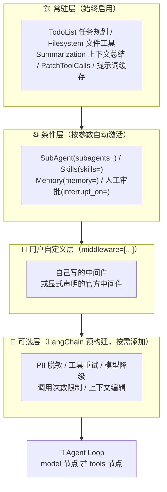
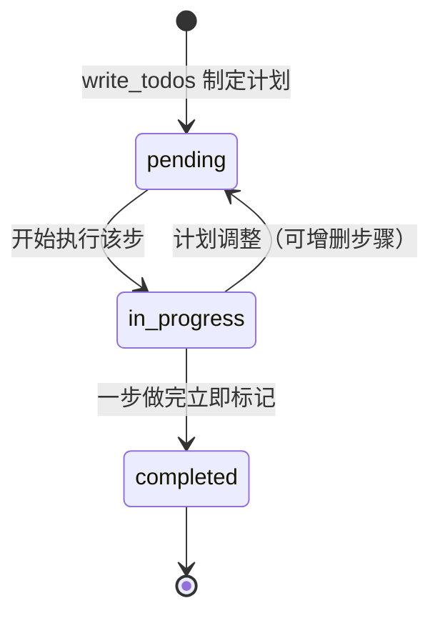
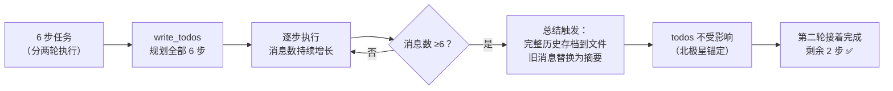

# 🧭 Deep Agent 的 Loop 架构怎么设计？—— 任务规划 + 中间件机制实战（ch04）

> 一句话：Agent 的本质是一个「模型 ↔ 工具」的 Loop，而 Deep Agents 的功力在于——**Loop 之上的每一项能力（规划、文件系统、总结、审批……）都是可插拔的中间件**。今天用 4 个实战任务把这套机制彻底跑通，还踩到一个新版本的坑。

---

## 🤔 先想清楚：Agent 为什么需要「规划」？

**简单任务**，Agent 一步到位就够了：

```text
用户：北京今天天气怎么样？
Agent：[调用天气工具] → 今天北京晴，25°C。
```

**复杂任务**，一步到位不可能：

```text
用户：帮我调研 LangGraph 的技术架构，对比三个竞品，写一份 3000 字的分析报告。
```

这个任务涉及：搜索多个信息源 → 阅读整理资料 → 对比分析 → 组织结构 → 撰写报告。**没有规划的 Agent 会得四种病**：

| 病症 | 表现 |
|---|---|
| 🕳️ 遗漏关键步骤 | 直接开始写报告，忘了先搜索竞品信息 |
| 🔁 重复劳动 | 同一个关键词搜了三次，因为它「忘记」搜过了 |
| 🥀 半途而废 | 上下文一长，失去对整体进度的把控 |
| 🎲 质量不稳定 | 有时做得很好，有时莫名跳过重要环节 |

规划能力的本质是让 Agent **先思考再行动**：把大任务拆成小步骤，逐步执行、追踪进度、动态调整（执行中发现新需求还能加步骤）。

---

## 📌 先看全局：Loop 之上，中间件是怎么叠上去的

`create_deep_agent()` 看起来是一行魔法，其实内部就是把一组中间件**自动组装**到了 Agent 的 Loop 上。中间件分四层：



**中间件全景表**（谁在什么条件下进入 Loop）：

**① 常驻层（`create_deep_agent()` 始终内置，5 个）**

| 中间件 | 用途 |
|---|---|
| TodoListMiddleware | 任务规划与追踪，注入 `write_todos` 工具 |
| FilesystemMiddleware | 7 个文件工具 + 权限控制 |
| SummarizationMiddleware | 对话历史自动总结（触发阈值可配置） |
| PatchToolCallsMiddleware | 工具调用内部修补（框架内部用） |
| AnthropicPromptCachingMiddleware | 提示词缓存（非 Anthropic 模型自动跳过） |

**② 条件层（按参数自动激活，5 个）**

| 传了什么参数 | 激活的中间件 | 得到什么能力 |
|---|---|---|
| `subagents=`（默认自动包含） | SubAgentMiddleware | `task` 工具 + 子 Agent 委派 |
| `skills=` | SkillsMiddleware | 技能包注入 |
| `subagents=`（异步） | AsyncSubAgentMiddleware | 异步子 Agent 任务管理 |
| `memory=` | MemoryMiddleware | AGENTS.md 记忆注入 |
| `interrupt_on=` | HumanInTheLoopMiddleware | 人工审批拦截 |

**③ 可选层（LangChain 预构建，`middleware=[...]` 按需叠加）**

| 类别 | 中间件 | 用途 |
|---|---|---|
| 🛡️ 安全 | PIIMiddleware | 个人信息检测和脱敏 |
| 🔁 弹性 | ToolRetryMiddleware | 工具调用失败自动重试 |
| | ModelRetryMiddleware | 模型调用失败自动重试 |
| | ModelFallbackMiddleware | 主模型失败自动切换备用模型 |
| 🚧 限制 | ToolCallLimitMiddleware | 限制工具调用次数 |
| | ModelCallLimitMiddleware | 限制模型调用次数 |
| 📦 上下文 | ContextEditingMiddleware | 清理旧的工具调用结果 |

> 🔒 **不可排除的底线**：`FilesystemMiddleware` 和 `SubAgentMiddleware` 是必要中间件——它们支撑文件工具、权限控制、子 Agent 委派这些核心能力，框架会**主动阻止**把它们从堆栈里移除。其余都可以按需增删——像拼积木一样给 Agent 加能力。

**两类 Hook，别混用**：

| 风格 | Hook | 执行方式 | 适合场景 |
|---|---|---|---|
| **Node-style** | `before_agent` / `before_model` / `after_model` / `after_agent` | 编译成 Agent 图中的**独立节点**，按生命周期顺序运行 | 校验、状态更新、审计、**人工中断** |
| **Wrap-style** | `wrap_model_call` / `wrap_tool_call` | **包裹**一次模型/工具调用；可不调、调一次或多次 `handler` | 重试、缓存、降级、请求/响应转换 |

> ⚠️ 为什么自定义「人工中断」要放 Node-style？因为 Node-style 有清晰的图节点边界，`interrupt()` 暂停与恢复时容易推断哪些逻辑会重放；Wrap-style 位于 model/tools 节点内部，恢复时可能连 `handler` 一起重新执行——技术上能调 `interrupt()`，但不适合作为默认中断边界。

> 💡 和 LangChain 的关系：中间件机制是 LangChain（Framework 层）实现的，Deep Agents（Harness 层）只是**预设了一组最佳组合**。所以修改中间件内容非常简单——比如 `write_todos` 的提示词，改几个字就能适配自己的团队规范，后面任务二实测。

---

## 📌 任务一：write_todos 基础 —— 规划、状态流转、会不会串线程

> A：跑完完整流程，看 todo list 各阶段状态；B：换线程再读，看有没有「泄露」。

**先认识一下这个工具**。`write_todos` 由 `TodoListMiddleware` 注入（0.7.6 需显式声明，见本节末尾提示），每个任务的数据结构非常朴素：

```python
{
    "content": "搜索 LangGraph 官方文档，整理核心架构和 API 设计",  # 任务内容
    "status": "pending"                                            # 状态
}
```

| 状态 | 含义 | 典型场景 |
|---|---|---|
| `pending` | 待办 | 刚规划出来，还没开始做 |
| `in_progress` | 进行中 | Agent 正在执行这个步骤 |
| `completed` | 已完成 | Agent 确认做完了 |

**任务清单的三个持久化特性**（存在 Agent State 里）：

1. 🧵 **同对话不丢**：同一个 thread 里，清单跨多轮 invoke 保留
2. 🧹 **总结压不垮**：即使对话历史被总结压缩，清单依然完整（见任务三）
3. 🚧 **子 Agent 看不见**：主 Agent 的清单对子 Agent 隔离，互不干扰（上下文隔离，下篇展开）

**核心代码**（`01_write_todos_basics.py`）：

```python
from deepagents import create_deep_agent
from langchain.agents.middleware import TodoListMiddleware

agent = create_deep_agent(
    model=make_model(),                        # deepseek-v4-flash
    middleware=[TodoListMiddleware()],         # ⚠️ 见下方版本提示
    system_prompt="你是文件助手。面对多步骤任务，必须先用 write_todos 制定计划，"
                  "逐步执行并实时更新状态（完成后立即标 completed）。",
    checkpointer=MemorySaver(),                # Part B 需要：跨轮持久化
)
r = agent.invoke({"messages": [{"role": "user", "content": "...5 步任务..."}]},
                 config={"configurable": {"thread_id": "todo-A"}})
print(r["todos"])                              # 任务清单就在 state 里
```

**运行结果（A：5 步任务的真实状态流转）**——Agent 一共调了 4 次 `write_todos`：

```text
第1次调用:                          ← 制定计划
  [in_progress] write_file /workspace/plan
  [  pending  ] write_file /workspace/n1.md
  [  pending  ] write_file /workspace/n2.md
  [  pending  ] read_file  /workspace/plan.md
  [  pending  ] 汇总所有要点
第2次调用:                          ← 前两步完成，第三步进行中
  [ completed ] ...plan / n1 / n2
  [in_progress] read_file  /workspace/plan.md
第3次调用:                          ← 只剩最后一步
  [ completed ] ...（4 项）
  [in_progress] 汇总所有要点
第4次调用:                          ← 全部收尾
  [ completed ] × 5（全部完成）
```



**运行结果（B：持久化与隔离）**：

```text
--- 第一轮后 todos（thread todo-A）---
  [ completed ] write_file /workspace/s1.md
  [ completed ] write_file /workspace/s2.md
  [  pending  ] 读回 s1.md（下一轮执行）
  [  pending  ] 汇总（下一轮执行）
--- 第二轮后 todos（同 thread，接着上轮继续）---
  [ completed ] × 4          ← 上轮 pending 的两步自动接上
--- 新线程 todo-B 的 todos ---
  （空，未跨线程泄漏）        ← 换 thread 不串数据 ✅
```

> ⚠️ **重要提示（新版本必看）**：在当前新版 langchain + deepagents（0.7.6）里，**`TodoListMiddleware` 必须显式写明声明**，否则不会默认加载、Agent 根本没有 `write_todos` 工具（实测模型会直接裸做任务，`result["todos"]` 为空）。教程说的「自动注入」与当前版本行为不一致，加一行 `middleware=[TodoListMiddleware()]` 即可对齐。
>
> 另一个细节：内置工具描述要求「≥3 步才用 write_todos」，演示任务要设计成 5~6 步才能稳定触发规划。

---

## 📌 任务二：复现 LangChain 中间件 —— 手动组装 + 改提示词适配自己

**先揭开引擎盖**：`write_todos` 不是 Deep Agents 的私货，它的真身就是 LangChain 的 `TodoListMiddleware`；第 3 章的「对话历史自动总结」，真身是 `SummarizationMiddleware`。Deep Agents 做的只是把它们**预设成最佳组合**。理解了这一点，你就能：

- 看懂 Deep Agents 内部是怎么拼装出来的
- 自己按需加新能力（PII 脱敏、模型降级、调用次数限制……）
- 在更底层的 `create_agent()` 上搭定制化 Agent

`TodoListMiddleware` 支持两个可选参数，**大多数情况默认就够**，只有想让规划行为按你的流程走时才需要改：

| 参数 | 作用 | 什么时候改 |
|---|---|---|
| `system_prompt` | 规划指导提示词（注入系统提示词） | 想强制特定工作流，如「总是先写测试再写代码」 |
| `tool_description` | `write_todos` 工具的描述 | 想改变模型调用该工具的时机判断 |

这一步我们**脱离 Deep Agents，直接用更底层的 `create_agent()`**，把能力一件件装回去，体会 Framework 层和 Harness 层的区别：

**核心代码**（`02_langchain_middleware.py`）：

```python
from langchain.agents import create_agent
from langchain.agents.middleware import TodoListMiddleware
from deepagents.middleware import FilesystemMiddleware

# 方式一：手动组装（create_agent = Framework 层，一切自己选）
agent = create_agent(
    model=model,
    tools=[],
    middleware=[
        TodoListMiddleware(),     # 注入 write_todos 工具 + 规划提示词
        FilesystemMiddleware(),   # 注入 read_file / write_file 等 7 个文件工具
    ],
)

# 方式二：自定义规划规范 —— 改提示词适配自己的团队
agent = create_agent(
    model=model, tools=[],
    middleware=[
        TodoListMiddleware(
            system_prompt=(
                "## 任务规划规范（本团队约定）\n"
                "1. 任何 >=2 步的任务都必须先 write_todos。\n"
                "2. 计划的第一项永远是「撰写任务说明 documentation.md」。\n"
                "3. 计划的最后一项永远是「核对清单 review」。\n"
                "4. 每完成一步立即标记 completed。"
            ),
            tool_description="创建/更新任务清单（团队规范：首项写文档，末项做核对）。",
        ),
        FilesystemMiddleware(),
    ],
)
```

**运行结果**：手动组装版 5 步任务全部完成，`todos` 与 `files` 都正常；自定义规范版最有意思——**模型严格执行了我们定的「首项文档、末项核对」规范**：

```text
--- todos（自定义规范形态）---
  [ completed ] 撰写任务说明 documentation.md   ← 我们要求的固定首项
  [ completed ] write_file /workspace/demo.md
  [ completed ] 读回 demo.md 确认内容
  [ completed ] 核对清单 review                  ← 我们要求的固定末项
```

| 对比 | `create_agent()`（LangChain） | `create_deep_agent()`（Deep Agents） |
|---|---|---|
| 中间件 | 手动选择、组合 | 预设最佳组合（常驻层自动带上） |
| 适合 | 精细定制、学习原理 | 快速构建复杂 Agent |
| 改提示词 | 同样简单（传参即可） | 同样简单 |

> 💡 这就是中间件机制的好处：**能力 = 参数**。不想要就拆掉，想改就传参，不用碰框架源码。

---

## 📌 任务三：三中间件组合 —— 规划 + 文件系统 + 总结（「北极星」验证）

**先看问题场景**：假设 Agent 在执行一个 10 步研究任务，做到第 6 步时，对话历史已经很长——前 5 步的搜索结果、文件读写、中间思考全堆在上下文里。此时第 3 章的上下文管理会自动介入：

1. **大结果卸载**：大量搜索结果被卸载到文件系统（超 20K tokens 触发）
2. **对话总结**：上下文仍超阈值（默认窗口的 85%）时，旧对话被 LLM 压缩成结构化摘要（意图、产出物、下一步）

压缩之后 Agent 还知道自己做到哪了吗？——**知道，因为任务清单不在被压缩的消息里，它在 State 中独立存放**。总结后 Agent 仍然清楚：总共有哪些步骤、哪些完成哪些在做、下一步做什么。

这就是课程里的经典论断：**即使对话历史被总结压缩了，任务清单依然完整**——清单是 Agent 的「北极星」，无论过程如何压缩，方向不丢。我们把三个中间件组装起来实测这个论断：

**核心代码**（`03_todo_summarization_synergy.py`）：

```python
agent = create_agent(
    model=model,
    tools=[],
    middleware=[
        TodoListMiddleware(),                     # ① 任务规划
        FilesystemMiddleware(),                   # ② 文件工具（总结存档的后端）
        SummarizationMiddleware(
            model=model,
            backend=StateBackend(),
            trigger={"messages": 6},              # 消息数 ≥6 触发（低成本复现默认的 85% 窗口）
            keep=("messages", 2),                 # 摘要后只保留最近 2 条
        ),                                        # ③ 上下文总结
    ],
    checkpointer=MemorySaver(),
)
```



**运行结果**：

```text
--- 第一轮后 todos ---
  [ completed ] write_file /workspace/t1.md ~ t4.md（4 项）
  [  pending  ] Read back t1.md（下一轮）
  [  pending  ] Summarize all task statuses（下一轮）
第一轮后文件: ['/conversation_history/session_4c1e….md',   ← 总结已触发，完整历史落盘
               '/workspace/t1.md', …, '/workspace/t4.md']
--- 第二轮后 todos ---
  [ completed ] × 6                                  ← 清单完整，全部完成
[check] 总结触发（存档文件）: ['/conversation_history/session_4c1e….md']  ✅
[check] todos 完整性: 6 项（应为 6），全部完成: True                        ✅
```

第二轮 Agent 的汇总表还能准确列出全部 6 步的执行记录——**对话被压缩了，方向没丢**。这就是规划与上下文管理的协同：摘要是工作记忆，清单是导航仪，文件系统是完整档案。

---

## 📌 终极任务：Tavily 搜索 + 规划 → 自动生成研究报告

最后把之前用过的 Tavily 搜索注册成工具，让 Agent 自主「规划 → 搜索 → 整理 → 写报告」：

**核心代码**（`04_research_task.py`）：

```python
def internet_search(query: str, max_results: int = 3) -> dict:
    """搜索互联网获取最新信息。"""
    return tavily_client.search(query, max_results=max_results)

agent = create_deep_agent(
    model=model,
    tools=[internet_search],              # 自定义搜索工具
    middleware=[TodoListMiddleware()],    # 规划（0.7.6 显式声明）
    system_prompt="""你是一位专业的技术研究员。
面对复杂研究任务时，你会：
1. 先用 write_todos 制定研究计划
2. 逐步执行每个步骤，及时更新进度
3. 将搜索结果写入文件系统整理
4. 最终输出完整的研究报告""",
)

result = agent.invoke({"messages": [{
    "role": "user",
    "content": "请调研 Agent 开发领域的三大 Harness 框架"
               "（Deep Agents、Claude Agent SDK、Codex SDK），"
               "对比它们的核心能力差异，写一份简要分析报告。"
}]})
```

**运行结果**：5 步计划全部完成，报告自动落盘，搜索中间结果也整理进了虚拟文件系统：

```text
--- 最终任务清单 ---
  [ completed ] 调研 Deep Agents（LangChain）的核心能力与架构
  [ completed ] 调研 Claude Agent SDK（Anthropic）的核心能力与架构
  [ completed ] 调研 Codex SDK（OpenAI）的核心能力与架构
  [ completed ] 对比三大框架核心能力差异
  [ completed ] 撰写并输出简要分析报告
--- 虚拟文件系统 ---
  /research/agent-harness-comparison-report.md  (5326 chars)
```

Agent 生成的报告节选（真实搜索驱动）：

> **核心能力对比（节选）**
>
> | 维度 | Deep Agents | Claude Agent SDK | Codex SDK |
> |---|---|---|---|
> | 模型支持 | **模型无关**（任意 LLM） | 仅 Claude | 仅 OpenAI |
> | 规划 | `write_todos` 强制 Todo + LangGraph 状态图 | 编排在 Prompt/对话历史中 | 无强制规划，靠 AGENTS.md 约定 |
> | 沙箱 | 文件权限 + 远程沙箱 | permission + hooks | **OS 级三级沙箱**（最强） |
> | 扩展机制 | **可插拔 Middleware 栈** + Skills | Hooks + MCP | MCP + Skills |
>
> **选型建议**：多模型/企业级观测 → Deep Agents；Claude 生态开箱即用 → Claude Agent SDK；最强沙箱隔离 + CI/CD → Codex SDK；混合架构：后两者做执行层，LangGraph/LangSmith 做编排治理。

一次 `invoke()`，背后是 Agent 自己规划 5 步、多轮搜索、整理落盘、综合成文——我们只写了一个搜索函数。

---

## ✅ 小结

1. 🧱 **Loop 是骨架，中间件是器官**：Agent = `model ⇄ tools` 循环 + 四层中间件（常驻 / 条件 / 自定义 / 可选），能力即插件。
2. 📏 **先思考再行动**：复杂任务不规划会得四种病（遗漏步骤 / 重复劳动 / 半途而废 / 质量不稳定）——这是 `write_todos` 存在的根本原因；而它的真身是 LangChain 的 `TodoListMiddleware`，理解底层才能自由扩展。
3. 📝 **write_todos 三状态流转**（pending → in_progress → completed）实测清晰，清单存在 State 里：同 thread 跨轮保留、换 thread 隔离不泄露。
4. 🔧 **改提示词就能定制规划行为**：团队规范「首项文档、末项核对」被模型严格执行——中间件机制让能力变成参数。
5. 🧭 **北极星验证通过**：总结触发后（存档文件出现），todos 依旧 6 项完整、Agent 不迷失方向——摘要是工作记忆，清单是导航仪，文件系统是完整档案。
6. ⚠️ **版本坑**：deepagents 0.7.6 默认栈**不含** `TodoListMiddleware`，必须 `middleware=[TodoListMiddleware()]` 显式声明；且内置提示词要求「≥3 步才规划」，演示任务设计成 5~6 步最稳。

**复现方式**（环境沿用前几篇的 uv + DeepSeek，直接跑）：

```bash
cd ch04
uv run 01_write_todos_basics.py          # 规划 + 状态流转 + 隔离
uv run 02_langchain_middleware.py        # 手动组装 + 自定义规范
uv run 03_todo_summarization_synergy.py  # 北极星验证
uv run 04_research_task.py               # 终极实战（真实搜索）
```

> 下一篇：子 Agent 与上下文隔离——让 Agent 学会「委派」。
