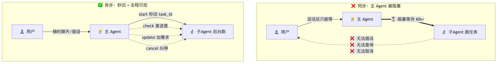
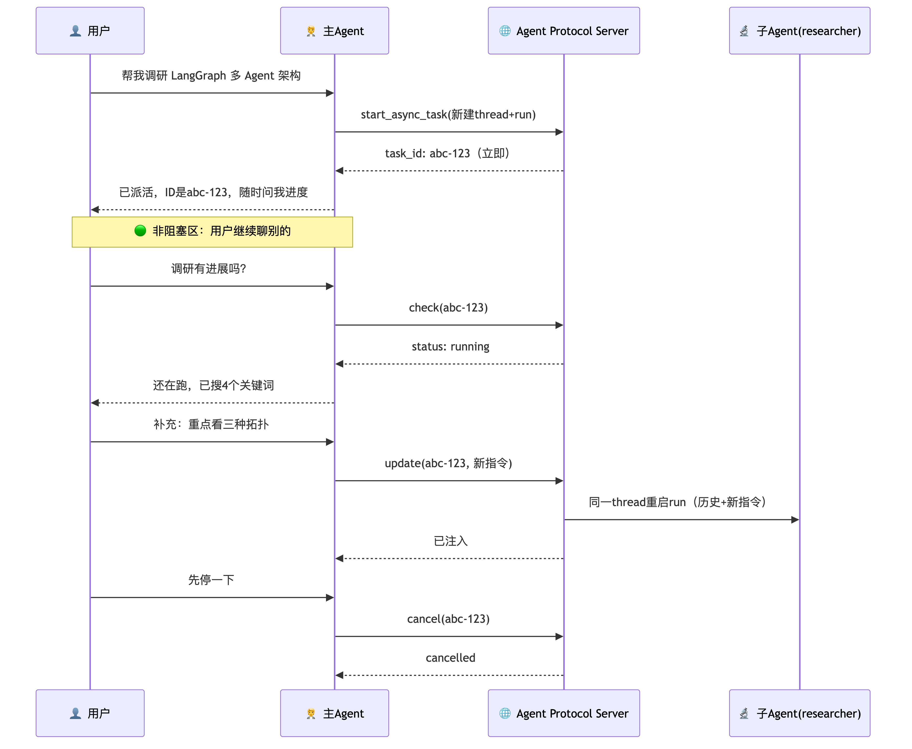
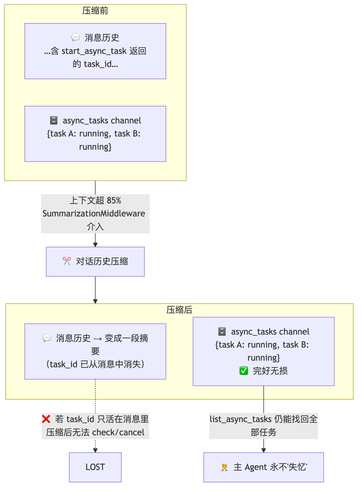
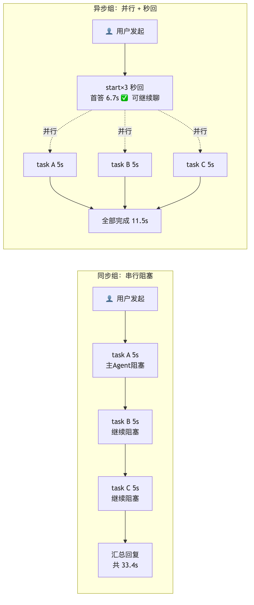
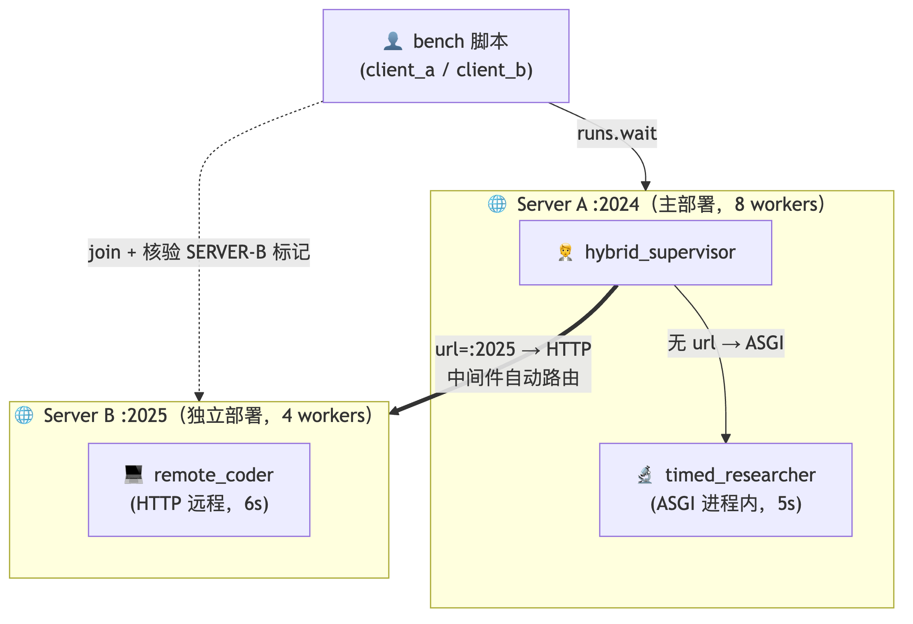
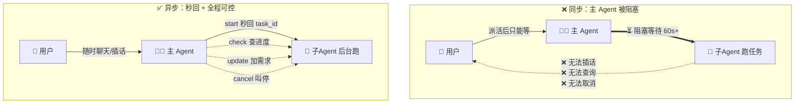
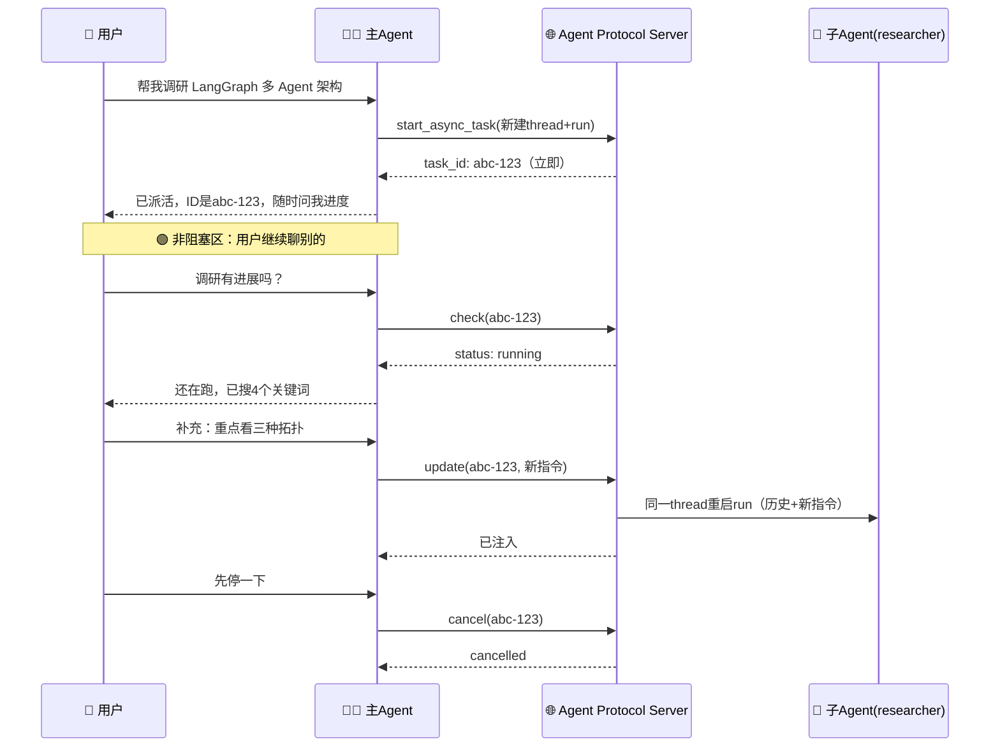
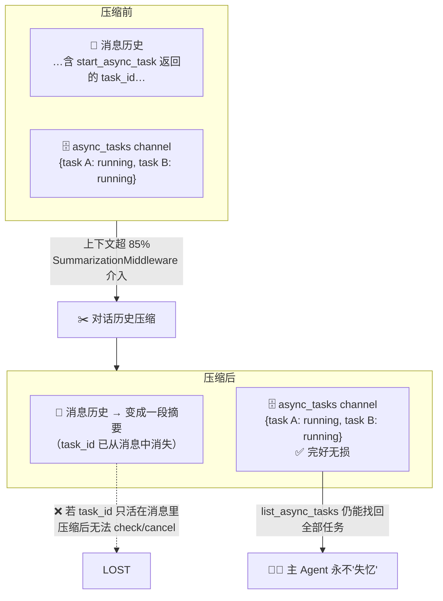
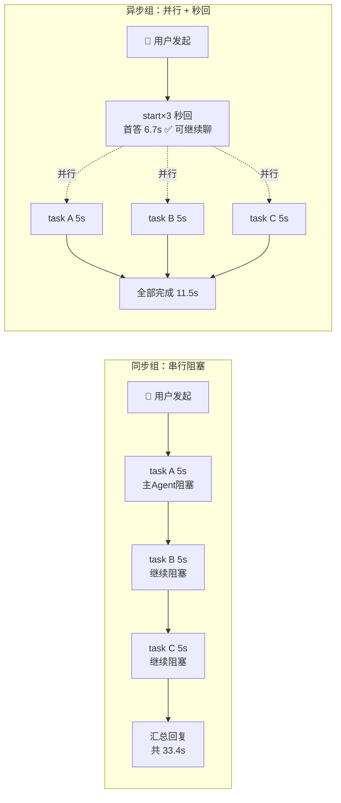
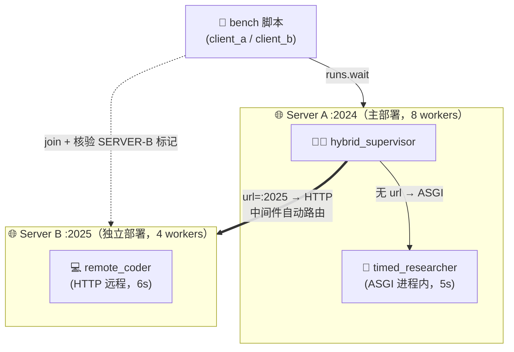

# 🧭 异步子 Agent —— 让主 Agent 学会"派活不等待"（ch06）

> 一句话：同步子 Agent 是"把活交出去然后干等"，异步子 Agent 是"派活后秒回任务 ID，后台并行跑，随时查进度、加需求、叫停"。性能更高，但**必须在 Agent Protocol 服务里跑**——这是本章最大的架构变化，也是理解一切的前提。

---

## 🤔 为什么需要异步？同步的两大痛点

上一章（ch05）的同步模式：主 Agent 调 `task()` 委派后**原地等待**，可能 60 秒、120 秒甚至更久，用户只能盯着转圈。这在两类场景下是致命的：

**① 长程任务**：深度调研、大规模代码迁移、批量数据处理，子 Agent 一跑就是几分钟到几小时。中间想知道"跑到哪了"？同步模式下主 Agent 自己都被挂起，根本没法回答。

**② 可交互任务**：跑到一半发现方向不对——"换个数据源"、"把 2024 年的数据加上"、"先停一下"。同步模式插不进去任何话，只能等它跑完（或错到底）。



> 💡 **我的体感**：异步带来的提升最明显的是**用户体验直线上升**，而且在团队协作场景特别好——支持中途追加指令、支持取消某些子工作、非阻塞、有并发性，还能不停看状态找卡点及时调整。我的判断是：**同步就适合做小测试，真实场景还是要上异步**——异步可用的场景多得多。

**判定法则**（课程给的）：子任务 5 秒内能完成 → 同步；可能跑数分钟以上且过程需要交互 → 异步。

---

## 📡 代价：必须跑在 Agent Protocol 服务里

这是本章和前几章最大的不同：异步子 Agent 不能像之前那样直接 `agent.invoke()`，**必须有一个 Agent Protocol 协议的服务做支撑**（本地就是 `langgraph dev` 起的 LangGraph Server，生产是 LangSmith Deployment 或自托管兼容服务）。

> 💡 我的理解：异步本质上是**把子 Agent 当成 API 一样丢到服务网关里管理**——任务的创建、查询、更新、取消全走服务接口。这样控制和管理都方便，大家也都灵活。代价就是多了一层服务要启动，但换来的是任务作为服务端"一等公民"——任何客户端都能查询它。

| 维度 | 同步子 Agent | 异步子 Agent |
|---|---|---|
| 执行模型 | 阻塞——等完成才能继续 | **非阻塞——立即返回任务 ID** |
| 并发性 | 可并行触发，但主 Agent 仍整批阻塞 | 完全并行，主 Agent 全程不阻塞 |
| 中途追加指令 | ❌ | ✅ `update_async_task` |
| 取消 | ❌ | ✅ `cancel_async_task` |
| 状态性 | 无状态，每次独立 | **有状态——子 Agent 有自己的 thread，历史持续累积** |
| 典型场景 | 一问一答、秒级委派 | 分钟级长程任务 + 需要交互管理 |

---

## 🎮 主 Agent 的 5 把"遥控器" + 生命周期

声明 `AsyncSubAgent` 后，中间件自动给主 Agent 注入 5 个工具：

| 工具 | 作用 | 实测返回 |
|---|---|---|
| `start_async_task` | 启动后台任务 | `Launched async subagent. task_id: 01a040b1-…` |
| `check_async_task` | 查状态与结果 | `{"status": "running"}` → `{"status": "success", "result": …}` |
| `update_async_task` | 给运行中任务追加指令 | `Updated async subagent. task_id: …`（**ID 不变**） |
| `cancel_async_task` | 终止任务 | cancelled（服务端异步生效） |
| `list_async_tasks` | 列出所有任务 | 任务总览（含实时状态） |

**一次完整生命周期**（用户视角的时序，注意中间多了 Agent Protocol Server 这一环——任务来来回回都经它中转）：



---

## 🗄️ 关键设计：任务元数据为何单开一个 channel？

课程这里突然一句带过，很多人会懵。先用实验事实铺垫：我们实测发现，主 Agent 的 state 里有一个独立于消息历史的 `async_tasks` 通道，每个任务在里面存的是**结构化元数据**：

```json
{
  "task_id": "01a04dcf…5e711b",
  "agent_name": "researcher",
  "thread_id": "01a04dcf…5e711b",
  "run_id": "…",
  "status": "running",
  "created_at": "2026-08-29T13:54:39Z",
  "last_checked_at": "…", "last_updated_at": "…"
}
```

**为什么不直接放在对话消息里？** 因为 Deep Agents 的上下文逼近模型窗口上限时会**自动压缩对话历史**（第 3 章的 SummarizationMiddleware）——把旧消息替换成摘要。如果 task_id 只活在某条 ToolMessage 里，压缩后就没了：主 Agent 会瞬间"忘掉"自己派出去的所有任务，再也无法 check 或 cancel。



> 💡 **我的疑问与理解**：课程没讲 memory 却突然提 channel，有点突兀。我的理解是：channel 就是把任务信息**独立存起来，不随上下文管理被压掉**。至于底层怎么存——它其实就是 LangGraph state 上的一个字段，和虚拟文件系统的 `files`、任务清单的 `todos` 是同一套设计哲学：**会被截断的放消息历史，必须长存的进 state channel**。这不是一个独立的 memory 系统，而是 state schema 的划分方式；真正的长期记忆（跨会话）是另一套（MemoryMiddleware + Store，后面章节展开）。
>
> 实验佐证：我们在计时实验里，正是通过 `threads.get_state()` 读 `async_tasks` 通道拿到的任务列表和 run_id——**绕过消息历史直接查通道**，这条路永远可用。

---

## 🔌 两种传输 + 三种拓扑

`AsyncSubAgent` 怎么"挂载"到服务上？两种模式：

| 模式 | 触发条件 | 特点 |
|---|---|---|
| **ASGI**（本地/同部署） | `AsyncSubAgent` **不传 `url`** | SDK 调用直接进程内函数路由：零网络延迟、零鉴权配置，但子 Agent 仍跑在独立 thread 上，隔离不打折 |
| **HTTP**（远程/拆分部署） | **传了 `url`** | 走网络到远程 Agent Protocol 服务；适合独立扩缩容、不同资源画像（GPU/大内存）、另一个团队维护、走互联网接第三方服务 |

三种部署拓扑：**单部署**（所有 Agent 同一台，全 ASGI——个人项目/绝大多数项目的起点）、**拆分部署**（主一台子一台，全 HTTP）、**混合**（多数 ASGI 省事，少数特殊的单独拆出去）。起手用单部署，遇到扩缩容/团队边界再拆。

---

## 🔬 实验一（基础款）：四轮对话跑通完整生命周期

单部署 + ASGI 的最小验证。目录结构：

```text
ch06/
├── .env                  # DEEPSEEK_API_KEY / MODEL_NAME
├── langgraph.json        # 注册 supervisor + researcher
├── run_demo.py           # SDK 四轮验证
└── graphs/
    ├── supervisor.py     # 主 Agent
    └── researcher.py     # 故意 sleep(8) 的子 Agent
```

**`langgraph.json`** —— 关键：supervisor 和 researcher 注册到**同一个**本地 Server，ASGI 才能进程内直调；`graph_id` 必须等于这里的键名：

```json
{
  "dependencies": ["./"],
  "graphs": {
    "supervisor": "./graphs/supervisor.py:graph",
    "researcher": "./graphs/researcher.py:graph",
    "sync_supervisor": "./graphs/sync_supervisor.py:graph",
    "async_supervisor": "./graphs/async_supervisor.py:graph",
    "timed_researcher": "./graphs/timed_researcher.py:graph",
    "hybrid_supervisor": "./graphs/hybrid_supervisor.py:graph"
  },
  "env": "./.env"
}
```

**`graphs/researcher.py`** —— 故意睡 8 秒，让异步行为稳定可观察：

```python
# ============================================================================
# graphs/researcher.py —— ch06：故意"跑得很慢"的异步子 Agent
#
# 用一个固定 sleep 8 秒的 LangGraph 图代替真实研究，让异步行为稳定可观察：
#   - supervisor 调 start_async_task 后【立刻】拿到 task_id（不等这 8 秒）
#   - 本图在后台独立 thread 中运行
#   - check_async_task 能观察到状态从 running → success
# ============================================================================

import asyncio

from langgraph.graph import END, START, MessagesState, StateGraph


async def slow_research(state: MessagesState):
    # 取用户委派的任务描述（最后一条人类消息）
    last_human = state["messages"][-1].content if state["messages"] else "No task provided."
    # 故意阻塞 8 秒——模拟长程任务
    await asyncio.sleep(8)
    return {
        "messages": [
            {
                "role": "ai",
                "content": (
                    "[researcher finished after 8s]\n"
                    f"latest task: {last_human}\n"
                    "summary: async subagents return a task ID immediately, "
                    "run in the background, and can be checked or updated later."
                ),
            }
        ]
    }


builder = StateGraph(MessagesState)
builder.add_node("slow_research", slow_research)
builder.add_edge(START, "slow_research")
builder.add_edge("slow_research", END)
graph = builder.compile()          # 变量名必须是 graph —— langgraph.json 指向它
```

**`graphs/supervisor.py`** —— 主 Agent。system_prompt 里写死四条遥控器行为规则（这一步很重要，防的是课程"常见问题"里的伪同步、状态过时、ID 截断三大坑）：

```python
# ============================================================================
# graphs/supervisor.py —— ch06：主 Agent（Supervisor）
#
# 关键点：
#   1. AsyncSubAgent(graph_id="researcher") 必须与 langgraph.json 里
#      "graphs" 的键名一致 —— 否则 start_async_task 报找不到 Agent；
#   2. 不传 url → 走 ASGI 进程内传输（同部署形态）；
#   3. system_prompt 明确行为规则：派完任务立刻交还控制权，
#      不主动轮询；汇报进度前必须实时 check。
#
# 模型：沿用 DeepSeek 官方接口（.env 由 langgraph.json 注入本进程）。
# 注意：langgraph dev 下【不要】传 checkpointer —— 平台自带持久化，传了会报错。
# ============================================================================

import os

from langchain_openai import ChatOpenAI

from deepagents import AsyncSubAgent, create_deep_agent

model = ChatOpenAI(
    model=os.environ.get("MODEL_NAME", "deepseek-v4-flash"),
    api_key=os.environ["DEEPSEEK_API_KEY"],
    base_url="https://api.deepseek.com/v1",
)

graph = create_deep_agent(
    model=model,
    system_prompt=(
        "你是异步子 Agent 演示的 supervisor。规则：\n"
        "1. 用户要求执行长耗时研究类任务时，必须立即用 start_async_task 委派给 "
        "researcher，然后把 task_id 原样告诉用户并停止——绝不要截断或改写 task_id。\n"
        "2. 派出任务后不要主动 check_async_task，除非用户明确问进度。\n"
        "3. 用户要求修改后台任务时，用 update_async_task 在原任务上追加指令。\n"
        "4. 回答任务进度前必须先调用 check_async_task 或 list_async_tasks 获取实时状态，"
        "对话历史里的状态永远是过时的。"
    ),
    subagents=[
        AsyncSubAgent(
            name="researcher",
            description=(
                "Use for any long-running background research or async demo task. "
                "This agent intentionally sleeps before returning so the async "
                "behavior is easy to observe."
            ),
            graph_id="researcher",   # 与 langgraph.json 中 graphs 键名一致
        )
    ],
)
```

**`run_demo.py`** —— 同一 thread 四轮：start → check(running) → update → check(success)：

```python
# ============================================================================
# run_demo.py —— ch06：用 SDK 在同一 Thread 上验证异步子 Agent 行为
#
# 前置：已启动本地 Agent Server（另一终端）：
#     uv run langgraph dev --n-jobs-per-worker 4 --port 2024
#
# 验证四步（同一 thread 连续对话，观察主 Agent 是否阻塞、任务状态流转）：
#   第1轮 start ：委派后台研究 → 应【立即】返回 task_id（不等 researcher 的 8 秒）
#   第2轮 check ：立刻问进度   → 主线程不被阻塞；researcher 可能还在 running
#   第3轮 update：追加新约束   → 应更新已有任务，而不是重开一个
#   等待后 check：状态 running → success，拿到子 Agent 最终结果
#
# 运行：uv run run_demo.py
# ============================================================================

import asyncio
import json

from langgraph_sdk import get_client

client = get_client(url="http://127.0.0.1:2024")
ASSISTANT = "supervisor"           # langgraph.json 里注册的主 graph 名


def show(tag: str, out: dict) -> None:
    """打印一轮对话的关键信息：用过的遥控器工具 + AI 最终回复。"""
    msgs = out.get("messages", [])
    calls = [tc["name"] for m in msgs if m.get("type") == "ai"
             for tc in (m.get("tool_calls") or [])]
    print(f"\n=== {tag} ===")
    print("本轮工具调用:", calls if calls else "（无工具调用）")
    for m in reversed(msgs):
        if m.get("type") == "ai":
            content = m.get("content") or ""
            if isinstance(content, list):
                content = " ".join(str(c) for c in content)
            print(f"AI 回复: {content[:400]}")
            break


async def ask(prompt: str, thread_id: str) -> dict:
    """往同一 thread 追加一轮用户消息并等待 supervisor 回合结束。"""
    return await client.runs.wait(
        thread_id,
        ASSISTANT,
        input={"messages": [{"role": "user", "content": prompt}]},
    )


async def main():
    thread = await client.threads.create()
    thread_id = thread["thread_id"]
    print("thread_id =", thread_id)

    # ── 第1轮：委派后台任务（关键观察：是否立即返回 task_id）──
    out1 = await ask("请把这个任务交给 researcher 异步处理：用后台任务总结 async subagent 的关键行为。",
                     thread_id)
    show("[第1轮] start_async_task", out1)

    # ── 第2轮：立刻问进度（关键观察：主线程未被阻塞；任务可能仍 running）──
    out2 = await ask("刚才那个后台任务现在进展如何？", thread_id)
    show("[第2轮] check_async_task", out2)

    # ── 第3轮：中途追加约束（关键观察：update 而不是重开任务）──
    out3 = await ask("补充约束：完成时请把答案写成 3 条 bullet。", thread_id)
    show("[第3轮] update_async_task", out3)

    # ── 等 researcher 的 8 秒 sleep 结束，再查最终结果 ──
    print("\n（等待 12 秒让 researcher 后台跑完……）")
    await asyncio.sleep(12)
    out4 = await ask("现在任务应该完成了，告诉我最终结果和当前状态。", thread_id)
    show("[第4轮] check → success", out4)


if __name__ == "__main__":
    asyncio.run(main())
```

**运行结果**（实测）：

```text
=== [第1轮] start_async_task ===
本轮工具调用: ['start_async_task']
AI 回复: 任务已交给 researcher 在后台异步处理。
**任务 ID：`01a040b1-b7ce-7523-b3be-b2705cb401f0`**   ← 秒回，没等 8 秒 ✅

=== [第2轮] check_async_task ===
本轮工具调用: ['check_async_task']
AI 回复: 后台任务目前**仍在运行中**                    ← {"status":"running"} ✅

=== [第3轮] update_async_task ===
本轮工具调用: ['update_async_task']
AI 回复: 已把补充约束（3 条 bullet）发送给后台任务      ← task_id 不变 ✅

=== [第4轮] check → success ===
本轮工具调用: ['check_async_task']
AI 回复: 当前状态：**success（已完成）**
最终结果（按你要求的 3 条 bullet 格式）：
- 立即返回 task ID…… - 后台运行…… - 可随时查询/更新……  ✅
```

最妙的是第 4 轮：**update 中途注入的"3 条 bullet"约束真的改变了后台任务的产出**——指令直达子 Agent。

---

## ⏱️ 实验二（挑战）：同步 vs 异步计时对比 —— 33.4s vs 11.5s

光看机制不过瘾，我们做了个量化实验：同样 **3 个主题 × 每个子任务固定 5 秒**，同步组和异步组各跑一遍，统一从"用户发起"计时。

**实验设计**：



**`graphs/timed_researcher.py`** —— 统一的 5 秒工作图：

```python
# ============================================================================
# graphs/timed_researcher.py —— 计时实验用的 5 秒工作图（ASGI 目标）
# 与 sync/async 对比实验配套：每个子任务固定耗时 5 秒，输出带唯一标记。
# ============================================================================

import asyncio

from langgraph.graph import END, START, MessagesState, StateGraph

SLEEP_SECONDS = 5


async def timed_work(state: MessagesState):
    last_human = state["messages"][-1].content if state["messages"] else "No task provided."
    await asyncio.sleep(SLEEP_SECONDS)
    return {
        "messages": [
            {
                "role": "ai",
                "content": (
                    f"[timed_researcher finished after {SLEEP_SECONDS}s]\n"
                    f"task: {last_human}\n"
                    "done."
                ),
            }
        ]
    }


builder = StateGraph(MessagesState)
builder.add_node("timed_work", timed_work)
builder.add_edge(START, "timed_work")
builder.add_edge("timed_work", END)
graph = builder.compile()
```

**`graphs/sync_supervisor.py`** —— 同步对照组（模拟 ch05 `task()` 的阻塞语义）：

```python
# ============================================================================
# graphs/sync_supervisor.py —— 实验一（对照组）：模拟 ch05 同步 task() 的阻塞语义
#
# 主 Agent 持有一个普通同步工具 research_topic()（内部 time.sleep(5)）。
# 用户一次下达 3 个主题 → 模型逐个调用工具 → 每次调用主 Agent 都被阻塞 5 秒
# —— 这正是 ch06 描述的"同步子 Agent 瓶颈"：用户只能盯着转圈。
# ============================================================================

import time

from langchain_openai import ChatOpenAI

from deepagents import create_deep_agent

import os


def research_topic(topic: str) -> str:
    """调研指定主题（同步阻塞 5 秒，模拟长耗时子任务）。"""
    time.sleep(5)   # 同步 sleep：主 Agent 在此期间完全阻塞
    return f"[sync research done in 5s] topic: {topic}"


model = ChatOpenAI(
    model=os.environ.get("MODEL_NAME", "deepseek-v4-flash"),
    api_key=os.environ["DEEPSEEK_API_KEY"],
    base_url="https://api.deepseek.com/v1",
)

graph = create_deep_agent(
    model=model,
    tools=[research_topic],
    system_prompt=(
        "你是同步调研助手。用户会给出多个主题，你必须对每个主题各调用一次 "
        "research_topic 工具（逐个调用，不要并行承诺），全部完成后汇总每个主题的结果。"
    ),
)
```

**`graphs/async_supervisor.py`** —— 异步实验组（3 连发 start_async_task）：

```python
# ============================================================================
# graphs/async_supervisor.py —— 实验一（实验组）：异步并行委派
#
# AsyncSubAgent 指向 timed_researcher（5 秒工作图，ASGI 同部署）。
# 用户一次下达 3 个主题 → 主 Agent 连发 3 个 start_async_task → 立即返回 3 个
# task_id（主对话不阻塞）→ 3 个子任务在后台【并行】跑（需 worker 槽位足够）。
# ============================================================================

import os

from langchain_openai import ChatOpenAI

from deepagents import AsyncSubAgent, create_deep_agent

model = ChatOpenAI(
    model=os.environ.get("MODEL_NAME", "deepseek-v4-flash"),
    api_key=os.environ["DEEPSEEK_API_KEY"],
    base_url="https://api.deepseek.com/v1",
)

graph = create_deep_agent(
    model=model,
    system_prompt=(
        "你是异步调度员。用户会给出多个主题；你必须为每个主题各调用一次 "
        "start_async_task（委派给 researcher，一个主题一个任务），"
        "全部启动后立刻把每个主题对应的 task_id 告诉用户并停止。"
        "不要等待结果、不要轮询。"
    ),
    subagents=[
        AsyncSubAgent(
            name="researcher",
            description=(
                "Long-running background research worker. Each run takes ~5 seconds. "
                "Use for parallel background research tasks."
            ),
            graph_id="timed_researcher",   # 必须与 langgraph.json 注册名一致；ASGI 同部署
        )
    ],
)
```

**`bench_sync_vs_async.py`** —— 计时脚本（核心：从 `async_tasks` 通道取元数据，用 `runs.join(thread_id, run_id)` 精确等待）：

```python
# ============================================================================
# bench_sync_vs_async.py —— 实验一：同步 task() vs 异步 start_async_task 计时对比
#
# 前置：server A 已启动（uv run langgraph dev --n-jobs-per-worker 8 --port 2024）
# 任务规格：3 个主题 × 每个子任务固定 5 秒
#
#   同步组（sync_supervisor）  ：模型逐个调 research_topic（time.sleep(5)），
#                                主对话从头阻塞到尾 → 用户等待 ≈ 15s + LLM 开销
#   异步组（async_supervisor） ：3 个 start_async_task 立即返回 → 首答耗时 ≈ 数秒；
#                                3 个 timed_researcher 在后台并行 → 全部完成 ≈ 5s + 开销
#
# 度量：
#   t_sync_total       同步组用户拿到最终答案的总耗时（全程阻塞）
#   t_async_first      异步组用户拿到 task_id 的耗时（主对话不阻塞的关键指标）
#   t_async_total      异步组所有后台任务完成的总耗时
# 运行：uv run bench_sync_vs_async.py
# ============================================================================

import asyncio
import time

from langgraph_sdk import get_client

client = get_client(url="http://127.0.0.1:2024")

TASK = "请分别调研这三个主题：LangGraph 架构、Temporal 工作流、Prefect 数据管道。"


async def timed_run(assistant: str):
    """在全新 thread 上跑一轮，返回 (总耗时, thread_id, 输出 state)。"""
    thread = await client.threads.create()
    t0 = time.perf_counter()
    out = await client.runs.wait(
        thread["thread_id"],
        assistant,
        input={"messages": [{"role": "user", "content": TASK}]},
    )
    return time.perf_counter() - t0, thread["thread_id"], out


async def collect_async_tasks(thread_id: str):
    """从 supervisor thread state 的 async_tasks 通道取任务元数据。

    这本身就是课程强调的设计：任务元数据独立于消息历史存放，
    上下文被压缩也不会丢 task_id。实测字段：task_id/agent_name/thread_id/
    run_id/status/created_at/last_checked_at/last_updated_at。"""
    state = await client.threads.get_state(thread_id)
    tasks = (state.get("values") or {}).get("async_tasks") or {}
    # 统一成 list[meta]（meta 里 task_id == 子 Agent 的 thread_id）
    return list(tasks.values()) if isinstance(tasks, dict) else list(tasks)


async def wait_all_tasks(metas: list[dict], t0: float):
    """并行 join 所有后台任务（thread_id + run_id），返回 (全部完成耗时, 各任务耗时)。"""
    async def join_one(meta):
        await client.runs.join(meta["thread_id"], meta["run_id"])
        return time.perf_counter() - t0

    times = await asyncio.gather(*[join_one(m) for m in metas])
    return max(times), {m["task_id"]: round(x, 1) for m, x in zip(metas, times)}


async def main():
    print("=" * 64)
    print("实验一：同步 task() vs 异步 start_async_task（3 主题 × 5 秒）")
    print("=" * 64)

    # ── 同步组 ──
    print("\n[同步组] 用户发出请求，主 Agent 逐个阻塞调用（预计 ≥15s）……")
    t_sync, _, out_sync = await timed_run("sync_supervisor")
    n_sleep = sum(
        1 for m in out_sync.get("messages", [])
        if m.get("type") == "tool" and "sync research done" in str(m.get("content"))
    )
    print(f"  用户拿到最终答案耗时: {t_sync:.1f}s（全程阻塞）")
    print(f"  同步工具调用次数: {n_sleep} × 5s = {n_sleep * 5}s 纯阻塞")

    # ── 异步组 ──（注意：后台任务在首轮 run 期间就已启动，因此计时统一从「用户发起」开始）
    print("\n[异步组] 用户发出请求，主 Agent 并发启动 3 个后台任务……")
    t_start = time.perf_counter()
    t_first, sup_thread, out_async = await timed_run("async_supervisor")
    print(f"  用户拿到 task_id 的耗时（首答，不阻塞）: {t_first:.1f}s")

    tasks = await collect_async_tasks(sup_thread)
    print(f"  async_tasks 通道中的任务数: {len(tasks)}")
    for meta in tasks:
        tid = meta.get("task_id", "?")
        print(f"    - agent={meta.get('agent_name','?'):<12} "
              f"task={tid[:8]}…{tid[-6:]} status={meta.get('status','?')}")

    if not tasks:
        print("  ⚠ 未取到任务列表（检查 async_tasks 通道字段结构）")
        return

    t_all, each = await wait_all_tasks(tasks, t_start)   # 统一基准：用户发起时刻
    print(f"  3 个后台任务全部完成（自用户发起计）: {t_all:.1f}s（并行 5s 起步）")
    for tid, sec in each.items():
        print(f"    - {tid[:8]}…{tid[-6:]} 完成于第 {sec}s")

    # ── 结论 ──
    print("\n" + "=" * 64)
    print("对比结论")
    print("=" * 64)
    print(f"  用户首答等待 : 同步 {t_sync:.1f}s（全程阻塞） vs 异步 {t_first:.1f}s（拿到ID即可继续聊）")
    print(f"  全部完成耗时 : 同步 {t_sync:.1f}s（串行 15s 起步） vs 异步 {t_all:.1f}s（并行 5s 起步）")
    print(f"  总加速比     : {t_sync / t_all:.1f}x")


if __name__ == "__main__":
    asyncio.run(main())
```

**运行结果**（实测）：

```text
[同步组] 用户拿到最终答案耗时: 33.4s（全程阻塞）
         同步工具调用次数: 3 × 5s = 15s 纯阻塞

[异步组] 用户拿到 task_id 的耗时（首答，不阻塞）: 6.7s
  async_tasks 通道中的任务数: 3
    - agent=researcher  task=01a04dcf…5e711b status=running
    - agent=researcher  task=01a04dcf…697f26 status=running
    - agent=researcher  task=01a04dcf…abce16 status=running
  3 个后台任务全部完成（自用户发起计）: 11.5s

================================================================
  用户首答等待 : 同步 33.4s（全程阻塞） vs 异步 6.7s（拿到ID即可继续聊）
  全部完成耗时 : 同步 33.4s（串行 15s 起步） vs 异步 11.5s（并行 5s 起步）
  总加速比     : 2.9x
```

**数字怎么读**（我的理解）：

- 同步组委派了 3 次，每次都把主 Agent 挂起 5 秒，加上多轮 LLM 往返，用户等了 **33 秒**——委派次数越多同步越亏（n 倍 vs 1 倍）。
- 异步组首答只要 **6.7 秒**（supervisor 自己也要调模型，这部分省不掉），拿到 3 个 ID 后用户就可以去干别的了；后台 3 个任务并行，11.5 秒全部完成。
- 异步消掉的是**等待子任务**的时间，不是模型开销——所以加速比是 2.9x 而不是理论上的 3x+。任务越重（真实调研几分钟级）、数量越多，这个差距会指数级拉开。

---

## 🌐 实验三（挑战）：混合拓扑 —— server A 走 ASGI，server B 走 HTTP

课程讲了三种拓扑（单部署 / 拆分 / 混合），我们直接把最难的**混合**跑通了：**两台 langgraph dev**，主 Agent 在 A，同时驱动"本机 ASGI 任务 + 远程 HTTP 任务"。

**`graphs/hybrid_supervisor.py`** —— 一个 supervisor，两种传输并存：

```python
# ============================================================================
# graphs/hybrid_supervisor.py —— 实验二：混合部署拓扑（Hybrid）
#
# 同一个主 Agent 声明两个异步子 Agent：
#   - researcher : graph_id=timed_researcher，不传 url → ASGI 进程内传输（同部署，server A）
#   - remote_coder: graph_id=remote_coder，url=http://127.0.0.1:2025 → HTTP 远程传输（server B）
# 验证：一条对话里同时驱动「同部署 + 远程」两种传输，且两者并行执行。
# ============================================================================

import os

from langchain_openai import ChatOpenAI

from deepagents import AsyncSubAgent, create_deep_agent

model = ChatOpenAI(
    model=os.environ.get("MODEL_NAME", "deepseek-v4-flash"),
    api_key=os.environ["DEEPSEEK_API_KEY"],
    base_url="https://api.deepseek.com/v1",
)

graph = create_deep_agent(
    model=model,
    system_prompt=(
        "你是混合拓扑调度员。收到任务后：\n"
        "1. 用 start_async_task 委派 researcher（本地同部署，走 ASGI）执行调研；\n"
        "2. 用 start_async_task 委派 remote_coder（远程服务，走 HTTP）执行编码；\n"
        "两个任务都要启动，然后把两个 task_id 分别告诉用户并停止。不要轮询。"
    ),
    subagents=[
        AsyncSubAgent(
            name="researcher",
            description="Local in-process research worker (~5s, ASGI transport).",
            graph_id="timed_researcher",          # ASGI：注册在 server A
        ),
        AsyncSubAgent(
            name="remote_coder",
            description="Remote coding worker (~6s, HTTP transport on another server).",
            graph_id="remote_coder",              # HTTP：注册在 server B
            url="http://127.0.0.1:2025",
        ),
    ],
)
```

**`remote/langgraph.json`** —— server B 的独立部署配置（一个坑：用 `source` 复用 venv 后，路径相对 ch06 根解析）：

```json
{
  "source": {"kind": "uv", "root": ".."},
  "graphs": {
    "remote_coder": "./remote/graphs/remote_coder.py:graph"
  },
  "env": "./.env"
}
```

**`remote/graphs/remote_coder.py`** —— 远程子 Agent（6 秒，输出带 SERVER-B 标记，用于核验任务真的跑在另一台服务上）：

```python
# ============================================================================
# remote/graphs/remote_coder.py —— 实验二：独立部署在 server B (port 2025) 的远程子 Agent
# 固定 sleep 6 秒（与本地 5 秒区分开），输出带 SERVER-B 标记，验证任务真的跑在另一台服务上。
# ============================================================================

import asyncio

from langgraph.graph import END, START, MessagesState, StateGraph

SLEEP_SECONDS = 6


async def remote_code(state: MessagesState):
    last_human = state["messages"][-1].content if state["messages"] else "No task provided."
    await asyncio.sleep(SLEEP_SECONDS)
    return {
        "messages": [
            {
                "role": "ai",
                "content": (
                    f"[remote_coder finished after {SLEEP_SECONDS}s ON SERVER B]\n"
                    f"task: {last_human}\n"
                    "code artifact written (simulated)."
                ),
            }
        ]
    }


builder = StateGraph(MessagesState)
builder.add_node("remote_code", remote_code)
builder.add_edge(START, "remote_code")
builder.add_edge("remote_code", END)
graph = builder.compile()
```

**`bench_hybrid.py`** —— 双服务器并行 join + 远程结果核验：

```python
# ============================================================================
# bench_hybrid.py —— 实验二：混合部署拓扑（ASGI 同部署 + HTTP 远程）
#
# 前置（两个终端分别启动）：
#   server A: uv run langgraph dev --n-jobs-per-worker 8 --port 2024
#             （hybrid_supervisor + timed_researcher，走 ASGI）
#   server B: uv run langgraph dev --config remote/langgraph.json \
#                 --n-jobs-per-worker 4 --port 2025 --no-browser
#             （remote_coder，被主 Agent 经 HTTP 调用）
#
# 验证点：
#   1. 一条对话同时启动 ASGI 任务（server A 进程内）与 HTTP 任务（server B 远程）
#   2. 两任务并行执行：总耗时 ≈ max(5s, 6s) 而非 11s
#   3. HTTP 任务的结果确实产自 server B（结果带 SERVER-B 标记）
#   4. supervisor 的 async_tasks 通道同时跟踪两种传输的任务
# 运行：uv run bench_hybrid.py
# ============================================================================

import asyncio
import time

from langgraph_sdk import get_client

client_a = get_client(url="http://127.0.0.1:2024")   # 主部署（supervisor + 本地 researcher）
client_b = get_client(url="http://127.0.0.1:2025")   # 远程部署（remote_coder）


async def main():
    print("=" * 64)
    print("实验二：混合拓扑 —— ASGI(本地) + HTTP(远程) 双传输并行")
    print("=" * 64)

    # 确认两台服务都在线
    for name, c in [("server A(2024, ASGI)", client_a), ("server B(2025, HTTP)", client_b)]:
        print(f"  {name}: online")

    thread = await client_a.threads.create()
    tid = thread["thread_id"]
    print("supervisor thread =", tid)

    t0 = time.perf_counter()
    out = await client_a.runs.wait(
        tid,
        "hybrid_supervisor",
        input={"messages": [{"role": "user", "content": (
            "请同时启动两个后台任务：1) 调研 'multi-agent topologies'；"
            "2) 让远程编码服务实现 'topology diagram generator'。"
        )}]},
    )
    t_first = time.perf_counter() - t0
    print(f"\n首答耗时（两任务均已启动）: {t_first:.1f}s")

    # 从 async_tasks 通道解析任务（meta 字段：task_id/agent_name/thread_id/run_id/status）
    state = await client_a.threads.get_state(tid)
    tasks = (state.get("values") or {}).get("async_tasks") or {}
    metas = list(tasks.values()) if isinstance(tasks, dict) else list(tasks)
    print(f"async_tasks 通道任务数: {len(metas)}")
    local, remote = [], []
    for meta in metas:
        name = meta.get("agent_name", "?")
        transport = "HTTP" if name == "remote_coder" else "ASGI"
        t = meta.get("task_id", "?")
        print(f"  - {name:<14} transport={transport:<4} task={t[:8]}…{t[-6:]} status={meta.get('status','?')}")
        (remote if transport == "HTTP" else local).append(meta)

    # 并行等待：ASGI 任务在 server A 上 join；HTTP 任务的 thread 在 server B 上 → 用 client_b join
    async def join(c, meta):
        await c.runs.join(meta["thread_id"], meta["run_id"])
        return time.perf_counter() - t0

    jobs = [join(client_a, m) for m in local] + [join(client_b, m) for m in remote]
    times = await asyncio.gather(*jobs) if jobs else []
    t_all = max(times) if times else 0.0
    print(f"\n两个任务全部完成（自用户发起计）: {t_all:.1f}s（若串行应 ≥ 5+6=11s）")

    # 验证 HTTP 任务结果真的来自 server B
    for meta in remote:
        st = await client_b.threads.get_state(meta["thread_id"])
        msgs = (st.get("values") or {}).get("messages") or []
        last = msgs[-1]["content"] if msgs else ""
        marker_ok = "SERVER B" in str(last)
        print(f"远程任务结果核验: {'✅ 产自 server B（HTTP 传输真实生效）' if marker_ok else '❌ 标记缺失'}")
        print(f"  结果预览: {str(last)[:120]}")

    print("\n" + "=" * 64)
    print("结论")
    print("=" * 64)
    print(f"  混合拓扑可用：一次对话同时驱动 ASGI({len(local)}) + HTTP({len(remote)})")
    print(f"  并行执行：总耗时 {t_all:.1f}s ≈ max(5,6)s，而非串行 11s")
    print("  传输选择与课程一致：同部署省事零延迟，远程按需扩缩容")


if __name__ == "__main__":
    asyncio.run(main())
```

**运行结果**（实测）：

```text
  server A(2024, ASGI): online
  server B(2025, HTTP): online

首答耗时（两任务均已启动）: 4.7s
async_tasks 通道任务数: 2
  - researcher     transport=ASGI task=01a04dd0…c74e51 status=running
  - remote_coder   transport=HTTP task=01a04dd0…292ec4 status=running

两个任务全部完成（自用户发起计）: 9.8s（若串行应 ≥ 5+6=11s）
远程任务结果核验: ✅ 产自 server B（HTTP 传输真实生效）
  结果预览: [remote_coder finished after 6s ON SERVER B]
```

**混合拓扑架构**（一图看懂"谁在哪、谁调谁"）：



> 💡 **一个企业场景的联想**（我觉得这是混合拓扑最实用的打开方式）：本地有敏感数据只能走本地部署的模型，那就让**本地 ASGI 子 Agent 负责取数和基础数据处理**（不用本地部署大模型，一个小模型够用），处理完把数据结构和逻辑要求通过 `update`/任务描述交给**远程 HTTP 子 Agent**（云端大模型）去写代码。数据不出内网、算力按需上云——安全性和效率都拿到了。

---

## ⚠️ 避坑清单（全部实测踩过）

1. **本地 `langgraph dev` 不需要 LangSmith Key**：课程说需要，实测启动日志 `auth of type=noop`，无 Key 直接跑通（in-memory runtime）。远端部署才涉及鉴权。
2. **langgraph dev 下不要传 `checkpointer`**：平台自带持久化，传入直接 `ValueError`。只有裸 `python` 跑 supervisor 才手动加 `InMemorySaver()`。
3. **第二台服务器的 config 必须带 `source`**：`--config` 启动报 `No dependencies found`，解法 `"source": {"kind": "uv", "root": ".."}`；且 **source 模式下 graph 路径相对 uv root 解析**（不是相对 config 文件目录）。
4. **`runs.join()` 必须同时传 `thread_id + run_id`**：只传 thread_id 会 TypeError——run_id 就藏在 `async_tasks` 通道的元数据里。
5. **Worker 槽位 = 并发上限**：每个活跃 run 占一个槽位；同步对照实验里 3 个任务若用异步跑，至少要 4 槽（1 主 + 3 子）。槽位不够的表现是 `start_async_task` 卡住或 `check` 长时间无进展。
6. **UUID7 同毫秒生成的任务 ID 前缀相同**：三个并行任务 ID 前 18 位一模一样，肉眼区分要看尾部。

---

## ✅ 小结

1. 🚀 **异步子 Agent = 派活不等待**：秒回 task_id、后台并行、随时 check/update/cancel——实测同步 33.4s 全程阻塞 vs 异步首答 6.7s、全部完成 11.5s（**2.9x**）。
2. 📡 **代价是架构升级**：必须跑在 Agent Protocol 服务里——把子 Agent 当 API 丢到服务网关管理，换来可控、可查、可协作。
3. 🎮 **5 把遥控器**：start / check / update / cancel / list；update 能**中途改变任务产出**（实测"3 条 bullet"约束直达后台任务）。
4. 🗄️ **async_tasks 独立通道**：任务元数据与消息历史解耦，上下文压缩后主 Agent 依然能找回全部任务——"会截断的进消息，必须长存的进 channel"，和虚拟文件系统、todos 一脉相承。
5. 🔌 **ASGI vs HTTP**：同部署省事零延迟起步；HTTP 按需拆分——独立扩缩容、不同资源画像、团队边界、接第三方。
6. 🏢 **混合拓扑的实用场景**：本地 ASGI 子 Agent 处理敏感数据（本地小模型够用），远程 HTTP 子 Agent 做重度生成（云端大模型）——数据不出内网，算力按需上云。

**复现方式**：

```bash
cd ch06 && uv sync
# 基础款（单服务器）
uv run langgraph dev --n-jobs-per-worker 4 --port 2024   # 终端1
uv run run_demo.py                                        # 终端2
# 挑战实验（双服务器）
uv run langgraph dev --n-jobs-per-worker 8 --port 2024 --no-browser                    # 终端1
uv run langgraph dev --config remote/langgraph.json --n-jobs-per-worker 4 --port 2025 --no-browser  # 终端2
uv run bench_sync_vs_async.py && uv run bench_hybrid.py   # 终端3
```

> 下一篇：Skills——可复用的 Agent 能力包，让 Agent 获得领域专属的多步骤工作流与知识模板。

---

<details>
<summary>📦 附：文中 5 张图的 Mermaid 源码（GitHub/Typora 可直接渲染）</summary>


**01-同步vs异步-对比**




**02-异步任务生命周期-时序图**




**03-async_tasks通道-压缩对比**




**04-计时实验设计-串行vs并行**




**05-混合拓扑架构**



</details>
