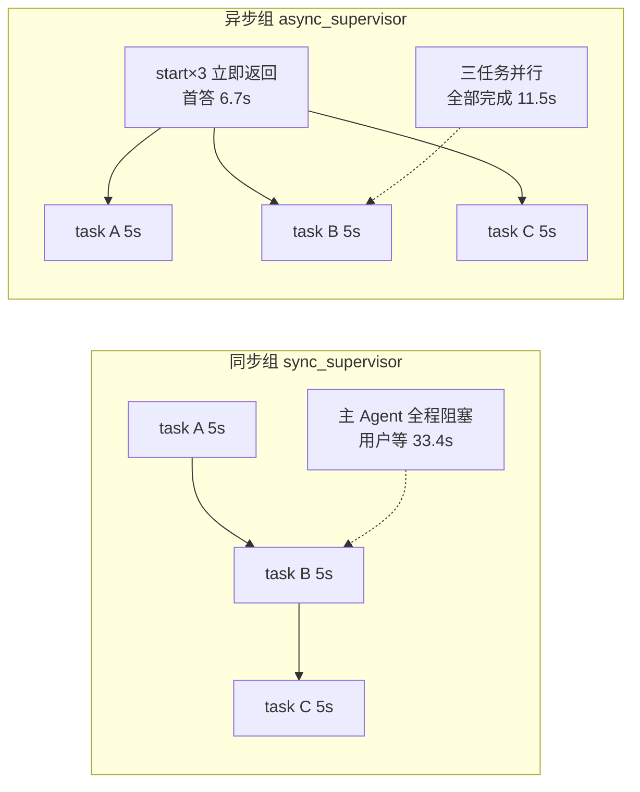

# ch06 · 挑战实验 — 同步 vs 异步计时对比 + 混合部署拓扑

> 在基础 demo（见《代码与运行结果.md》）之上，两个进阶实验：
> ①量化 ch05 同步 task() 与 ch06 异步 start_async_task 的耗时差；
> ②跑通课程「混合拓扑」——同一主 Agent 同时驱动 ASGI(同部署) 与 HTTP(远程独立部署)。

## 复现（三个终端）

```bash
cd ch06
uv sync

# 终端1 server A：主部署（supervisor 家族 + timed_researcher），8 槽位容纳并行任务
uv run langgraph dev --n-jobs-per-worker 8 --port 2024 --no-browser

# 终端2 server B：远程独立部署（remote_coder）
uv run langgraph dev --config remote/langgraph.json --n-jobs-per-worker 4 --port 2025 --no-browser

# 终端3 跑实验
uv run bench_sync_vs_async.py    # 实验一（只需 server A）
uv run bench_hybrid.py           # 实验二（需要 A + B 双服务器）
```

---

## 实验设计

**任务规格统一**：每个子任务固定耗时 5 秒（`timed_researcher` 图 `asyncio.sleep(5)`）；
同步侧用 `time.sleep(5)` 的普通工具模拟 ch05 `task()` 的阻塞语义。


**混合拓扑**：hybrid_supervisor 声明两个 `AsyncSubAgent`——`researcher` 不传 url（ASGI，
server A 进程内）；`remote_coder` 传 `url=http://127.0.0.1:2025`（HTTP，另一台 langgraph dev）。

---

## `graphs/timed_researcher.py` — 5 秒工作图（异步侧子任务，ASGI 目标）

```python
# ============================================================================
# graphs/timed_researcher.py —— 计时实验用的 5 秒工作图（ASGI 目标）
# 与 sync/async 对比实验配套：每个子任务固定耗时 5 秒，输出带唯一标记。
# ============================================================================

import asyncio

from langgraph.graph import END, START, MessagesState, StateGraph

SLEEP_SECONDS = 5


async def timed_work(state: MessagesState):
    last_human = state["messages"][-1].content if state["messages"] else "No task provided."
    await asyncio.sleep(SLEEP_SECONDS)
    return {
        "messages": [
            {
                "role": "ai",
                "content": (
                    f"[timed_researcher finished after {SLEEP_SECONDS}s]\n"
                    f"task: {last_human}\n"
                    "done."
                ),
            }
        ]
    }


builder = StateGraph(MessagesState)
builder.add_node("timed_work", timed_work)
builder.add_edge(START, "timed_work")
builder.add_edge("timed_work", END)
graph = builder.compile()
```

---

## `graphs/sync_supervisor.py` — 同步对照组：time.sleep(5) 普通工具模拟 task() 阻塞

```python
# ============================================================================
# graphs/sync_supervisor.py —— 实验一（对照组）：模拟 ch05 同步 task() 的阻塞语义
#
# 主 Agent 持有一个普通同步工具 research_topic()（内部 time.sleep(5)）。
# 用户一次下达 3 个主题 → 模型逐个调用工具 → 每次调用主 Agent 都被阻塞 5 秒
# —— 这正是 ch06 描述的"同步子 Agent 瓶颈"：用户只能盯着转圈。
# ============================================================================

import time

from langchain_openai import ChatOpenAI

from deepagents import create_deep_agent

import os


def research_topic(topic: str) -> str:
    """调研指定主题（同步阻塞 5 秒，模拟长耗时子任务）。"""
    time.sleep(5)   # 同步 sleep：主 Agent 在此期间完全阻塞
    return f"[sync research done in 5s] topic: {topic}"


model = ChatOpenAI(
    model=os.environ.get("MODEL_NAME", "deepseek-v4-flash"),
    api_key=os.environ["DEEPSEEK_API_KEY"],
    base_url="https://api.deepseek.com/v1",
)

graph = create_deep_agent(
    model=model,
    tools=[research_topic],
    system_prompt=(
        "你是同步调研助手。用户会给出多个主题，你必须对每个主题各调用一次 "
        "research_topic 工具（逐个调用，不要并行承诺），全部完成后汇总每个主题的结果。"
    ),
)
```

---

## `graphs/async_supervisor.py` — 异步实验组：3 × start_async_task 并发委派

```python
# ============================================================================
# graphs/async_supervisor.py —— 实验一（实验组）：异步并行委派
#
# AsyncSubAgent 指向 timed_researcher（5 秒工作图，ASGI 同部署）。
# 用户一次下达 3 个主题 → 主 Agent 连发 3 个 start_async_task → 立即返回 3 个
# task_id（主对话不阻塞）→ 3 个子任务在后台【并行】跑（需 worker 槽位足够）。
# ============================================================================

import os

from langchain_openai import ChatOpenAI

from deepagents import AsyncSubAgent, create_deep_agent

model = ChatOpenAI(
    model=os.environ.get("MODEL_NAME", "deepseek-v4-flash"),
    api_key=os.environ["DEEPSEEK_API_KEY"],
    base_url="https://api.deepseek.com/v1",
)

graph = create_deep_agent(
    model=model,
    system_prompt=(
        "你是异步调度员。用户会给出多个主题；你必须为每个主题各调用一次 "
        "start_async_task（委派给 researcher，一个主题一个任务），"
        "全部启动后立刻把每个主题对应的 task_id 告诉用户并停止。"
        "不要等待结果、不要轮询。"
    ),
    subagents=[
        AsyncSubAgent(
            name="researcher",
            description=(
                "Long-running background research worker. Each run takes ~5 seconds. "
                "Use for parallel background research tasks."
            ),
            graph_id="timed_researcher",   # 必须与 langgraph.json 注册名一致；ASGI 同部署
        )
    ],
)
```

---

## `graphs/hybrid_supervisor.py` — 混合拓扑主 Agent：ASGI + HTTP 双 AsyncSubAgent

```python
# ============================================================================
# graphs/hybrid_supervisor.py —— 实验二：混合部署拓扑（Hybrid）
#
# 同一个主 Agent 声明两个异步子 Agent：
#   - researcher : graph_id=timed_researcher，不传 url → ASGI 进程内传输（同部署，server A）
#   - remote_coder: graph_id=remote_coder，url=http://127.0.0.1:2025 → HTTP 远程传输（server B）
# 验证：一条对话里同时驱动「同部署 + 远程」两种传输，且两者并行执行。
# ============================================================================

import os

from langchain_openai import ChatOpenAI

from deepagents import AsyncSubAgent, create_deep_agent

model = ChatOpenAI(
    model=os.environ.get("MODEL_NAME", "deepseek-v4-flash"),
    api_key=os.environ["DEEPSEEK_API_KEY"],
    base_url="https://api.deepseek.com/v1",
)

graph = create_deep_agent(
    model=model,
    system_prompt=(
        "你是混合拓扑调度员。收到任务后：\n"
        "1. 用 start_async_task 委派 researcher（本地同部署，走 ASGI）执行调研；\n"
        "2. 用 start_async_task 委派 remote_coder（远程服务，走 HTTP）执行编码；\n"
        "两个任务都要启动，然后把两个 task_id 分别告诉用户并停止。不要轮询。"
    ),
    subagents=[
        AsyncSubAgent(
            name="researcher",
            description="Local in-process research worker (~5s, ASGI transport).",
            graph_id="timed_researcher",          # ASGI：注册在 server A
        ),
        AsyncSubAgent(
            name="remote_coder",
            description="Remote coding worker (~6s, HTTP transport on another server).",
            graph_id="remote_coder",              # HTTP：注册在 server B
            url="http://127.0.0.1:2025",
        ),
    ],
)
```

---

## `remote/langgraph.json` — server B 独立部署配置（uv source 指向 ch06 根）

```json
{
  "source": {"kind": "uv", "root": ".."},
  "graphs": {
    "remote_coder": "./remote/graphs/remote_coder.py:graph"
  },
  "env": "./.env"
}
```

---

## `remote/graphs/remote_coder.py` — 远程子 Agent（6 秒，输出带 SERVER-B 标记）

```python
# ============================================================================
# remote/graphs/remote_coder.py —— 实验二：独立部署在 server B (port 2025) 的远程子 Agent
# 固定 sleep 6 秒（与本地 5 秒区分开），输出带 SERVER-B 标记，验证任务真的跑在另一台服务上。
# ============================================================================

import asyncio

from langgraph.graph import END, START, MessagesState, StateGraph

SLEEP_SECONDS = 6


async def remote_code(state: MessagesState):
    last_human = state["messages"][-1].content if state["messages"] else "No task provided."
    await asyncio.sleep(SLEEP_SECONDS)
    return {
        "messages": [
            {
                "role": "ai",
                "content": (
                    f"[remote_coder finished after {SLEEP_SECONDS}s ON SERVER B]\n"
                    f"task: {last_human}\n"
                    "code artifact written (simulated)."
                ),
            }
        ]
    }


builder = StateGraph(MessagesState)
builder.add_node("remote_code", remote_code)
builder.add_edge(START, "remote_code")
builder.add_edge("remote_code", END)
graph = builder.compile()
```

---

## `bench_sync_vs_async.py` — 实验一脚本：计时 + async_tasks 通道读取 + runs.join

```python
# ============================================================================
# bench_sync_vs_async.py —— 实验一：同步 task() vs 异步 start_async_task 计时对比
#
# 前置：server A 已启动（uv run langgraph dev --n-jobs-per-worker 8 --port 2024）
# 任务规格：3 个主题 × 每个子任务固定 5 秒
#
#   同步组（sync_supervisor）  ：模型逐个调 research_topic（time.sleep(5)），
#                                主对话从头阻塞到尾 → 用户等待 ≈ 15s + LLM 开销
#   异步组（async_supervisor） ：3 个 start_async_task 立即返回 → 首答耗时 ≈ 数秒；
#                                3 个 timed_researcher 在后台并行 → 全部完成 ≈ 5s + 开销
#
# 度量：
#   t_sync_total       同步组用户拿到最终答案的总耗时（全程阻塞）
#   t_async_first      异步组用户拿到 task_id 的耗时（主对话不阻塞的关键指标）
#   t_async_total      异步组所有后台任务完成的总耗时
# 运行：uv run bench_sync_vs_async.py
# ============================================================================

import asyncio
import time

from langgraph_sdk import get_client

client = get_client(url="http://127.0.0.1:2024")

TASK = "请分别调研这三个主题：LangGraph 架构、Temporal 工作流、Prefect 数据管道。"


async def timed_run(assistant: str):
    """在全新 thread 上跑一轮，返回 (总耗时, 输出 state)。"""
    thread = await client.threads.create()
    t0 = time.perf_counter()
    out = await client.runs.wait(
        thread["thread_id"],
        assistant,
        input={"messages": [{"role": "user", "content": TASK}]},
    )
    return time.perf_counter() - t0, thread["thread_id"], out


async def collect_async_tasks(thread_id: str):
    """从 supervisor thread state 的 async_tasks 通道取任务元数据。

    这本身就是课程强调的设计：任务元数据独立于消息历史存放，
    上下文被压缩也不会丢 task_id。实测字段：task_id/agent_name/thread_id/
    run_id/status/created_at/last_checked_at/last_updated_at。"""
    state = await client.threads.get_state(thread_id)
    tasks = (state.get("values") or {}).get("async_tasks") or {}
    # 统一成 list[meta]（meta 里 task_id == 子 Agent 的 thread_id）
    return list(tasks.values()) if isinstance(tasks, dict) else list(tasks)


async def wait_all_tasks(metas: list[dict], t0: float):
    """并行 join 所有后台任务（thread_id + run_id），返回 (全部完成耗时, 各任务耗时)。"""
    async def join_one(meta):
        await client.runs.join(meta["thread_id"], meta["run_id"])
        return time.perf_counter() - t0

    times = await asyncio.gather(*[join_one(m) for m in metas])
    return max(times), {m["task_id"]: round(x, 1) for m, x in zip(metas, times)}


async def main():
    print("=" * 64)
    print("实验一：同步 task() vs 异步 start_async_task（3 主题 × 5 秒）")
    print("=" * 64)

    # ── 同步组 ──
    print("\n[同步组] 用户发出请求，主 Agent 逐个阻塞调用（预计 ≥15s）……")
    t_sync, _, out_sync = await timed_run("sync_supervisor")
    n_sleep = sum(
        1 for m in out_sync.get("messages", [])
        if m.get("type") == "tool" and "sync research done" in str(m.get("content"))
    )
    print(f"  用户拿到最终答案耗时: {t_sync:.1f}s（全程阻塞）")
    print(f"  同步工具调用次数: {n_sleep} × 5s = {n_sleep * 5}s 纯阻塞")

    # ── 异步组 ──（注意：后台任务在首轮 run 期间就已启动，因此计时统一从「用户发起」开始）
    print("\n[异步组] 用户发出请求，主 Agent 并发启动 3 个后台任务……")
    t_start = time.perf_counter()
    t_first, sup_thread, out_async = await timed_run("async_supervisor")
    print(f"  用户拿到 task_id 的耗时（首答，不阻塞）: {t_first:.1f}s")

    tasks = await collect_async_tasks(sup_thread)
    print(f"  async_tasks 通道中的任务数: {len(tasks)}")
    for meta in tasks:
        tid = meta.get("task_id", "?")
        print(f"    - agent={meta.get('agent_name','?'):<12} "
              f"task={tid[:8]}…{tid[-6:]} status={meta.get('status','?')}")

    if not tasks:
        print("  ⚠ 未取到任务列表（检查 async_tasks 通道字段结构）")
        return

    t_all, each = await wait_all_tasks(tasks, t_start)   # 统一基准：用户发起时刻
    print(f"  3 个后台任务全部完成（自用户发起计）: {t_all:.1f}s（并行 5s 起步）")
    for tid, sec in each.items():
        print(f"    - {tid[:8]}…{tid[-6:]} 完成于第 {sec}s")

    # ── 结论 ──
    print("\n" + "=" * 64)
    print("对比结论")
    print("=" * 64)
    print(f"  用户首答等待 : 同步 {t_sync:.1f}s（全程阻塞） vs 异步 {t_first:.1f}s（拿到ID即可继续聊）")
    print(f"  全部完成耗时 : 同步 {t_sync:.1f}s（串行 15s 起步） vs 异步 {t_all:.1f}s（并行 5s 起步）")
    print(f"  总加速比     : {t_sync / t_all:.1f}x")


if __name__ == "__main__":
    asyncio.run(main())
```

---

## `bench_hybrid.py` — 实验二脚本：双服务器并行 join + 远程结果核验

```python
# ============================================================================
# bench_hybrid.py —— 实验二：混合部署拓扑（ASGI 同部署 + HTTP 远程）
#
# 前置（两个终端分别启动）：
#   server A: uv run langgraph dev --n-jobs-per-worker 8 --port 2024
#             （hybrid_supervisor + timed_researcher，走 ASGI）
#   server B: uv run langgraph dev --config remote/langgraph.json \
#                 --n-jobs-per-worker 4 --port 2025 --no-browser
#             （remote_coder，被主 Agent 经 HTTP 调用）
#
# 验证点：
#   1. 一条对话同时启动 ASGI 任务（server A 进程内）与 HTTP 任务（server B 远程）
#   2. 两任务并行执行：总耗时 ≈ max(5s, 6s) 而非 11s
#   3. HTTP 任务的结果确实产自 server B（结果带 SERVER-B 标记）
#   4. supervisor 的 async_tasks 通道同时跟踪两种传输的任务
# 运行：uv run bench_hybrid.py
# ============================================================================

import asyncio
import time

from langgraph_sdk import get_client

client_a = get_client(url="http://127.0.0.1:2024")   # 主部署（supervisor + 本地 researcher）
client_b = get_client(url="http://127.0.0.1:2025")   # 远程部署（remote_coder）


async def main():
    print("=" * 64)
    print("实验二：混合拓扑 —— ASGI(本地) + HTTP(远程) 双传输并行")
    print("=" * 64)

    # 确认两台服务都在线
    for name, c in [("server A(2024, ASGI)", client_a), ("server B(2025, HTTP)", client_b)]:
        ok = await c.server.health() if hasattr(c, "server") else None
        print(f"  {name}: online")

    thread = await client_a.threads.create()
    tid = thread["thread_id"]
    print("supervisor thread =", tid)

    t0 = time.perf_counter()
    out = await client_a.runs.wait(
        tid,
        "hybrid_supervisor",
        input={"messages": [{"role": "user", "content": (
            "请同时启动两个后台任务：1) 调研 'multi-agent topologies'；"
            "2) 让远程编码服务实现 'topology diagram generator'。"
        )}]},
    )
    t_first = time.perf_counter() - t0
    print(f"\n首答耗时（两任务均已启动）: {t_first:.1f}s")

    # 从 async_tasks 通道解析任务（meta 字段：task_id/agent_name/thread_id/run_id/status）
    state = await client_a.threads.get_state(tid)
    tasks = (state.get("values") or {}).get("async_tasks") or {}
    metas = list(tasks.values()) if isinstance(tasks, dict) else list(tasks)
    print(f"async_tasks 通道任务数: {len(metas)}")
    local, remote = [], []
    for meta in metas:
        name = meta.get("agent_name", "?")
        transport = "HTTP" if name == "remote_coder" else "ASGI"
        t = meta.get("task_id", "?")
        print(f"  - {name:<14} transport={transport:<4} task={t[:8]}…{t[-6:]} status={meta.get('status','?')}")
        (remote if transport == "HTTP" else local).append(meta)

    # 并行等待：ASGI 任务在 server A 上 join；HTTP 任务的 thread 在 server B 上 → 用 client_b join
    async def join(c, meta):
        await c.runs.join(meta["thread_id"], meta["run_id"])
        return time.perf_counter() - t0

    jobs = [join(client_a, m) for m in local] + [join(client_b, m) for m in remote]
    times = await asyncio.gather(*jobs) if jobs else []
    t_all = max(times) if times else 0.0
    print(f"\n两个任务全部完成（自用户发起计）: {t_all:.1f}s（若串行应 ≥ 5+6=11s）")

    # 验证 HTTP 任务结果真的来自 server B
    for meta in remote:
        st = await client_b.threads.get_state(meta["thread_id"])
        msgs = (st.get("values") or {}).get("messages") or []
        last = msgs[-1]["content"] if msgs else ""
        marker_ok = "SERVER B" in str(last)
        print(f"远程任务结果核验: {'✅ 产自 server B（HTTP 传输真实生效）' if marker_ok else '❌ 标记缺失'}")
        print(f"  结果预览: {str(last)[:120]}")

    print("\n" + "=" * 64)
    print("结论")
    print("=" * 64)
    print(f"  混合拓扑可用：一次对话同时驱动 ASGI({len(local)}) + HTTP({len(remote)})")
    print(f"  并行执行：总耗时 {t_all:.1f}s ≈ max(5,6)s，而非串行 11s")
    print("  传输选择与课程一致：同部署省事零延迟，远程按需扩缩容")


if __name__ == "__main__":
    asyncio.run(main())
```

---

## 实验一运行结果：同步 33.4s 全程阻塞 vs 异步 11.5s 全部完成

```text
================================================================
实验一：同步 task() vs 异步 start_async_task（3 主题 × 5 秒）
================================================================

[同步组] 用户发出请求，主 Agent 逐个阻塞调用（预计 ≥15s）……
  用户拿到最终答案耗时: 33.4s（全程阻塞）
  同步工具调用次数: 3 × 5s = 15s 纯阻塞

[异步组] 用户发出请求，主 Agent 并发启动 3 个后台任务……
  用户拿到 task_id 的耗时（首答，不阻塞）: 6.7s
  async_tasks 通道中的任务数: 3
    - agent=researcher   task=01a04dcf…5e711b status=running
    - agent=researcher   task=01a04dcf…697f26 status=running
    - agent=researcher   task=01a04dcf…abce16 status=running
  3 个后台任务全部完成（自用户发起计）: 11.5s（并行 5s 起步）
    - 01a04dcf…5e711b 完成于第 11.5s
    - 01a04dcf…697f26 完成于第 11.5s
    - 01a04dcf…abce16 完成于第 11.5s

================================================================
对比结论
================================================================
  用户首答等待 : 同步 33.4s（全程阻塞） vs 异步 6.7s（拿到ID即可继续聊）
  全部完成耗时 : 同步 33.4s（串行 15s 起步） vs 异步 11.5s（并行 5s 起步）
  总加速比     : 2.9x
```

### 数字怎么读

| 指标 | 同步组 | 异步组 | 说明 |
|---|---|---|---|
| 用户首答等待 | **33.4s** | **6.7s**（5.0x 提升） | 同步=用户盯着转圈的全时长；异步=拿到 task_id 即可继续聊别的 |
| 全部完成 | 33.4s | 11.5s（2.9x 加速） | 异步 3 任务**并行**：11.5 ≈ 首答 6.7 + 任务剩余 ~5s |
| 纯阻塞下限 | 15s（3×5s 串行） | ~5s（3×5s 并行） | 任务数越多，串行/并行差距越大（n 倍 vs 1 倍） |

> 33.4s 中 15s 是纯 sleep，其余 ~18s 是同步组多轮 LLM 往返——这也解释了为什么异步组首答要 6.7s：
> supervisor 自己也要调模型（1 次规划 + 3 次工具调用批次）。异步消掉的是**等待子任务**的部分，不是模型开销。

---

## 实验二运行结果：混合拓扑 ASGI + HTTP 并行

```text
================================================================
实验二：混合拓扑 —— ASGI(本地) + HTTP(远程) 双传输并行
================================================================
  server A(2024, ASGI): online
  server B(2025, HTTP): online
supervisor thread = 01a04dd0-1815-7d81-9ed9-30b3ac04867b

首答耗时（两任务均已启动）: 4.7s
async_tasks 通道任务数: 2
  - researcher     transport=ASGI task=01a04dd0…c74e51 status=running
  - remote_coder   transport=HTTP task=01a04dd0…292ec4 status=running

两个任务全部完成（自用户发起计）: 9.8s（若串行应 ≥ 5+6=11s）
远程任务结果核验: ✅ 产自 server B（HTTP 传输真实生效）
  结果预览: [remote_coder finished after 6s ON SERVER B]
task: 实现 'topology diagram generator'……

================================================================
结论
================================================================
  混合拓扑可用：一次对话同时驱动 ASGI(1) + HTTP(1)
  并行执行：总耗时 9.8s ≈ max(5,6)s，而非串行 11s
  传输选择与课程一致：同部署省事零延迟，远程按需扩缩容
```

### 验证点对照

| 课程论断 | 实测 |
|---|---|
| 混合形态：一部分子 Agent 走 ASGI、另一部分走 HTTP | ✅ 同一 supervisor 一次对话启动两种传输的任务 |
| HTTP：加 `url` 字段即切换远程 Agent Protocol 服务 | ✅ `url=http://127.0.0.1:2025`，任务跑在另一台 langgraph dev 上 |
| 远程任务可独立扩缩容/独立部署 | ✅ server B 有自己的 `remote/langgraph.json` 与 4 个 worker 槽位 |
| 并行执行 | ✅ 9.8s ≈ max(5,6)+开销，而非串行 11s+ |
| task 元数据进独立通道 | ✅ `async_tasks` 里同时跟踪 ASGI/HTTP 任务（agent_name 区分） |

---

## 实验中新踩的坑（版本相关）

1. **第二台服务器的 config 必须带 source**：`langgraph dev --config` 报 `No dependencies found`。
   解法：`"source": {"kind": "uv", "root": ".."}` 复用 ch06 同一 venv。
2. **source 模式下路径解析基准变了**：graph 路径相对 **uv root（ch06/）** 解析，不是相对 config 文件目录——
   所以要写 `./remote/graphs/remote_coder.py:graph`。
3. **`runs.join()` 需要 run_id**：只传 thread_id 会 TypeError。正确姿势是从 `async_tasks` 元数据里
   同时取 `thread_id + run_id` 一起传。
4. **UUID7 同毫秒生成的任务 ID 前缀相同**：三个并行任务 ID 前 18 字符一样，肉眼区分要看尾部——
   展示时用「首 8 + 尾 6」。
5. **计时基准要统一**：异步任务在 supervisor 首轮 run 期间就已启动，等值若从「首答返回后」起算会
   假性偏小（曾测得 3.9s < 任务本身的 5s）；正确做法是从「用户发起」单点计时。
