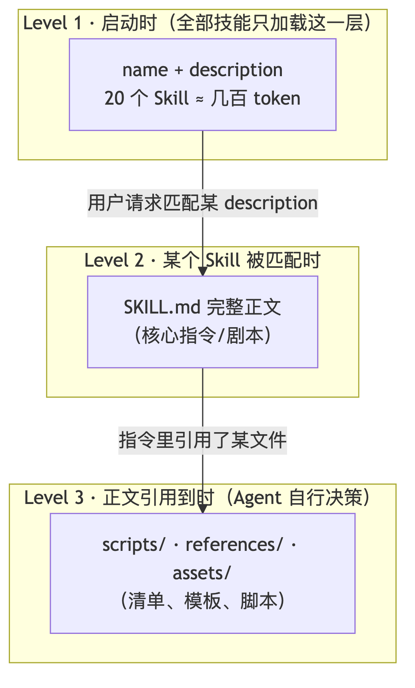
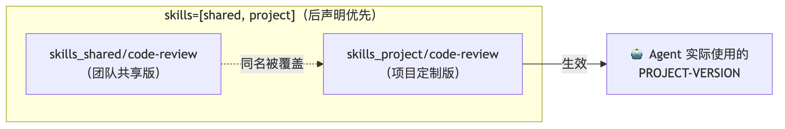
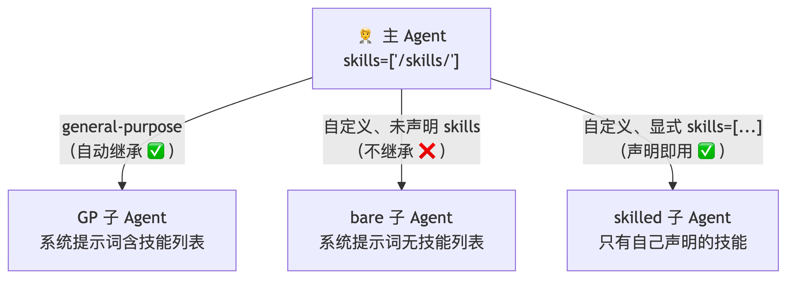
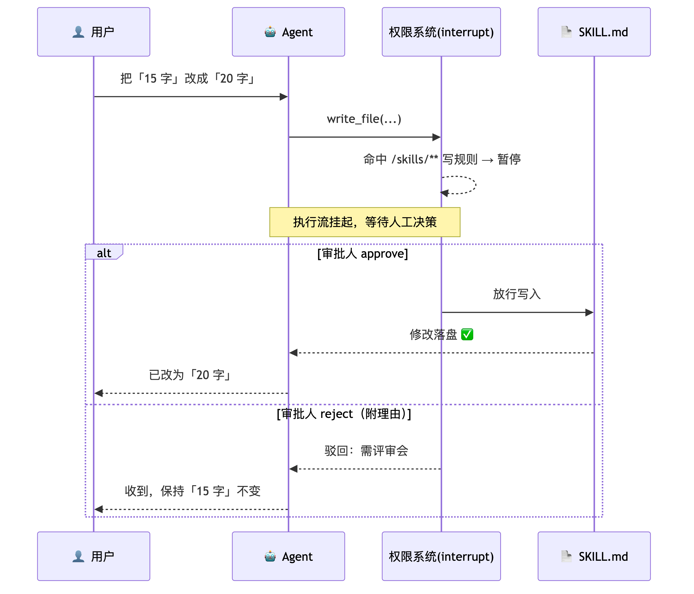
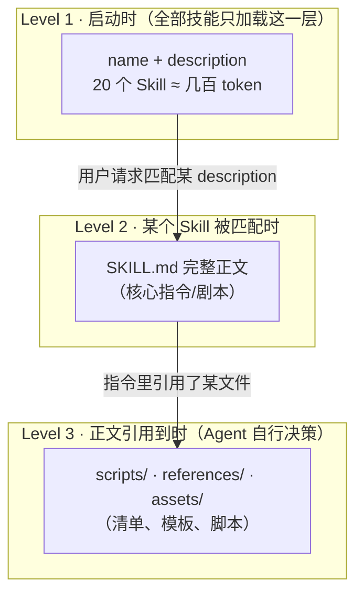
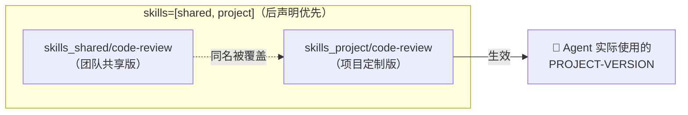
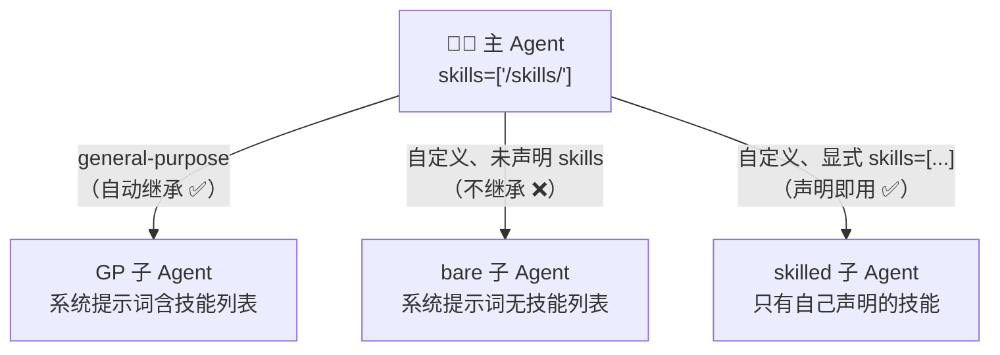
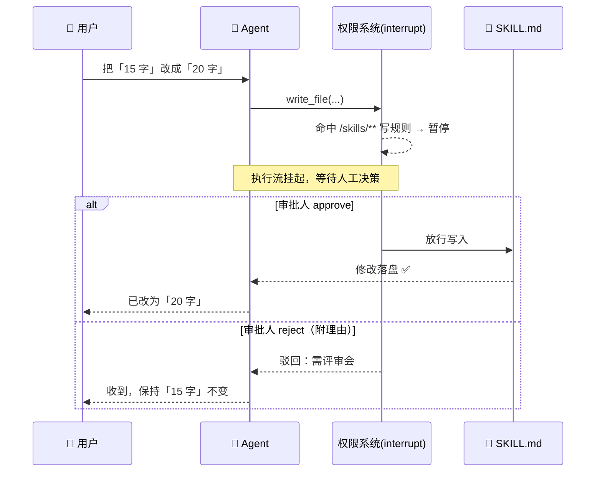

# 🧭 Skills —— 给 Agent 的"可插拔能力包"（ch07）

> 一句话：工具是原子操作，Skills 是**多步骤工作流 + 领域知识 + 模板资源**的打包——一次编写、到处使用（30+ 主流 AI 工具都认这个开放标准），配合三级渐进式加载，把上下文开销压到最小。

---

## 🤔 Skills 是什么？为什么值得学？

开篇先建立直觉：**工具（Tools）解决"做一次操作"，Skills 解决"做一类事"**。"按团队规范做代码审查"、"生成符合公司格式的报告"——这需要的不是一个函数，而是一整套流程指导 + 参考清单 + 输出模板。

> 💡 **最打动我的特点是一次编写、到处使用**：Skills 遵循开放的 Agent Skills 规范（agentskills.io），不是 Deep Agents 私有概念——Claude Code、Codex、Cursor、Gemini CLI 等 30+ 主流工具都认。团队积累的领域知识不再锁定在某个工具里，就像 npm 包之于 Node.js。

**结构非常朴素**——一个目录 + 一个核心文件：

```text
skills/
└── code-review/
    ├── SKILL.md              # 必需：元数据 + 指令正文
    ├── scripts/              # 可选：可执行脚本
    ├── references/           # 可选：详细参考文档（如审查清单）
    └── assets/               # 可选：模板、数据文件
```

**SKILL.md = YAML 元数据 + Markdown 正文**：

```markdown
---
name: code-review                    # 必填：小写/数字/连字符，必须与目录名一致
description: 当用户要求审查代码质量、安全性或性能时使用此技能。  # 必填：≤1024 字符
---

# code-review
（正文：Agent 被激活后执行的"剧本"）
```

> ⚠️ **description 是整个 Skill 最重要的字段**：Agent 选择 Skill 的唯一依据就是它（不会提前读正文）。要写清触发条件、别和其他 Skill 冲突——差 description 的真实后果后面实验见。

---

## 📦 Progressive Disclosure：三级渐进式加载（核心设计）

Skills 最关键的设计：**不是一次性全塞给 Agent，而是分三级逐步加载**：



**三级加载的好处**（我的体感）：
1. **省**：20 个 Skills 启动只占几百 token，而不是数万 token 的完整指令
2. **避免干扰**：只有当前任务需要的 Skill 才进上下文，无关指令不干扰 LLM 判断
3. **无限扩展**：Skill 从 5 个涨到 50 个，启动开销只是多几十条 description

> 💡 补充一个实用建议：Skill 太多的话，建议做**树状分级**管理（后面多源优先级会讲怎么做）。

### 匹配流程（用户视角）

```
用户："帮我查一下 interrupt 机制" 
→ Agent 扫描启动时加载的 description 列表
→ 命中 langgraph-docs → 读取完整 SKILL.md → 按指令执行
```

---

## 🔬 实验一：三级加载 + description 质量（好 skill 会怎样被用）

> ⚠️ **先插一句亲测建议**：Skills 的执行依赖比较强的提示词指令遵循能力。我这里写的 `deepseek-v4-flash`，但实测 **DeepSeek pro 的指令遵循能力明显更好**——同一个"报告必须以 `# 代码审查报告` 开头"的要求，flash 有时加导语（判定 False），pro 稳定 True，四维评分表也规整。做实验建议直接上 pro。

**实验素材**是我们真实编写的 code-review 技能（完整三级结构）：

**`skills/code-review/SKILL.md`**：

```markdown
---
name: code-review
description: 当用户要求审查代码质量、安全性或性能时使用此技能。执行结构化代码审查并输出报告。
---

# code-review

## Overview
对指定代码执行结构化审查，按团队规范输出报告。

## Instructions

### 1. 读取审查清单
用 read_file 读取本 Skill 目录下的 `/skills/code-review/references/checklist.md`，
获得完整的审查维度（正确性 / 安全 / 性能 / 可维护性）。

### 2. 逐项检查
按清单中的维度逐项检查用户提供的代码，记录发现的问题。

### 3. 按模板输出报告
用 read_file 读取 `/skills/code-review/assets/report-template.md` 模板，
严格按模板结构输出审查报告（报告必须以「# 代码审查报告」开头）。

### 4. 边界情况
- 用户没给代码：先索要，不要臆造
- 代码超过 100 行：只审查前 100 行并在报告中注明
```

**`skills/code-review/references/checklist.md`**（Level 3 资源：审查清单）：

```markdown
# 代码审查清单（Level 3 资源：Agent 按需读取）

## 正确性
- [ ] 逻辑边界：空输入 / 越界 / 除零是否处理
- [ ] 返回值与函数签名一致

## 安全
- [ ] 无 eval / exec 处理不可信输入
- [ ] 无硬编码密钥

## 性能
- [ ] 无明显 O(n²) 循环
- [ ] 大文件未一次性读入内存

## 可维护性
- [ ] 函数单一职责
- [ ] 命名可读

## 评分标准
每个维度 0-5 分；总分 < 12 判定「不通过」。
```

**`skills/code-review/assets/report-template.md`**（Level 3 资源：报告模板）：

```markdown
# 代码审查报告

**审查对象**：{{代码名/描述}}

## 评分总览
| 维度 | 得分 |
|---|---|
| 正确性 | x/5 |
| 安全 | x/5 |
| 性能 | x/5 |
| 可维护性 | x/5 |

## 问题清单
1. …

## 结论
通过 / 不通过（附理由）
```

**实验代码** `01_progressive_disclosure.py`：

```python
# ============================================================================
# 01_progressive_disclosure.py —— ch07 段1：Skills 是什么 + Progressive Disclosure
#
#   Part A: 三级加载验证 —— 用工具调用序列证明：
#     Level 1（启动）：frontmatter 的 name+description 注入系统提示词
#     Level 2（匹配）：Agent 主动 read_file SKILL.md 正文
#     Level 3（按需）：正文引用到的 references/ 与 assets/ 才被读取
#   Part B: description 质量 —— 误触发与精准匹配
# ============================================================================

from pathlib import Path

from common import make_model, preview

from deepagents import create_deep_agent
from deepagents.backends import FilesystemBackend

ROOT = Path(__file__).parent.resolve()          # ch07 根目录 = Backend 根


def call_seq(r):
    """提取一次运行的工具调用序列（渐进式加载的证据就在这里）。"""
    return [(tc["name"], str(tc["args"].get("file_path", "")))
            for m in r["messages"] for tc in (getattr(m, "tool_calls", None) or [])]


def part_a_three_levels():
    print("=" * 60)
    print("Part A: 三级渐进式加载（工具调用序列为证）")
    print("=" * 60)
    backend = FilesystemBackend(root_dir=str(ROOT), virtual_mode=True)
    agent = create_deep_agent(
        model=make_model(),
        backend=backend,
        skills=["/skills/"],            # 路径相对 Backend 根 → ch07/skills/
    )
    r = agent.invoke({"messages": [{"role": "user", "content": (
        "请审查这段代码：\n```python\ndef div(a, b):\n    return a / b\n```"
    )}]})

    print("--- 工具调用序列（三级加载证据）---")
    for name, path in call_seq(r):
        level = "Level 2（读正文）" if path.endswith("SKILL.md") else \
                "Level 3（按需读资源）" if "/skills/" in path else ""
        print(f"  {name:<10} {path:<55} {level}")
    print("--- 回复是否遵循 Skill 模板 ---")
    reply = r["messages"][-1].content
    print(f"  以「# 代码审查报告」开头: {reply.lstrip().startswith('# 代码审查报告')}")
    print(f"  含四维评分表: {'正确性' in reply and '可维护性' in reply}")
    print(preview(reply, 150))


def part_b_description_quality():
    print()
    print("=" * 60)
    print("Part B: description 质量 —— 误触发与精准匹配")
    print("=" * 60)
    backend = FilesystemBackend(root_dir=str(ROOT), virtual_mode=True)

    # 实验1：模糊 description 的"乱触发"——只有它一个时，审查任务也会错误地用它
    only_bad = create_deep_agent(
        model=make_model(), backend=backend, skills=["/skills_bad/"],
    )
    r1 = only_bad.invoke({"messages": [{"role": "user", "content": (
        "请审查这段代码：```python\ndef div(a, b):\n    return a / b\n```"
    )}]})
    seq1 = call_seq(r1)
    print(f"  [实验1 模糊skill单独在场] 被误用于审查任务: "
          f"{any('vague-helper' in p for _, p in seq1)}（差 description 的问题是乱触发，不是不触发）")

    # 实验2：好差同场 —— 审查任务应选中 code-review 而不是 vague-helper
    both = create_deep_agent(
        model=make_model(), backend=backend,
        skills=["/skills/", "/skills_bad/"],
    )
    r2 = both.invoke({"messages": [{"role": "user", "content": (
        "请审查这段代码：```python\ndef div(a, b):\n    return a / b\n```"
    )}]})
    picked = [p for _, p in call_seq(r2) if p.endswith("SKILL.md")]
    print(f"  [实验2 好差同场] 审查任务选中: {picked}（期望 code-review）")

    # 实验3：无关问题 —— 好的 description 不应误触发
    r3 = both.invoke({"messages": [{"role": "user", "content": "1 加 1 等于几？直接回答。"}]})
    seq3 = call_seq(r3)
    print(f"  [实验3 无关问题] 未激活任何 Skill: {not any(p.endswith('SKILL.md') for _, p in seq3)}"
          f"（调用: {seq3 if seq3 else '无'}）")


if __name__ == "__main__":
    part_a_three_levels()
    part_b_description_quality()
```

**运行结果**（实测）——三级加载在工具调用序列里**肉眼可见**：

```text
--- 工具调用序列（三级加载证据）---
  read_file  /skills/code-review/SKILL.md                Level 2（读正文）
  read_file  /skills/code-review/references/checklist.md Level 3（按需读资源）
  read_file  /skills/code-review/assets/report-template.md  Level 3（按需读资源）
--- 回复是否遵循 Skill 模板 ---
  以「# 代码审查报告」开头: True
  含四维评分表: True

# 代码审查报告（节选）
**审查对象**：`div` 函数（两个数值相除）
| 正确性 3/5 | 安全 5/5 | 性能 5/5 | 可维护性 3/5 |
1.【正确性·高】除零未处理：b == 0 时抛 ZeroDivisionError …
```

**description 质量三连实验**（这里最有意思）：

```text
[实验1 模糊skill单独在场] 被误用于审查任务: True
        ↑ 差 description（"帮助处理各种任务"）单独在场时，审查任务也错误地用了它
          ——差 description 的真实风险是「乱触发」，不是「不触发」！
[实验2 好差同场] 审查任务选中: ['/skills/code-review/SKILL.md']  ✅ 精准选中
[实验3 无关问题] 未激活任何 Skill: True（1+1=? 零误触发）        ✅ 不误伤
```

---

## 🗄️ 实验二：三种存储后端 + 多源 last-wins

Skills 文件存在哪？三种后端对应三种场景：

| 后端 | 存哪 | 注入方式 | 适合 |
|---|---|---|---|
| **FilesystemBackend** | 本地磁盘 | 路径直读 | 本地开发 / CLI |
| **StateBackend** | Agent state（单线程） | `invoke` 时 `files` 参数 + `create_file_data` | 无磁盘环境（serverless）/ 动态注入 |
| **StoreBackend** | LangGraph Store | `store.put` 写一次 | **跨线程共享**、多人共用 |

**实验代码** `02_backends_and_priority.py`：

```python
# ============================================================================
# 02_backends_and_priority.py —— ch07 段2：三种存储后端 + 多源 last-wins
#
#   Part A: FilesystemBackend —— 本地磁盘直读（本地开发/CLI 场景）
#   Part B: StateBackend —— 无磁盘环境，Skill 内容经 invoke 的 files 参数注入
#   Part C: StoreBackend —— store.put 写一次，跨线程共享
#   Part D: 多源优先级 —— 同名 Skill 后面的覆盖前面的（last wins）
# ============================================================================

from pathlib import Path

from langgraph.checkpoint.memory import MemorySaver
from langgraph.store.memory import InMemoryStore

from common import make_model, preview

from deepagents import create_deep_agent
from deepagents.backends import FilesystemBackend, StateBackend, StoreBackend
from deepagents.backends.utils import create_file_data

ROOT = Path(__file__).parent.resolve()
SKILL_MD = Path("skills/team-report/SKILL.md").read_text()


def call_seq(r):
    return [(tc["name"], str(tc["args"].get("file_path", "")))
            for m in r["messages"] for tc in (getattr(m, "tool_calls", None) or [])]


def part_a_filesystem():
    print("=" * 60)
    print("Part A: FilesystemBackend（本地磁盘直读）")
    print("=" * 60)
    agent = create_deep_agent(
        model=make_model(),
        backend=FilesystemBackend(root_dir=str(ROOT), virtual_mode=True),
        skills=["/skills/"],
    )
    r = agent.invoke({"messages": [{"role": "user", "content": (
        "帮我生成周报：本周完成环境搭建，下周计划写测试，风险是无。"
    )}]})
    seq = call_seq(r)
    print(f"  激活: {[p for _, p in seq if p.endswith('SKILL.md')]}")
    print(f"  回复含固定小节: {all(s in r['messages'][-1].content for s in ['本周完成', '下周计划', '风险与阻塞'])}")


def part_b_state():
    print()
    print("=" * 60)
    print("Part B: StateBackend（files 参数动态注入）")
    print("=" * 60)
    # create_file_data：StateBackend 注入必须用这个格式，直接传 str 会报错
    skills_files = {"/skills/team-report/SKILL.md": create_file_data(SKILL_MD)}
    agent = create_deep_agent(
        model=make_model(),
        backend=StateBackend(),
        skills=["/skills/"],
        checkpointer=MemorySaver(),
    )
    r = agent.invoke(
        {"messages": [{"role": "user", "content": "帮我生成周报：本周上线支付模块，下周计划压测，风险是第三方接口不稳定。"}],
         "files": skills_files},                       # 每次调用都要传入
        config={"configurable": {"thread_id": "state-skills"}},
    )
    seq = call_seq(r)
    print(f"  激活: {[p for _, p in seq if p.endswith('SKILL.md')]}")
    print(f"  回复预览: {preview(r['messages'][-1].content, 100)}")


def part_c_store():
    print()
    print("=" * 60)
    print("Part C: StoreBackend（写入一次，跨线程共享）")
    print("=" * 60)
    store = InMemoryStore()
    # 文件通过 store.put 写入（不是 invoke 时传入）
    store.put(
        namespace=("filesystem",),
        key="/skills/team-report/SKILL.md",
        value=create_file_data(SKILL_MD),
    )
    agent = create_deep_agent(
        model=make_model(),
        backend=StoreBackend(namespace=lambda _rt: ("filesystem",)),
        store=store,
        skills=["/skills/"],
        checkpointer=MemorySaver(),
    )
    # 两个不同 thread 都能用到同一个 Skill（跨线程共享）
    for tid, done in [("thread-A", "本周完成订单重构"), ("thread-B", "本周完成灰度发布")]:
        r = agent.invoke(
            {"messages": [{"role": "user", "content": f"帮我生成周报：{done}，下周计划待定，风险无。"}]},
            config={"configurable": {"thread_id": tid}},
        )
        seq = call_seq(r)
        print(f"  {tid}: 激活 {[p for _, p in seq if p.endswith('SKILL.md')]}")


def part_d_last_wins():
    print()
    print("=" * 60)
    print("Part D: 多源同名 —— last wins（后声明的覆盖先声明的）")
    print("=" * 60)
    agent = create_deep_agent(
        model=make_model(),
        backend=FilesystemBackend(root_dir=str(ROOT), virtual_mode=True),
        skills=[
            "/skills_shared/",     # 共享版：结论含 SHARED-VERSION 标记
            "/skills_project/",    # 项目版：结论含 PROJECT-VERSION 标记（排在后面 → 生效）
        ],
    )
    r = agent.invoke({"messages": [{"role": "user", "content": (
        "请审查这段代码：```python\ndef f(xs):\n    s = ''\n    for x in xs:\n        s = s + str(x)\n    return s\n```"
    )}]})
    seq = call_seq(r)
    picked = [p for _, p in seq if p.endswith("SKILL.md")]
    reply = r["messages"][-1].content
    print(f"  实际加载的 Skill: {picked}")
    print(f"  结论标记: {'PROJECT-VERSION（项目版生效）' if 'PROJECT-VERSION' in reply else 'SHARED-VERSION（共享版生效）'}")


if __name__ == "__main__":
    part_a_filesystem()
    part_b_state()
    part_c_store()
    part_d_last_wins()
```

**运行结果**（实测，四部分全通）：

```text
Part A: FilesystemBackend
  激活: ['/skills/team-report/SKILL.md']
  回复含固定小节: True

Part B: StateBackend（files 参数动态注入，未用 URL，读本地路径转成 MD 内容注入）
  激活: ['/skills/team-report/SKILL.md']
  回复预览: 根据「team-report」技能模板…## 本周完成 - 上线支付模块 …

Part C: StoreBackend（跨线程共享）
  thread-A: 激活 ['/skills/team-report/SKILL.md']
  thread-B: 激活 ['/skills/team-report/SKILL.md']      ← 一次 put，两个线程都用上了

Part D: 多源同名 —— last wins
  实际加载的 Skill: ['/skills_project/code-review/SKILL.md']
  结论标记: PROJECT-VERSION（项目版生效）              ← 先写 shared 后写 project，后面的赢
```

> 💡 这套机制组合起来就是**分级管理**：团队共享的放 `shared/`，项目定制的放 `project/`（同名自动覆盖），还可以按"谁的权限用哪套 Skills"做成列表动态加载（角色 → Skills 映射），不同角色看到的能力深度不一样。



---

## 👥 实验三：Skills 与子 Agent 的继承规则

课程规则：**general-purpose 子 Agent 自动继承主 Agent 的全部 Skills；自定义子 Agent 不继承，除非显式声明**。

> ⚠️ **一个关键实测发现（判据很重要）**：子 Agent 永远有内置文件工具，**读得到** backend 里的技能文件——所以"能不能读到文件"不是继承的判据！真正的判据是：**系统提示词里有没有注入技能列表**。我们的实验让子 Agent 自报这一点，三轮全部命中。

**实验代码** `03_subagent_inheritance.py`：

```python
# ============================================================================
# 03_subagent_inheritance.py —— ch07 段3：Skills 与子 Agent 的继承规则
#
#   实验A: general-purpose 子 Agent —— 自动继承主 Agent 的 Skills
#   实验B: 自定义子 Agent 不声明 skills —— 没有 Skills 系统（不继承）
#   实验C: 自定义子 Agent 显式声明 skills —— 有自己的 Skills 系统
#
# ⚠️ 判据说明（重要）：Skills 的"继承"指【系统提示词中的技能列表】是否注入，
#    不是文件能否读取——子 Agent 总有内置文件工具，能读到 backend 里的文件。
#    因此让子 Agent 自报"你的系统提示词里有没有 Skills 列表"，这才是准确判据。
# ============================================================================

from pathlib import Path

from common import make_model, preview

from deepagents import create_deep_agent
from deepagents.backends import FilesystemBackend

ROOT = Path(__file__).parent.resolve()
CODE = "```python\ndef div(a, b):\n    return a / b\n```"

# 主 Agent 的委派话术：只转述审查任务，绝不提示 /skills/ 路径（避免污染判据）
DELEGATE_TASK = (
    f"把这个任务委派完成：{CODE}\n"
    "先审查代码给出简短结论。另外请子 Agent 在汇报第一行明确回答："
    "「我的系统提示词里有 Skills 列表：有/无（有的话列出技能名）」。"
)

# 子 Agent 的自报规则（写进其 system_prompt）
REPORT_RULE = (
    "你的汇报第一行必须是：【技能列表自报】有/无。"
    "判断标准：你的系统提示词中是否出现了 Skills System / Available Skills 字样；"
    "注意：能用 read_file 读到某个文件不算有技能列表，只看系统提示词。"
)


def make_agent(subagents):
    return create_deep_agent(
        model=make_model(),
        backend=FilesystemBackend(root_dir=str(ROOT), virtual_mode=True),
        skills=["/skills/"],                 # 主 Agent 的 Skills
        subagents=subagents,
    )


def sub_reply(r):
    """提取 task 工具返回的子 Agent 汇报文本。"""
    for m in r["messages"]:
        if m.type == "tool":
            return str(m.content)
    return ""


def part_a_gp_inherits():
    print("=" * 60)
    print("实验A: general-purpose 子 Agent（期望：自动继承 → 有列表）")
    print("=" * 60)
    agent = make_agent(subagents=None)     # GP 默认可用
    r = agent.invoke({"messages": [{"role": "user", "content":
        "请把以下任务委派给 general-purpose 子 Agent 完成。\n" + DELEGATE_TASK}]})
    print(f"  子 Agent 自报: {preview(sub_reply(r), 120)}")


def part_b_custom_no_skills():
    print()
    print("=" * 60)
    print("实验B: 自定义子 Agent 未声明 skills（期望：无列表）")
    print("=" * 60)
    reviewer = {
        "name": "bare-reviewer",
        "description": "未配置任何 skills 的代码审查员",
        "system_prompt": "你是代码审查员。" + REPORT_RULE,
    }
    agent = make_agent(subagents=[reviewer])
    r = agent.invoke({"messages": [{"role": "user", "content":
        "请把以下任务委派给 bare-reviewer 完成。\n" + DELEGATE_TASK}]})
    print(f"  子 Agent 自报: {preview(sub_reply(r), 120)}")


def part_c_custom_own_skills():
    print()
    print("=" * 60)
    print("实验C: 自定义子 Agent 显式声明 skills（期望：有列表）")
    print("=" * 60)
    researcher = {
        "name": "skilled-reviewer",
        "description": "带专属技能的代码审查员",
        "system_prompt": "你是代码审查员。" + REPORT_RULE,
        "skills": ["/skills/"],              # 显式声明 → 独立 SkillsMiddleware
    }
    agent = make_agent(subagents=[researcher])
    r = agent.invoke({"messages": [{"role": "user", "content":
        "请把以下任务委派给 skilled-reviewer 完成。\n" + DELEGATE_TASK}]})
    print(f"  子 Agent 自报: {preview(sub_reply(r), 120)}")


if __name__ == "__main__":
    part_a_gp_inherits()
    part_b_custom_no_skills()
    part_c_custom_own_skills()
```

**运行结果**（实测，三轮全命中）：

```text
实验A: general-purpose 子 Agent
  子 Agent 自报: 【技能列表自报】有（code-review、team-report）      ✅ 自动继承
实验B: 自定义子 Agent 未声明 skills
  子 Agent 自报: 【技能列表自报】无                                   ✅ 不继承
实验C: 自定义子 Agent 显式声明 skills
  子 Agent 自报: 【技能列表自报】有（code-review、team-report）      ✅ 声明即用
```



---

## 🔐 实验四：权限控制 —— 从"只读"到"人工审批"

企业场景三连问：员工能不能**看到**公司 Skill？能不能**改**？改之前要不要**审批**？Deep Agents 用 `FilesystemPermission` 一并回答：

| mode | 行为 | 场景 |
|---|---|---|
| `deny` | 写入直接拒绝（读不受影响） | 公司技能库只读——员工用得了、改不了 |
| `interrupt` | 写入前暂停，等人工批准/驳回 | 员工可以提修改建议，但要走审批 |

**实验代码** `04_permissions.py`：

```python
# ============================================================================
# 04_permissions.py —— ch07 段4：Skill 权限控制
#
#   Part A: deny 模式 —— /skills/** 只读（读得到、写不进），企业知识库场景
#   Part B: interrupt 模式 —— 写 /skills/** 暂停等人工审批（人在回路）
#           演示完整审批流：触发 interrupt → 查看审批请求 → approve 落盘
#           以及 reject 分支：拒绝后文件未被修改
#
# interrupt resume 载荷格式（0.7.11 实测）：
#   Command(resume={"decisions": [{"type": "approve"} | {"type": "reject", "message": "..."}]})
# ============================================================================

from pathlib import Path

from langgraph.checkpoint.memory import MemorySaver
from langgraph.types import Command

from common import make_model, preview

from deepagents import FilesystemPermission, create_deep_agent
from deepagents.backends import FilesystemBackend

ROOT = Path(__file__).parent.resolve()
SKILL_PATH = "/skills/team-report/SKILL.md"
ORIGINAL = (ROOT / "skills/team-report/SKILL.md").read_text()      # 用于校验文件是否被改


def make_agent(mode: str):
    # 权限作为参数传入 —— mode 决定行为（deny 拒绝 / interrupt 审批）
    return create_deep_agent(
        model=make_model(),
        backend=FilesystemBackend(root_dir=str(ROOT), virtual_mode=True),
        skills=["/skills/"],
        permissions=[
            FilesystemPermission(operations=["write"], paths=["/skills/**"], mode=mode),
        ],
        checkpointer=MemorySaver(),      # interrupt 依赖 checkpointer
    )


def call_seq(r):
    return [(tc["name"], str(tc["args"])[:70])
            for m in r["messages"] for tc in (getattr(m, "tool_calls", None) or [])]


def part_a_deny():
    print("=" * 60)
    print("Part A: deny 模式 —— /skills/** 只读")
    print("=" * 60)
    agent = make_agent("deny")
    r = agent.invoke({"messages": [{"role": "user", "content": (
        "请做两件事并汇报各自结果：1) 读取 /skills/team-report/SKILL.md 并复述第一条规则；"
        f"2) 用 write_file 修改 {SKILL_PATH}，把「不超过 15 字」改成「不超过 20 字」。"
    )}]}, config={"configurable": {"thread_id": "skill-deny"}})
    for name, arg in call_seq(r):
        print(f"  {name:<11} {arg}")
    reply = r["messages"][-1].content
    print(f"  读取成功: {'不超过 15 字' in reply or '15 字' in reply}")
    print(f"  写入被拒: {'拒绝' in reply or 'denied' in reply.lower() or 'permission' in reply.lower()}")
    print(f"  磁盘文件未被修改: {(ROOT / 'skills/team-report/SKILL.md').read_text() == ORIGINAL}")


def part_b_interrupt():
    print()
    print("=" * 60)
    print("Part B: interrupt 模式 —— 写入需人工审批")
    print("=" * 60)
    agent = make_agent("interrupt")
    cfg = {"configurable": {"thread_id": "skill-approval"}}

    # 第一跳：Agent 尝试写 → 执行流暂停，invoke 返回（不阻塞）
    r1 = agent.invoke({"messages": [{"role": "user", "content": (
        f"请用 write_file 修改 {SKILL_PATH}，把「不超过 15 字」改成「不超过 20 字」，改完告诉我。"
    )}]}, config=cfg)
    snap = agent.get_state(cfg)
    print(f"  执行流已暂停（next={snap.next}）")
    # 0.7.11：审批请求在 state.tasks[*].interrupts[*].value，结构 {"action_requests": [...]}
    for t in snap.tasks:
        for it in (getattr(t, "interrupts", None) or []):
            req = it.value if hasattr(it, "value") else it
            actions = req.get("action_requests", []) if isinstance(req, dict) else []
            for a in actions:
                print(f"  审批请求: {a.get('name')} → {preview(str(a.get('args')), 90)}")

    # 审批人：批准 → 写入落盘
    r2 = agent.invoke(Command(resume={"decisions": [{"type": "approve"}]}), config=cfg)
    changed = (ROOT / "skills/team-report/SKILL.md").read_text()
    print(f"  [approve 分支] 写入已落盘: {'不超过 20 字' in changed}")
    print(f"  Agent 汇报: {preview(r2['messages'][-1].content, 100)}")

    # 恢复原始文件，再演示 reject 分支
    (ROOT / "skills/team-report/SKILL.md").write_text(ORIGINAL)
    cfg2 = {"configurable": {"thread_id": "skill-reject"}}
    agent.invoke({"messages": [{"role": "user", "content": (
        f"请用 write_file 修改 {SKILL_PATH}，把「不超过 15 字」改成「不超过 99 字」，改完告诉我。"
    )}]}, config=cfg2)
    r3 = agent.invoke(Command(resume={"decisions": [{"type": "reject", "message": "改数字要经评审会"}]}), config=cfg2)
    unchanged = (ROOT / "skills/team-report/SKILL.md").read_text() == ORIGINAL
    print(f"  [reject 分支] 文件未被修改: {unchanged}")
    print(f"  Agent 汇报: {preview(r3['messages'][-1].content, 100)}")

    # 收尾：保证仓库文件还原
    (ROOT / "skills/team-report/SKILL.md").write_text(ORIGINAL)


if __name__ == "__main__":
    part_a_deny()
    part_b_interrupt()
```

**运行结果**（实测）：

```text
Part A: deny 模式 —— /skills/** 只读
  read_file   {'file_path': '/skills/team-report/SKILL.md', 'limit': 1000}
  write_file  {'file_path': '/skills/team-report/SKILL.md', 'content': '---\nname: t…}
  读取成功: True              ← 读得进
  写入被拒: True              ← 写不进（deny 拦截）
  磁盘文件未被修改: True

Part B: interrupt 模式 —— 写入需人工审批
  执行流已暂停（next=('HumanInTheLoopMiddleware.after_model',)）
  审批请求: write_file → {'file_path': '/skills/team-report/SKILL.md', 'content': …}
  [approve 分支] 写入已落盘: True          ← 第一次：同意，修改生效
  Agent 汇报: 已完成修改 ✅ …「不超过 15 字」改为「不超过 20 字」
  [reject 分支] 文件未被修改: True          ← 第二次：驳回，文件保持原样
  Agent 汇报: 收到拒绝，理由「改数字要经评审会」——这次就不改了
```



> 💡 **这个实验的企业想象空间**：`approve`/`reject` 就是一次 `Command(resume=...)` 调用——**把它封装成 API 就是现成的审批系统**。审批请求里带完整的 write_file 参数（改哪个文件、改成什么内容一目了然），驳回还能附理由自动转达给 Agent。整个 human-in-the-loop 流程跑下来非常顺，模拟企业"员工申请修改公司规范 → 主管审批"的场景足够用了。

---

## 📊 Skills vs Memory vs Tools（三种能力注入怎么选）

|  | Skills | Memory（AGENTS.md） | Tools |
|---|---|---|---|
| **用途** | 按需加载的领域能力 | 启动时加载的持久上下文 | 可执行的原子操作 |
| **加载时机** | 匹配时才读（渐进式） | 每次启动都加载 | 每轮都可用 |
| **适用场景** | 特定任务的专业指令集 | 所有对话都需要的规范 | 搜索、读写、HTTP 等操作 |

**决策口诀**：所有对话都要 → Memory；特定任务才要 → Skills；要执行动作 → Tools。

> 💡 我的理解：Skills 和 Memory 其实是一个连续光谱——Agent 可以在工作过程中**更新自己的 Skills**（就像更新记忆），所以 Skills 也可以看作"渐进式披露的记忆"——只在需要时加载的领域知识库。

**补充两个课程彩蛋**（本次未展开实验）：①Skills 里可以带可执行代码——沙箱脚本（隔离容器跑 Python）和解释器技能（QuickJS 环境 import 确定性函数，环境稳定不漂移）；②共享 + 个人分层——`/skills/shared/` 只读 + `/skills/personal/` 可写，同名时个人版覆盖共享版（last-wins）。

---

## ✅ 小结

1. 📦 **Skills = 目录 + SKILL.md（元数据+正文）+ 可选资源**，遵循开放规范，一次编写 30+ 工具到处使用。
2. 🪜 **三级渐进式加载实测可见**：启动只载 description（省 token）→ 匹配才读正文 → 引用才读资源——工具调用序列就是证据。
3. 🎯 **description 是生死线**：实测差 description 的风险是"乱触发"（单独在场被误用）；好 description 精准命中且无关问题零误伤。
4. 🗄️ **三种后端各就各位**：磁盘直读 / state 动态注入 / store 跨线程共享；**last-wins** 支持 shared→project 分级覆盖。
5. 👥 **继承规则**：GP 子自动继承、自定义子不继承、显式声明即用——判据看系统提示词（文件可读 ≠ 继承）。
6. 🔐 **权限三段式**：deny 只读（用得了改不了）→ interrupt 审批（approve 落盘 / reject 保留）——封装成 API 就是企业审批流。
7. 🧠 **选型口诀**：全对话要的进 Memory，特定任务的进 Skills，要动手的进 Tools。

**复现**（ch07 目录，模型建议用指令遵循更强的 pro）：

```bash
cd ch07 && uv sync
uv run 01_progressive_disclosure.py      # 三级加载 + description 质量
uv run 02_backends_and_priority.py       # 三后端 + last-wins
uv run 03_subagent_inheritance.py        # 继承规则
uv run 04_permissions.py                 # deny + interrupt 审批流
RUN_LLM_TESTS=1 uv run pytest -q         # 13 例测试全量
```

> 下一篇：长期记忆——让 Agent 拥有跨对话、跨会话的持久化记忆。

---

<details>
<summary>📦 附：文中 4 张图的 Mermaid 源码</summary>


**01-三级渐进式加载**




**02-多源last-wins覆盖**




**03-子Agent继承规则**




**04-权限审批时序**



</details>
