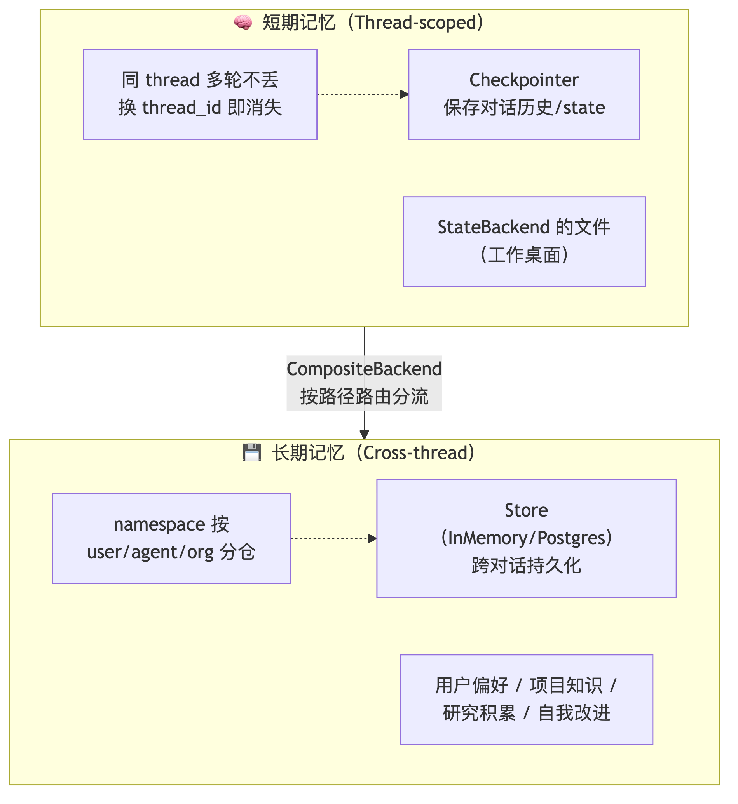
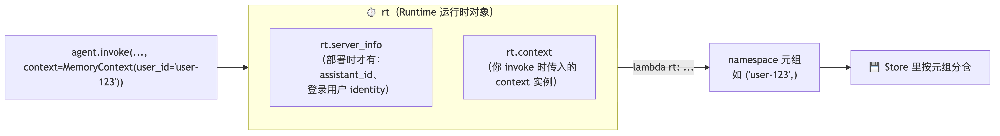
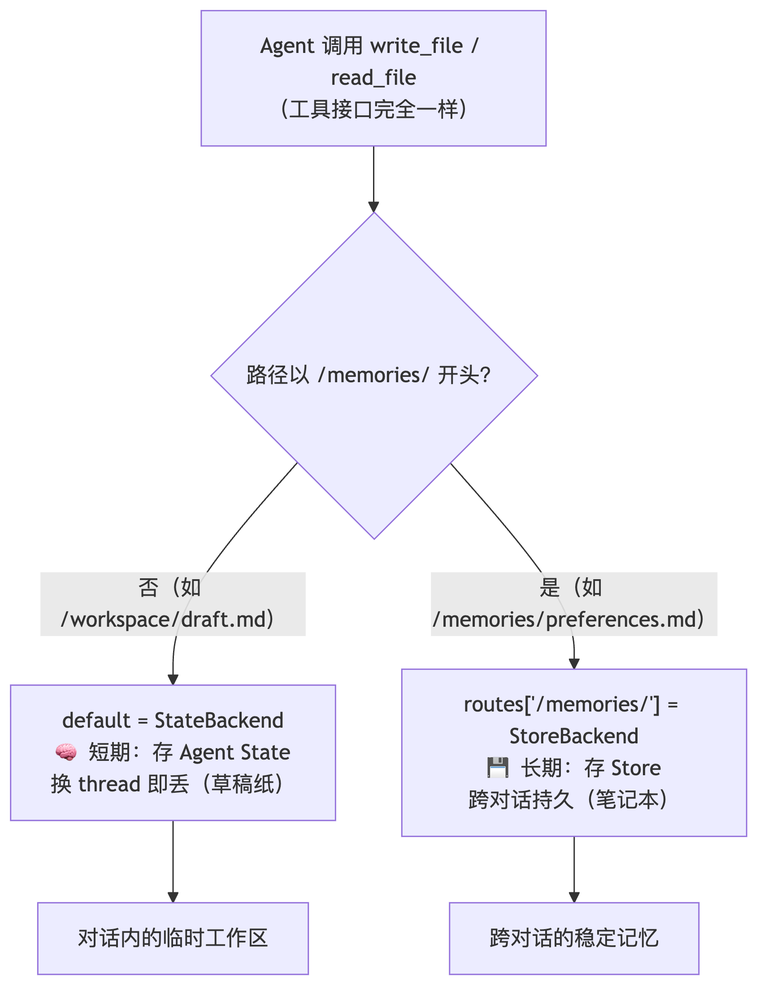
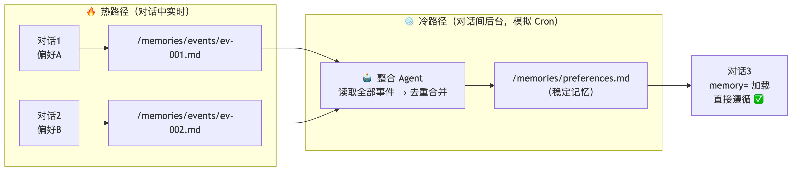
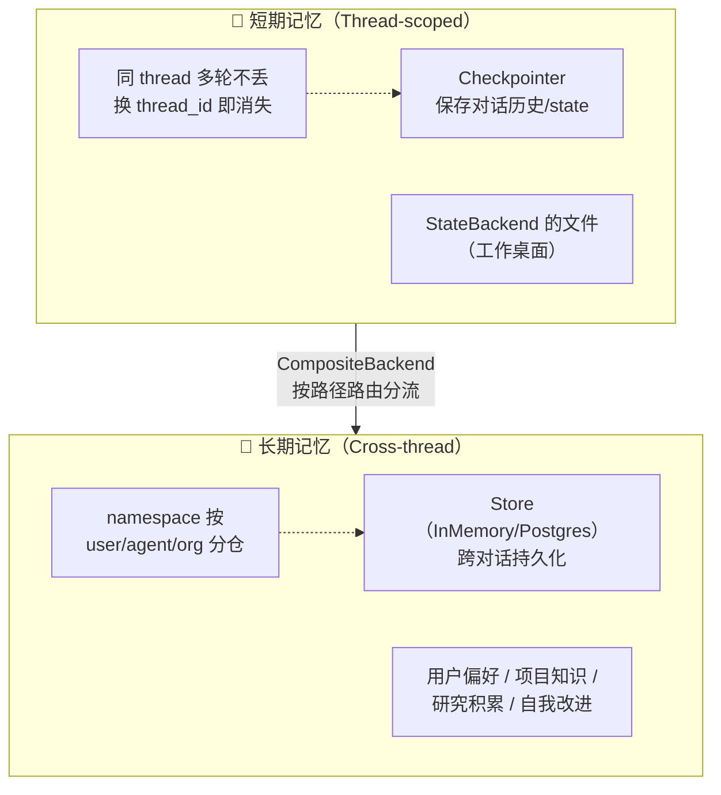
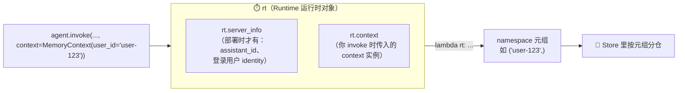
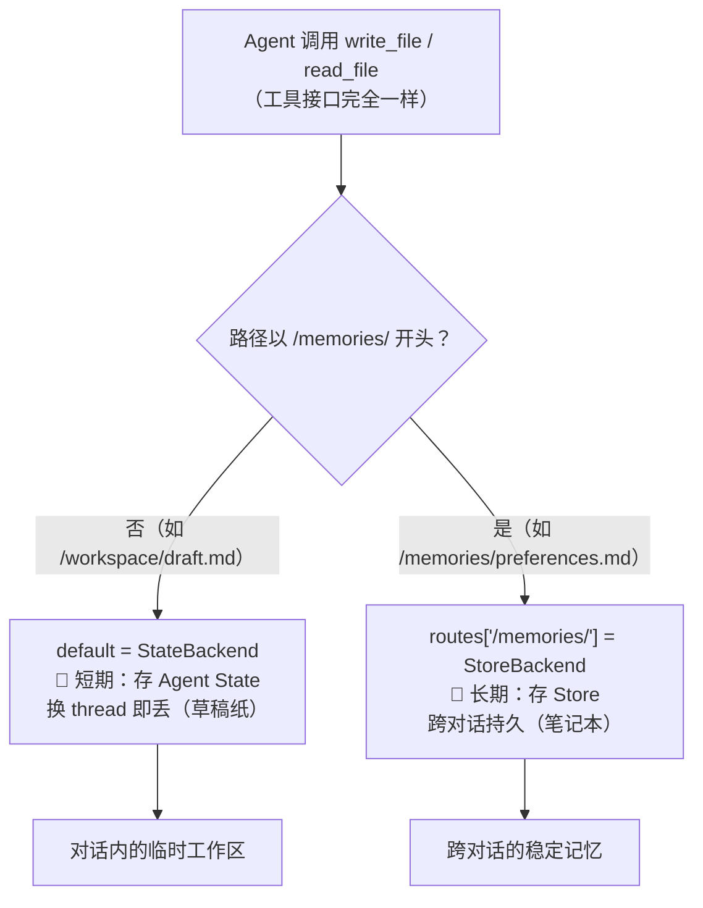
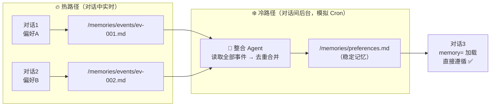

# 🧭 长期记忆 —— 让 Agent 拥有跨对话的记忆（ch08）

> 一句话：前七章的所有能力（文件系统、规划、子 Agent、Skills）都有一个共同局限——**对话结束，一切归零**。本章用 Checkpointer 管短期、Store 管长期、CompositeBackend 做路由分流，让 Agent 真正"认识"它的用户。

---

## 🤔 先想清楚：记忆为什么值得单独一章？

> 💡 **我的理解**：记忆是串在对话整个过程中的——它需要**不停地被调用、整理、处理、分析**，同时辅助 RAG 做出更精准的回答。记忆系统的重要程度不言而喻：没有它，Agent 每次见面都是陌生人；有了它，偏好、项目背景、累积的研究成果都能延续。

人类有短期记忆（记得今天的对话）和长期记忆（记得你的名字和偏好），Agent 也一样——但需要**不同的技术**来实现：



| | 短期记忆 | 长期记忆 |
|---|---|---|
| 技术 | Checkpointer + StateBackend | StoreBackend（Store） |
| 生命周期 | 同一 thread 内 | 跨 thread、跨对话 |
| 典型内容 | 当前任务的草稿、对话历史 | 偏好设置、项目背景、研究成果 |
| 比喻 | 工作桌面（下班清空） | 笔记本（一直带在身上） |

---

## 🔧 短期记忆的底座：Checkpointer

```python
from langgraph.checkpoint.memory import MemorySaver

agent = create_deep_agent(model=model, checkpointer=MemorySaver())

config = {"configurable": {"thread_id": "conversation-001"}}
agent.invoke({"messages": [{"role": "user", "content": "我叫张三"}]}, config=config)
agent.invoke({"messages": [{"role": "user", "content": "我叫什么名字？"}]}, config=config)
# 能答"张三"；换 thread_id 再问 → 不知道
```

工作原理：每执行完一步自动保存状态（消息历史、文件、任务清单），同 thread_id 下次调用自动恢复。开发用 `MemorySaver`（内存），生产用 `PostgresSaver`。**关键限制：只在同一 thread_id 内有效**。

### 短期记忆的三种管理策略

对话越长，消息历史可能撑爆上下文窗口。三种应对：

| 策略 | 做法 | 备注 |
|---|---|---|
| **Summarize 总结** | 旧消息压缩成摘要 | **Deep Agents 已自动内置**（第 3/4 章的 SummarizationMiddleware，85% 窗口触发） |
| **Trim 裁剪** | 只留最近 N 条 | 用 `@before_model` 自定义 |
| **Delete 删除** | `RemoveMessage` 精确删特定消息 | 选择性清理（如敏感信息） |

课程给的自定义裁剪中间件（`@before_model` 在**每次模型调用前**执行，另有 `@after_model`）：

```python
from langchain.messages import RemoveMessage
from langgraph.graph.message import REMOVE_ALL_MESSAGES
from langchain.agents import AgentState
from langchain.agents.middleware import before_model
from langgraph.runtime import Runtime

@before_model
def trim_messages(state: AgentState, runtime: Runtime) -> dict | None:
    """只保留第一条 + 最近 3 条，防止上下文溢出。"""
    messages = state["messages"]
    if len(messages) <= 3:
        return None                                  # 不需要裁剪
    first_msg = messages[0]                          # 通常保留系统消息
    recent = messages[-3:]                           # 最近 3 条
    return {
        "messages": [
            RemoveMessage(id=REMOVE_ALL_MESSAGES),   # 先全删
            first_msg,
            *recent,                                 # 再放回要留的
        ]
    }

agent = create_deep_agent(model=model, middleware=[trim_messages])
```

> 注意这个"全删再放回"的手法：`RemoveMessage(id=REMOVE_ALL_MESSAGES)` 清空后，把想保留的消息作为更新返回——每次模型看到的都是有限的上下文。

### 进阶：自定义 AgentState + ToolRuntime

LangChain 允许扩展 `AgentState` 加自定义字段（相当于给短期记忆加结构化格子）：

```python
class CustomAgentState(AgentState):
    user_id: str          # 用户 ID
    preferences: dict     # 用户偏好

agent = create_agent(model=model, tools=[get_user_info],
                     state_schema=CustomAgentState, checkpointer=checkpointer)

result = agent.invoke(
    {"messages": [...], "user_id": "user_123", "preferences": {"theme": "dark"}},
    {"configurable": {"thread_id": "1"}},
)
```

**ToolRuntime 是个隐藏参数**——模型看不到它，但工具可以用它读写 Agent 的完整状态：

```python
@tool
def get_user_info(runtime: ToolRuntime) -> str:
    """查询当前用户信息。"""
    user_id = runtime.state["user_id"]        # 读状态
    if user_id == "user_123":
        return "用户：张三，VIP 会员，偏好简洁风格"
    return "未知用户"

@tool
def update_preferences(new_theme: str, runtime: ToolRuntime):
    """更新用户偏好设置。"""
    current_prefs = runtime.state.get("preferences", {})
    current_prefs["theme"] = new_theme
    return Command(update={                    # 写状态
        "preferences": current_prefs,
        "messages": [ToolMessage("偏好已更新", tool_call_id=runtime.tool_call_id)]
    })
```

> 关键口诀：**`runtime.state` 是读，`Command(update={...})` 是写**——工具不仅能返回结果给模型，还能直接修改 Agent 的短期记忆。

---

## 🗄️ 长期记忆核心方案：CompositeBackend

第 3 章学过 CompositeBackend（不同路径路由到不同后端），现在用它实现长期记忆。先解决两个最容易懵的问题。

### ❓问题一：namespace lambda 里的 `rt` 到底是什么？

课程的 `MemoryContext` 和三个 namespace 函数里反复出现 `rt`，但没展开讲。**`rt` = Runtime（运行时对象）**，是 LangGraph 在每次执行时注入给 namespace 工厂函数的"当前运行环境快照"，它主要带两样东西：



- **`rt.server_info`**：只有部署到 LangGraph/LangSmith 服务时才有值（能拿到 assistant_id 和登录用户身份）；**本地 `invoke()` 时它是 None**——这就是为什么所有 namespace 函数都要写 `if rt.server_info ... else 兜底`。
- **`rt.context`**：你在 invoke 时通过 `context=MemoryContext(user_id=...)` 传入的实例——本地身份就靠它。

```python
@dataclass(frozen=True)
class MemoryContext:
    user_id: str = "local-user"
    org_id: str = "default-org"

def user_namespace(rt):                     # rt 由框架注入，不用自己传
    if rt.server_info and rt.server_info.user:      # 部署环境：登录态
        return (rt.server_info.user.identity,)
    return (getattr(rt.context, "user_id", "local-user"),)   # 本地：context 兜底

# 调用时把身份喂进 rt.context
agent.invoke({...}, context=MemoryContext(user_id="user-123"),
             config={"configurable": {"thread_id": "1"}})
```

> 一句话：**rt 是框架递给你的"这次执行我是谁"的上下文**；部署时身份来自登录态（平台强制、可信），本地时来自你传的 context（自己负责）。

### ❓问题二：为什么 default 是 StateBackend，routes 里是 StoreBackend？分工是什么？

这是 CompositeBackend 最容易看反的地方。它本质是一个**按路径前缀分流的路由器**：



**分工逻辑**：
- **`default=StateBackend()`** = 兜底路由。所有不匹配 `/memories/` 前缀的文件操作都走它——这些是**短期内容**（当前任务的草稿、中间文件），本来就应该随对话结束消失，放 State 里既快又自动清理。
- **`routes={"/memories/": StoreBackend(namespace=...)}`** = 特权路由。以 `/memories/` 开头的路径走 Store——这些是**长期内容**（偏好、知识库），必须跨 thread 存活。
- **对 Agent 完全透明**：它调用的还是同一套 `write_file`/`read_file`，"这个文件活多久"只由**路径前缀**决定。这就是"记忆作为一等公民，用 Backend 控制存哪里"的含义。

> 顺带解答我笔记里的一个疑问：「用户级用 user_id 区分用户，好像也没有强制的区分？」——**对，namespace 是约定式隔离，不是强制隔离**。隔离是否成立取决于 lambda 是否正确使用了身份来源：部署时 `server_info.user.identity` 由平台登录态强制（改不了）；本地时靠你传对 `context`。如果你的 lambda 写死 `("shared",)`，那就真不隔离了。我们的实验里 user-A/B 隔离成立，正是因为 invoke 时传了不同的 `context`。

### Agent 级 vs 用户级记忆

| 作用域 | namespace | 特性 | 典型文件 |
|---|---|---|---|
| **Agent 级** | `(assistant_id,)` | 所有用户**共享**，Agent 自我进化 | `/memories/AGENTS.md` |
| **用户级** | `(user_id,)` | 用户间**隔离**，互不干扰 | `/memories/preferences.md` |
| **组织级** | `(org_id,)` | 全组织共享，通常**只读** | `/policies/compliance.md` |

`memory=` 参数（0.5.0+ 新特性）声明记忆路径，**启动时自动加载进系统提示词**，比在 system_prompt 里引导 Agent 手动读文件优雅得多：

```python
agent = create_deep_agent(
    model=model,
    context_schema=MemoryContext,
    memory=["/memories/preferences.md"],     # 启动自动注入 <agent_memory>
    backend=CompositeBackend(
        default=StateBackend(),              # 短期（草稿）
        routes={"/memories/": StoreBackend(namespace=user_namespace)},   # 长期
    ),
)
```

---

## 🔬 实验一：短期 vs 长期，三组对照见分晓

```python
# ============================================================================
# 01_two_memories.py —— ch08 段1：短期记忆 vs 长期记忆（对照实验）
#
#   Part A: Checkpointer 短期记忆 —— 同 thread 记得 / 换 thread 忘记
#   Part B: StateBackend 文件也是短期 —— 换 thread 文件消失
#   Part C: /memories/ 路由到 Store —— 换 thread 文件还在（长期记忆）
#
# ⚠️ 0.7.13 实测细节：CompositeBackend 存进 store 的 key 会剥掉路由前缀
#    （/memories/prefs.md → store key "/prefs.md"），排查数据时别找不到。
# ============================================================================

from langgraph.checkpoint.memory import MemorySaver
from langgraph.store.memory import InMemoryStore

from common import make_model, preview

from deepagents import create_deep_agent
from deepagents.backends import CompositeBackend, StateBackend, StoreBackend


def part_a_checkpointer():
    print("=" * 60)
    print("Part A: Checkpointer 短期记忆（对话历史）")
    print("=" * 60)
    agent = create_deep_agent(model=make_model(), checkpointer=MemorySaver())
    t1 = {"configurable": {"thread_id": "conv-001"}}
    t2 = {"configurable": {"thread_id": "conv-002"}}
    agent.invoke({"messages": [{"role": "user", "content": "我叫张三，记住这个名字。"}]}, config=t1)
    r = agent.invoke({"messages": [{"role": "user", "content": "我叫什么名字？"}]}, config=t1)
    print(f"  同一 thread 还记得: {preview(r['messages'][-1].content, 50)}")
    r2 = agent.invoke({"messages": [{"role": "user", "content": "我叫什么名字？"}]}, config=t2)
    print(f"  换 thread 后: {preview(r2['messages'][-1].content, 60)}（期望：不知道）")


def part_b_state_files():
    print()
    print("=" * 60)
    print("Part B: StateBackend 的文件也是短期（换 thread 消失）")
    print("=" * 60)
    agent = create_deep_agent(model=make_model(), checkpointer=MemorySaver(),
                              system_prompt="你是文件助手，按指令操作文件。")
    t1 = {"configurable": {"thread_id": "file-001"}}
    t2 = {"configurable": {"thread_id": "file-002"}}
    agent.invoke({"messages": [{"role": "user", "content": "用 write_file 创建 /workspace/note.txt，内容 '桌面上的便签'，完成后回一句。"}]}, config=t1)
    r = agent.invoke({"messages": [{"role": "user", "content": "read_file /workspace/note.txt，把内容告诉我。"}]}, config=t1)
    print(f"  同一 thread 读到: {preview(r['messages'][-1].content, 60)}")
    r2 = agent.invoke({"messages": [{"role": "user", "content": "read_file /workspace/note.txt，如果不存在就说'不存在'。"}]}, config=t2)
    print(f"  换 thread 读取: {preview(r2['messages'][-1].content, 60)}（期望：不存在）")


def part_c_store_files():
    print()
    print("=" * 60)
    print("Part C: /memories/ 路由到 Store —— 长期记忆（换 thread 仍在）")
    print("=" * 60)
    store = InMemoryStore()
    agent = create_deep_agent(
        model=make_model(),
        checkpointer=MemorySaver(),
        system_prompt="你是助手。用户让你'记住'的信息，用 write_file 保存到 /memories/ 下。",
        backend=CompositeBackend(
            default=StateBackend(),
            routes={"/memories/": StoreBackend(namespace=lambda rt: ("demo-user",))},
        ),
        store=store,
    )
    t1 = {"configurable": {"thread_id": "mem-001"}}
    t2 = {"configurable": {"thread_id": "mem-002"}}
    agent.invoke({"messages": [{"role": "user", "content": "记住：我的咖啡偏好是拿铁少糖。保存到 /memories/prefs.md"}]}, config=t1)
    r = agent.invoke({"messages": [{"role": "user", "content": "read_file /memories/prefs.md，把内容告诉我。"}]}, config=t2)
    print(f"  全新 thread 读到: {preview(r['messages'][-1].content, 70)}")
    keys = [(i.namespace, i.key) for i in store.search(("demo-user",))]
    print(f"  store 中的条目: {keys}（注意 key 已剥掉 /memories/ 前缀）")


if __name__ == "__main__":
    part_a_checkpointer()
    part_b_state_files()
    part_c_store_files()
```

**运行结果**（实测）：

```text
Part A: Checkpointer 短期记忆
  同一 thread 还记得: 你的名字是**张三**，这是你刚才告诉我的。😊
  换 thread 后: 我没有看到你的名字信息。……（不知道 ✅）

Part B: StateBackend 的文件也是短期
  同一 thread 读到: 文件内容为：**桌面上的便签**
  换 thread 读取: 不存在。（✅）

Part C: /memories/ 路由到 Store —— 长期记忆
  全新 thread 读到: 已读取 /memories/prefs.md，内容：# 个人偏好 ## 咖啡 - 拿铁，少糖 ✅
  store 中的条目: [(('demo-user',), '/prefs.md')]（key 已剥前缀）
```

---

## 🔬 实验二：三种作用域（用户隔离 / Agent 共享 / 路径路由）

```python
# ============================================================================
# 02_memory_scopes.py —— ch08 段2：CompositeBackend 长期记忆 + 三种作用域
#
#   Part A: 用户级记忆 —— user-A 的偏好跨线程可用，user-B 看不到（隔离）
#   Part B: Agent 级记忆 —— namespace=(assistant_id,)，所有用户共享
#   Part C: 路径路由 —— /workspace/ 临时（换线程丢）、/memories/ 持久（换线程在）
#
# 技巧：用 store.put + create_file_data 预填记忆文件，让断言路径确定。
# ============================================================================

from dataclasses import dataclass

from langgraph.checkpoint.memory import MemorySaver
from langgraph.store.memory import InMemoryStore

from common import make_model, preview

from deepagents import create_deep_agent
from deepagents.backends import CompositeBackend, StateBackend, StoreBackend
from deepagents.backends.utils import create_file_data


# ---------------------- 运行时身份与 namespace（课程推荐的三件套） ----------------------
@dataclass(frozen=True)
class MemoryContext:
    user_id: str = "local-user"
    org_id: str = "default-org"


def assistant_namespace(rt):
    if rt.server_info:
        return (rt.server_info.assistant_id,)
    return ("local-agent",)          # 本地兜底


def user_namespace(rt):
    if rt.server_info and rt.server_info.user:
        return (rt.server_info.user.identity,)
    return (getattr(rt.context, "user_id", "local-user"),)


def org_namespace(rt):
    return (getattr(rt.context, "org_id", "default-org"),)


def make_scoped_agent(store, routes):
    return create_deep_agent(
        model=make_model(),
        context_schema=MemoryContext,
        checkpointer=MemorySaver(),
        system_prompt="你是助手。按用户指令读写文件并如实汇报。",
        backend=CompositeBackend(default=StateBackend(), routes=routes),
        store=store,
    )


def part_a_user_scoped():
    print("=" * 60)
    print("Part A: 用户级记忆（namespace=(user_id,)，A/B 隔离）")
    print("=" * 60)
    store = InMemoryStore()
    # 预填 user-A 的偏好（应用代码写入，路径确定）
    store.put(("user-A",), "/preferences.md",
              create_file_data("# 用户A的偏好\n- 回答使用中文\n- 代码示例用 Python\n"))
    agent = make_scoped_agent(store, {"/memories/": StoreBackend(namespace=user_namespace)})

    ctx_a = MemoryContext(user_id="user-A")
    ctx_b = MemoryContext(user_id="user-B")
    # user-A 新线程读自己的记忆 → 能读到
    r1 = agent.invoke({"messages": [{"role": "user", "content": "read_file /memories/preferences.md，复述内容要点。"}]},
                      context=ctx_a, config={"configurable": {"thread_id": "a-t1"}})
    print(f"  user-A 读取: {preview(r1['messages'][-1].content, 70)}")
    # user-B 读同一路径 → 隔离，读不到
    r2 = agent.invoke({"messages": [{"role": "user", "content": "read_file /memories/preferences.md，如果不存在就说'不存在'。"}]},
                      context=ctx_b, config={"configurable": {"thread_id": "b-t1"}})
    print(f"  user-B 读取: {preview(r2['messages'][-1].content, 60)}（期望：不存在）")


def part_b_agent_scoped():
    print()
    print("=" * 60)
    print("Part B: Agent 级记忆（namespace=(assistant_id,)，全员共享）")
    print("=" * 60)
    store = InMemoryStore()
    # 预填 Agent 级知识（所有用户共享同一份）
    store.put(("local-agent",), "/AGENTS.md",
              create_file_data("# Agent 知识\n- 本 Agent 专精 LangGraph 生态答疑\n- 回答保持三段式结构\n"))
    agent = make_scoped_agent(store, {"/memories/": StoreBackend(namespace=assistant_namespace)})

    # 两个不同用户、不同线程，读到同一份 Agent 记忆
    for uid in ["user-A", "user-B"]:
        r = agent.invoke({"messages": [{"role": "user", "content": "read_file /memories/AGENTS.md，用一句话概括这个文件。"}]},
                          context=MemoryContext(user_id=uid),
                          config={"configurable": {"thread_id": f"{uid}-t1"}})
        print(f"  {uid} 读取: {preview(r['messages'][-1].content, 60)}")


def part_c_path_routing():
    print()
    print("=" * 60)
    print("Part C: 路径路由（同一次对话写两个路径，换线程对比）")
    print("=" * 60)
    store = InMemoryStore()
    agent = make_scoped_agent(store, {"/memories/": StoreBackend(namespace=user_namespace)})
    t1 = {"configurable": {"thread_id": "route-1"}}
    t2 = {"configurable": {"thread_id": "route-2"}}
    ctx = MemoryContext(user_id="router")

    agent.invoke({"messages": [{"role": "user", "content": (
        "写两个文件：1) write_file /workspace/draft.md 内容 '临时草稿'；"
        "2) write_file /memories/keep.md 内容 '长期记忆'。完成后回一句。"
    )}]}, context=ctx, config=t1)

    r = agent.invoke({"messages": [{"role": "user", "content": (
        "分别 read_file /workspace/draft.md 和 /memories/keep.md，逐个告诉我存在还是不存在。"
    )}]}, context=ctx, config=t2)
    print(f"  全新线程读两个文件: {preview(r['messages'][-1].content, 140)}")
    print(f"  （期望：draft.md 不存在（State 短期）；keep.md 存在（Store 长期））")
    print(f"  store 条目: {[i.key for i in store.search(('router',))]}")


if __name__ == "__main__":
    part_a_user_scoped()
    part_b_agent_scoped()
    part_c_path_routing()
```

**运行结果**（实测，三组全命中）：

```text
Part A: 用户级记忆
  user-A 读取: 已读取 /memories/preferences.md，内容要点：回答使用中文、代码示例用 Python
  user-B 读取: 不存在。（隔离生效 ✅）

Part B: Agent 级记忆
  user-A 读取: 一句话概括：该文件记录了本 Agent 的核心设定——专精 LangGraph 生态答疑…
  user-B 读取: /memories/AGENTS.md 是一份简短的 Agent 备忘……（两用户读到同一份 ✅）

Part C: 路径路由
  1. /workspace/draft.md — 不存在（State 短期）
  2. /memories/keep.md — 存在，内容是：长期记忆（Store 长期 ✅）
  store 条目: ['/keep.md']
```

---

## 🔬 实验三：四种场景里最能打的三个

```python
# ============================================================================
# 03_memory_scenarios.py —— ch08 段3：四种实用场景中的三个（本地可完整验证）
#
#   场景1: 用户偏好记忆 —— 对话1说偏好 → 对话2（全新线程）自动应用
#   场景2: 自我改进的 Agent —— 用户纠错 → edit_file 更新 AGENTS.md → 新对话遵循
#   场景3: 知识库累积 —— 三个对话逐次追加，最后读出完整知识
#   （场景4 研究持续推进 = 场景3 的多文件版，机制相同不再重复）
#
# 关键：memory= 参数声明记忆路径，启动时自动注入系统提示词（<agent_memory>），
#       Agent 用 edit_file 更新后持久化到下次对话。
# ============================================================================

from dataclasses import dataclass

from langgraph.checkpoint.memory import MemorySaver
from langgraph.store.memory import InMemoryStore

from common import make_model, preview

from deepagents import create_deep_agent
from deepagents.backends import CompositeBackend, StateBackend, StoreBackend
from deepagents.backends.utils import create_file_data


@dataclass(frozen=True)
class MemoryContext:
    user_id: str = "local-user"


def user_namespace(rt):
    if rt.server_info and rt.server_info.user:
        return (rt.server_info.user.identity,)
    return (getattr(rt.context, "user_id", "local-user"),)


def make_memory_agent(store, memory_paths, seed=None):
    """带长期记忆的 Agent。seed: 预填的 {store_key: content}。"""
    for key, content in (seed or {}).items():
        store.put(("demo-user",), key, create_file_data(content))
    return create_deep_agent(
        model=make_model(),
        context_schema=MemoryContext,
        memory=memory_paths,                 # 启动时自动加载进系统提示词
        checkpointer=MemorySaver(),
        backend=CompositeBackend(
            default=StateBackend(),
            routes={"/memories/": StoreBackend(namespace=user_namespace)},
        ),
        store=store,
    )


def scenario1_preferences():
    print("=" * 60)
    print("场景1: 用户偏好记忆（对话1 记住 → 对话2 应用）")
    print("=" * 60)
    store = InMemoryStore()
    agent = make_memory_agent(store, memory_paths=["/memories/preferences.md"])
    ctx = MemoryContext(user_id="demo-user")

    agent.invoke({"messages": [{"role": "user", "content":
        "记住我的偏好：代码注释用中文，变量名用英文。保存到 /memories/preferences.md。"}]},
        context=ctx, config={"configurable": {"thread_id": "s1-conv1"}})

    r = agent.invoke({"messages": [{"role": "user", "content":
        "用 Python 写一个两数相加的函数（注意应用我的偏好）。"}]},
        context=ctx, config={"configurable": {"thread_id": "s1-conv2"}})   # 全新对话！
    reply = r["messages"][-1].content
    print(f"  新对话的代码注释是中文: {'# ' in reply and any(ord(c) > 0x4e00 for c in reply.split('#')[-1] if c.strip()[:1]) or '两数相加' in reply}")
    print(f"  回复预览: {preview(reply, 160)}")


def scenario2_self_improving():
    print()
    print("=" * 60)
    print("场景2: 自我改进的 Agent（纠错 → 更新 AGENTS.md → 新对话遵循）")
    print("=" * 60)
    store = InMemoryStore()
    agent = make_memory_agent(
        store,
        memory_paths=["/memories/AGENTS.md"],
        seed={"/AGENTS.md": "# Agent 行为准则\n- 回答末尾附一句英文格言\n"},
    )
    ctx = MemoryContext(user_id="demo-user")

    # 对话1：用户纠错 → Agent 应更新记忆文件
    agent.invoke({"messages": [{"role": "user", "content":
        "以后不要附英文格言了，改成在开头先给一句话结论。请更新你的行为准则文件 /memories/AGENTS.md。"}]},
        context=ctx, config={"configurable": {"thread_id": "s2-conv1"}})
    updated = next(iter(store.search(("demo-user",)))).value["content"]
    print(f"  AGENTS.md 已更新: {'结论' in updated and '格言' not in updated}")

    # 对话2：新对话应遵循新准则
    r = agent.invoke({"messages": [{"role": "user", "content": "Python 的 GIL 是什么？"}]},
                     context=ctx, config={"configurable": {"thread_id": "s2-conv2"}})
    print(f"  新对话回复预览: {preview(r['messages'][-1].content, 100)}")
    print(f"  （观察：开头是否先给一句话结论、结尾是否已无英文格言）")


def scenario3_knowledge_accumulation():
    print()
    print("=" * 60)
    print("场景3: 知识库累积（三次对话逐次追加）")
    print("=" * 60)
    store = InMemoryStore()
    agent = make_memory_agent(store, memory_paths=["/memories/project/tech-stack.md"])
    ctx = MemoryContext(user_id="demo-user")

    # 对话1：前端技术栈
    agent.invoke({"messages": [{"role": "user", "content":
        "记录到 /memories/project/tech-stack.md：前端用 React + TypeScript。"}]},
        context=ctx, config={"configurable": {"thread_id": "s3-c1"}})
    # 对话2：追加后端
    agent.invoke({"messages": [{"role": "user", "content":
        "在 /memories/project/tech-stack.md 里补充：后端用 FastAPI + PostgreSQL。"}]},
        context=ctx, config={"configurable": {"thread_id": "s3-c2"}})
    # 对话3：读出完整知识
    r = agent.invoke({"messages": [{"role": "user", "content":
        "读 /memories/project/tech-stack.md，总结我们项目的完整技术栈。"}]},
        context=ctx, config={"configurable": {"thread_id": "s3-c3"}})
    final = next(iter(store.search(("demo-user",)))).value["content"]
    print(f"  记忆文件最终内容: {preview(final, 120)}")
    print(f"  对话3 总结: {preview(r['messages'][-1].content, 120)}")
    print(f"  前后端都在: {'React' in final and 'FastAPI' in final}")


if __name__ == "__main__":
    scenario1_preferences()
    scenario2_self_improving()
    scenario3_knowledge_accumulation()
```

**运行结果**（实测）：

```text
场景1: 用户偏好记忆
  回复预览: 好的，根据您的偏好（中文注释、英文变量名）……
  def add_numbers(num1, num2):
      """计算两个数字之和。"""        ← 中文注释 + 英文变量名，跨对话生效 ✅

场景2: 自我改进的 Agent
  AGENTS.md 已更新: True（格言 → 结论先行）
  新对话回复预览: 一句话结论：**GIL（全局解释器锁）是……** ✅ 开头先给结论

场景3: 知识库累积
  记忆文件最终内容: # 技术栈 - 前端：React + TypeScript - 后端：FastAPI + PostgreSQL
  前后端都在: True ✅（三次对话逐步叠加）
```

---

## 🔬 实验四：外部预填（冷启动）+ 组织只读 + 存储格式

```python
# ============================================================================
# 04_advanced_memory.py —— ch08 段4：高级用法（本地可完整验证的部分）
#
#   Part A: 外部预填 —— 应用代码 store.put + create_file_data 预填
#           Agent 级记忆（AGENTS.md）和 Skill，Agent 启动即用
#   Part B: 组织级只读 —— /policies/ 路由 org namespace + deny 写权限
#           Agent 读得到、写不进（应用代码写入的合规策略）
#   Part C: 存储格式 —— 打印 store 条目验证 v2 格式
#           （content 完整字符串 + encoding + created_at/modified_at）
#
# 说明：情景记忆（搜索过去对话）、后台整合（Cron + 整合 Agent）需要
#       LangGraph 服务部署环境（见 ch06 的 langgraph dev），本章不做本地实验。
# ============================================================================

from dataclasses import dataclass

from langgraph.checkpoint.memory import MemorySaver
from langgraph.store.memory import InMemoryStore

from common import make_model, preview

from deepagents import FilesystemPermission, create_deep_agent
from deepagents.backends import CompositeBackend, StateBackend, StoreBackend
from deepagents.backends.utils import create_file_data


@dataclass(frozen=True)
class MemoryContext:
    user_id: str = "local-user"
    org_id: str = "default-org"


def org_namespace(rt):
    return (getattr(rt.context, "org_id", "default-org"),)


def part_a_external_prefill():
    print("=" * 60)
    print("Part A: 外部预填（应用代码写入记忆与 Skill）")
    print("=" * 60)
    store = InMemoryStore()
    # —— 应用代码预填：不要手写底层 JSON，用 create_file_data ——
    store.put(("local-agent",), "/AGENTS.md", create_file_data(
        "## Response style\n- Keep responses concise\n- 回答末尾标注 [Agent-KB]\n"
    ))
    # ⚠️ 前缀剥离：CompositeBackend 把 /skills/ 路由到 Store 时会剥掉前缀，
    #    所以 store.put 的 key 是 "/greeting/SKILL.md"（不带 /skills/）——与 AGENTS.md 同理
    store.put(("local-agent",), "/greeting/SKILL.md", create_file_data(
        "---\n"
        "name: greeting\n"
        "description: 当用户要求打招呼或问候时使用此技能。\n"
        "---\n"
        "# greeting\n\n## Instructions\n问候必须以「向您敬礼」四个字开头，"
        "再跟一句问候和一个 emoji。（这是公司统一问候规范）\n"
    ))

    agent = create_deep_agent(
        model=make_model(),
        memory=["/memories/AGENTS.md"],          # Agent 级记忆：启动注入系统提示词
        skills=["/skills/"],                      # 预填的 Skill
        checkpointer=MemorySaver(),
        backend=CompositeBackend(
            default=StateBackend(),
            routes={
                "/memories/": StoreBackend(namespace=lambda rt: ("local-agent",)),
                "/skills/": StoreBackend(namespace=lambda rt: ("local-agent",)),
            },
        ),
        store=store,
    )
    r1 = agent.invoke({"messages": [{"role": "user", "content": "用一句话介绍什么是向量数据库。"}]},
                      config={"configurable": {"thread_id": "pf-1"}})
    print(f"  [记忆生效] 回复末尾带标记: {'[Agent-KB]' in r1['messages'][-1].content}")
    print(f"  回复预览: {preview(r1['messages'][-1].content, 90)}")
    r2 = agent.invoke({"messages": [{"role": "user", "content": "跟我打个招呼。"}]},
                      config={"configurable": {"thread_id": "pf-2"}})
    paths = [str(tc["args"].get("file_path", "")) for m in r2["messages"]
             for tc in (getattr(m, "tool_calls", None) or [])]
    reply2 = r2["messages"][-1].content
    read_skill = any("greeting" in p for p in paths)
    # 判据：要么读了技能文件，要么输出里出现技能要求的独特标记（二者其一即证明技能生效）
    print(f"  [Skill 生效] 读取了预填技能: {read_skill or '向您敬礼' in reply2}")
    print(f"  打招呼回复: {preview(reply2, 60)}")


def part_b_org_readonly():
    print()
    print("=" * 60)
    print("Part B: 组织级只读（/policies/ + deny）")
    print("=" * 60)
    store = InMemoryStore()
    # 合规策略由应用代码写入（员工/Agent 无权改）
    store.put(("default-org",), "/compliance.md", create_file_data(
        "## 合规政策\n- 不得披露内部定价\n- 金融建议必须附加免责声明\n"
    ))

    agent = create_deep_agent(
        model=make_model(),
        context_schema=MemoryContext,
        memory=["/policies/compliance.md"],      # 启动加载（只读）
        checkpointer=MemorySaver(),
        backend=CompositeBackend(
            default=StateBackend(),
            routes={"/policies/": StoreBackend(namespace=org_namespace)},
        ),
        store=store,
        permissions=[                              # 组织记忆：Agent 只能读
            FilesystemPermission(operations=["write"], paths=["/policies/**"], mode="deny"),
        ],
    )
    r = agent.invoke(
        {"messages": [{"role": "user", "content": (
            "两件事：1) 读 /policies/compliance.md 复述第一条；"
            "2) 尝试 write_file 修改 /policies/compliance.md 把第一条删掉。汇报各自结果。"
        )}]},
        context=MemoryContext(org_id="default-org"),
        config={"configurable": {"thread_id": "pol-1"}},
    )
    reply = r["messages"][-1].content
    print(f"  读取成功: {'内部定价' in reply}")
    print(f"  写入被拒: {'拒绝' in reply or 'denied' in reply.lower() or 'permission' in reply.lower()}")
    policy = next(iter(store.search(("default-org",)))).value["content"]
    print(f"  策略文件未被篡改: {'不得披露内部定价' in policy}")


def part_c_storage_format():
    print()
    print("=" * 60)
    print("Part C: 存储格式验证（v2）")
    print("=" * 60)
    store = InMemoryStore()
    store.put(("fmt",), "/memories/x.md", create_file_data("第一行\n第二行\n第三行"))
    item = next(iter(store.search(("fmt",))))
    v = item.value
    print(f"  content 类型: {type(v['content']).__name__}（v2 应为完整 str，旧版可能是 list）")
    print(f"  encoding: {v.get('encoding')}")
    print(f"  created_at: {v.get('created_at', '(无)')[:19]}")
    print(f"  modified_at: {v.get('modified_at', '(无)')[:19]}")
    print(f"  全文: {preview(v['content'], 50)!r}")


if __name__ == "__main__":
    part_a_external_prefill()
    part_b_org_readonly()
    part_c_storage_format()
```

**运行结果**（实测）：

```text
Part A: 外部预填（冷启动模拟）
  [记忆生效] 回复末尾带标记: True（[Agent-KB]）
  [Skill 生效] 读取了预填技能: True
  打招呼回复: 向您敬礼！您好，很高兴见到您！😊……[Agent-KB]

Part B: 组织级只读
  读取成功: True / 写入被拒: True / 策略文件未被篡改: True

Part C: 存储格式（v2）
  content 类型: str | encoding: utf-8 | created_at/modified_at 齐全
```

> ⚠️ **本次最大的坑**就在 Part A：预填 Skill 时 `store.put` 的 key 写成 `/skills/greeting/SKILL.md`，结果技能死活不激活——因为 **CompositeBackend 存 Store 时会剥掉路由前缀**（Agent 侧 `/skills/greeting/SKILL.md` → store 查 `/greeting/SKILL.md`）。改成剥前缀的 key 立刻生效。外部预填、排查数据都受影响，切记。

---

## 🔬 实验五：情景记忆 + 后台整合（高级用法补全）

> 💡 高级用法这块，课程给的是案例级内容——实际还是要结合自己的系统设计去深入理解，我们浅尝辄止但把核心机制跑通。

```python
# ============================================================================
# 05_episodic_and_consolidation.py —— ch08 高级用法补全（一）
#
#   Part A: 情景记忆（Episodic Memory）
#     思路：每次对话结束追加一篇「情景日志」到 /memories/episodes/<id>.md
#     （保留完整经历：发生了什么、结论如何），再给 Agent 配一个自定义检索工具
#     search_episodes()，让它能"回忆起上次是怎么解决问题的"。
#     （课程版本用部署端 threads.search 检索历史线程；本地 invoke 环境用
#      文件式情景日志实现同一语义 —— 也是课程「追加式记录，再后台合并」推荐模式）
#
#   Part B: 后台记忆整合（Background Consolidation）
#     热路径：两次对话各自把要点写进事件日志（互不冲突，文件名唯一）
#     整合：独立"整合 Agent"读取全部事件日志 → 去重合并成稳定记忆 preferences.md
#     生效：第三次对话（memory= 加载整合结果）直接遵循合并后的偏好
# ============================================================================

from langgraph.checkpoint.memory import MemorySaver
from langgraph.store.memory import InMemoryStore

from _tool_helpers import make_search_episodes_tool, seed_episode
from common import make_model, preview

from deepagents import create_deep_agent
from deepagents.backends import CompositeBackend, StateBackend, StoreBackend

NS = ("demo-user",)          # store namespace（剥前缀后的 key 都挂在这里）


def make_store():
    return InMemoryStore()


def make_agent(store, memory=None, tools=None, system_prompt=None):
    return create_deep_agent(
        model=make_model(),
        memory=memory,
        tools=tools or [],
        checkpointer=MemorySaver(),
        system_prompt=system_prompt or "你是助手，按用户指令工作并如实汇报。",
        backend=CompositeBackend(
            default=StateBackend(),
            routes={"/memories/": StoreBackend(namespace=lambda rt: NS)},
        ),
        store=store,
    )


def part_a_episodic_memory():
    print("=" * 60)
    print("Part A: 情景记忆（episode 日志 + 检索工具）")
    print("=" * 60)
    store = make_store()
    # 归档两篇历史情景（保留"如何解决"的过程，而非仅结论）
    seed_episode(store, NS, "e001", "2026-09-01",
                 "用户问 Python GIL 是什么。我先给一句话结论，再解释了"
                 "「同一时刻仅一个线程执行字节码」，最后建议 IO 密集用 threading、"
                 "CPU 密集用 multiprocessing。用户满意。")
    seed_episode(store, NS, "e002", "2026-09-02",
                 "用户要排序函数。我默认给了 list.sort()，用户纠正：小数据集"
                 "希望用 sorted() 保持原列表不变。已记住该偏好。")

    agent = make_agent(store, tools=[make_search_episodes_tool(store, NS)])
    r = agent.invoke({"messages": [{"role": "user", "content": (
        "上次我问我 GIL 的时候，你当时是怎么建议的？先调用 search_episodes 查情景，再回答。"
    )}]}, config={"configurable": {"thread_id": "ep-1"}})
    reply = r["messages"][-1].content
    print(f"  调用了情景检索: {any(tc['name'] == 'search_episodes' for m in r['messages'] for tc in (getattr(m, 'tool_calls', None) or []))}")
    print(f"  回忆起当时的建议: {'multiprocessing' in reply or 'threading' in reply}")
    print(f"  回复预览: {preview(reply, 130)}")


def part_b_background_consolidation():
    print()
    print("=" * 60)
    print("Part B: 后台记忆整合（热路径事件日志 → 整合 Agent → 稳定记忆）")
    print("=" * 60)
    store = make_store()

    # ── 热路径：两次对话，各自把要点写入唯一命名的事件日志（互不冲突）──
    main = make_agent(store, system_prompt=(
        "你是助手。完成用户请求后，必须把本次学到的用户偏好写入指定的事件日志文件"
        "（write_file 追加式记录），然后才回复。"
    ))
    main.invoke({"messages": [{"role": "user", "content": (
        "帮我写个排序函数。记住：小数据我喜欢用 sorted() 不改原列表。"
        "把这条偏好写入 /memories/events/ev-001.md 后再回复。"
    )}]}, config={"configurable": {"thread_id": "bg-1"}})
    main.invoke({"messages": [{"role": "user", "content": (
        "再帮我写个 HTTP 重试逻辑。记住：重试间隔用指数退避。"
        "把这条偏好写入 /memories/events/ev-002.md 后再回复。"
    )}]}, config={"configurable": {"thread_id": "bg-2"}})
    events = [i.key for i in store.search(NS) if i.key.startswith("/events/")]
    print(f"  热路径产出事件日志: {sorted(events)}（两文件并存，零冲突）")

    # ── 整合：独立整合 Agent 读取全部事件 → 合并为稳定记忆 ──
    consolidator = make_agent(store, system_prompt=(
        "你是记忆整合器。读取 /memories/events/ 下所有日志，"
        "把用户偏好去重合并成一份简洁清单，写入 /memories/preferences.md"
        "（标题 # 用户偏好，每条一行），完成后汇报合并了哪几条。"
    ))
    rc = consolidator.invoke({"messages": [{"role": "user", "content": "请整合事件日志并更新稳定记忆。"}]},
                             config={"configurable": {"thread_id": "consol-1"}})
    consolidated = next((i.value["content"] for i in store.search(NS)
                         if i.key == "/preferences.md"), "")
    print(f"  整合产物存在: {bool(consolidated)}")
    print(f"  两条偏好都在: {'sorted()' in consolidated and '指数退避' in consolidated}")
    print(f"  整合器汇报: {preview(rc['messages'][-1].content, 90)}")

    # ── 生效：第三次对话（memory= 启动加载整合结果）──
    user3 = make_agent(store, memory=["/memories/preferences.md"])
    r3 = user3.invoke({"messages": [{"role": "user", "content": (
        "按我的偏好写一个列表去重的函数，一句话说明你遵循了哪条偏好。"
    )}]}, config={"configurable": {"thread_id": "bg-3"}})
    print(f"  新对话遵循整合记忆: {'sorted()' in r3['messages'][-1].content or '不改原列表' in r3['messages'][-1].content}")
    print(f"  回复预览: {preview(r3['messages'][-1].content, 110)}")


if __name__ == "__main__":
    part_a_episodic_memory()
    part_b_background_consolidation()
```

**配套的 `_tool_helpers.py`**（情景日志归档 + 检索工具，脚本与测试共用）：

```python
"""05 脚本的工具函数抽取（供脚本与测试共用）：情景日志归档 + 检索工具构造。"""

from deepagents.backends.utils import create_file_data


def seed_episode(store, namespace, ep_id: str, date: str, content: str):
    """归档一篇情景日志（对话结束后调用）。"""
    store.put(namespace, f"/episodes/{ep_id}.md",
              create_file_data(f"# 情景 {date}\n\n{content}\n"))


def make_search_episodes_tool(store, namespace):
    """给 Agent 的情景检索工具：按关键词扫描全部情景日志。"""

    def search_episodes(query: str) -> str:
        """搜索过去的对话情景（episode 日志），返回与关键词相关的经历摘要。

        Args:
            query: 检索关键词，例如 'GIL'、'排序函数'。
        """
        hits = []
        for item in store.search(namespace):
            if not item.key.startswith("/episodes/"):
                continue
            content = item.value.get("content", "")
            if query.lower() in content.lower():
                hits.append(f"--- {item.key} ---\n{content[:400]}")
        return "\n\n".join(hits) if hits else f"没有找到与 '{query}' 相关的过去情景。"

    return search_episodes
```

**运行结果**（实测）：

```text
Part A: 情景记忆
  调用了情景检索: True
  回忆起当时的建议: True
  回复预览: 我查到了那次对话的情景记录……你问的是 Python 的 GIL 是什么。
            我当时的回答方式是"先结论、后解释、再给建议"……

Part B: 后台记忆整合
  热路径产出事件日志: ['/events/ev-001.md', '/events/ev-002.md']（零冲突）
  整合产物存在: True / 两条偏好都在: True
  新对话遵循整合记忆: True（去重函数"不改原列表"）
```

> 💡 **我的理解**：后台整合本质上是 **RAG 的一种实现思路**——把某段时间的所有对话（事件）做整理，压缩上下文、提取有效信息。区别在于检索入口：课程版用部署端 `threads.search` 搜历史线程，我们的本地版用文件式情景日志 + 自定义检索工具，语义相同，也正是课程推荐的"追加式记录，再后台合并"模式。



---

## 🔬 实验六：并发写入 + 多 Agent 隔离 + 升级路径

```python
# ============================================================================
# 06_concurrency_and_isolation.py —— ch08 高级用法补全（二）
#
#   Part A: 并发写入冲突 —— 同一文件 last-write-wins（后写覆盖先写）
#           + 两种缓解：按主题拆文件 / 追加式唯一命名日志（都不丢数据）
#   Part B: 多 Agent 部署隔离 —— namespace 用 (assistant_id, user_id) 二元组，
#           同一用户在不同 Agent 间记忆互不干扰
#   Part C: Store 升级路径 —— InMemoryStore → PostgresStore（代码就绪，
#           未配置 DATABASE_URL 时演示跳过逻辑）
# ============================================================================

import os

from langgraph.store.memory import InMemoryStore

from common import preview

from deepagents.backends import StoreBackend
from deepagents.backends.utils import create_file_data


def part_a_write_conflicts():
    print("=" * 60)
    print("Part A: 并发写入 —— last-write-wins 与两种缓解")
    print("=" * 60)

    def store_backend(store):
        return StoreBackend(namespace=lambda _rt: ("u1",), store=store)

    # ── 冲突现场：两个"线程"先后写同一个 preferences.md ──
    store = InMemoryStore()
    b = store_backend(store)
    b.write("/preferences.md", "# 偏好\n- 线程1写入：注释用中文")        # 线程1
    b.write("/preferences.md", "# 偏好\n- 线程2写入：主题色用暗色")        # 线程2（后写）
    final = b.read("/preferences.md").file_data["content"]
    print(f"  [冲突] 同文件后写覆盖先写: {'线程2' in final and '线程1' not in final}")
    print(f"         最终内容: {preview(final, 50)!r}（线程1 的偏好丢了）")

    # ── 缓解1：按主题拆文件（两个 key 并存）──
    store2 = InMemoryStore()
    b2 = store_backend(store2)
    b2.write("/coding_style.md", "- 注释用中文")
    b2.write("/theme.md", "- 主题色用暗色")
    keys = sorted(i.key for i in store2.search(("u1",)))
    print(f"  [缓解1 按主题拆分] 两个主题文件并存: {keys}（零丢失）")

    # ── 缓解2：追加式唯一命名日志（课程推荐：events/<thread>.md）──
    store3 = InMemoryStore()
    b3 = store_backend(store3)
    b3.write("/events/2026-09-03-t001.md", "- 学到：注释用中文")
    b3.write("/events/2026-09-03-t002.md", "- 学到：主题色用暗色")
    events = sorted(i.key for i in store3.search(("u1",)))
    print(f"  [缓解2 追加式日志] 每线程一个文件: {events}（零丢失，后台再合并）")


def part_b_multi_agent_isolation():
    print()
    print("=" * 60)
    print("Part B: 多 Agent 部署隔离（namespace = (assistant_id, user_id)）")
    print("=" * 60)
    store = InMemoryStore()

    # 图内（create_deep_agent 运行时）推荐写法：
    #   lambda rt: (rt.server_info.assistant_id, getattr(rt.context, "user_id", "local-user"))
    # 本脚本在图外直接调用 backend，Runtime 不可用，用常量元组等价演示隔离语义
    def agent_ns(aid, uid="user-42"):
        return lambda _rt: (aid, uid)

    # 同一个用户 user-42 同时使用两个不同的 Agent（assistant-a / assistant-b）
    backend_a = StoreBackend(namespace=agent_ns("assistant-a"), store=store)
    backend_b = StoreBackend(namespace=agent_ns("assistant-b"), store=store)

    backend_a.write("/AGENTS.md", "Agent A 的知识：专精 LangGraph")
    backend_b.write("/AGENTS.md", "Agent B 的知识：专精 数据分析")

    content_a = backend_a.read("/AGENTS.md").file_data["content"]
    content_b = backend_b.read("/AGENTS.md").file_data["content"]
    print(f"  assistant-a 读到: {content_a!r}")
    print(f"  assistant-b 读到: {content_b!r}")
    print(f"  互不干扰: {'LangGraph' in content_a and '数据分析' in content_b and content_a != content_b}")
    all_ns = set()
    for probe in ("assistant-a", "assistant-b"):
        all_ns |= {i.namespace for i in store.search((probe,))}
    print(f"  store 中的 namespace: {sorted(all_ns)}（按 agent 分仓）")


def part_c_store_upgrade_path():
    print()
    print("=" * 60)
    print("Part C: Store 升级路径（InMemory → Postgres）")
    print("=" * 60)
    print("  开发阶段: InMemoryStore()（本章全部实验在用，重启丢失）")
    db_url = os.environ.get("DATABASE_URL")
    if not db_url:
        print("  生产阶段: 未检测到 DATABASE_URL，PostgresStore 演示跳过。生产代码如下：")
        print("""
            from langgraph.store.postgres import PostgresStore

            with PostgresStore.from_conn_string(os.environ["DATABASE_URL"]) as store:
                store.setup()                     # 首次建表
                agent = create_deep_agent(
                    model=model,
                    memory=["/memories/AGENTS.md"],
                    store=store,                  # 其余配置与 InMemory 完全一致
                    backend=CompositeBackend(
                        default=StateBackend(),
                        routes={"/memories/": StoreBackend(namespace=assistant_namespace)},
                    ),
                )
            # LangSmith 部署：省略 store 参数，平台自动提供
        """)
        return
    # 配置了数据库则真连（保真演示升级路径）
    from langgraph.store.postgres import PostgresStore
    with PostgresStore.from_conn_string(db_url) as store:
        store.setup()
        store.put(("upgrade-demo",), "/AGENTS.md", create_file_data("来自 PostgresStore 的记忆"))
        item = next(iter(store.search(("upgrade-demo",))))
        print(f"  ✅ PostgresStore 写入并读回: {item.value['content']!r}")


if __name__ == "__main__":
    part_a_write_conflicts()
    part_b_multi_agent_isolation()
    part_c_store_upgrade_path()
```

**运行结果**（实测）：

```text
Part A: 并发写入
  [冲突] 同文件后写覆盖先写: True（'# 偏好\n- 线程2写入：主题色用暗色'，线程1 丢了）
  [缓解1 按主题拆分] 两个主题文件并存: ['/coding_style.md', '/theme.md']（零丢失）
  [缓解2 追加式日志] 每线程一个文件: ['/events/…-t001.md', '/events/…-t002.md']（零丢失）

Part B: 多 Agent 隔离
  assistant-a 读到: 'Agent A 的知识：专精 LangGraph'
  assistant-b 读到: 'Agent B 的知识：专精 数据分析'
  互不干扰: True | namespace: [('assistant-a', 'user-42'), ('assistant-b', 'user-42')]

Part C: 升级路径（无 DATABASE_URL 优雅跳过 + 生产代码展示）
```

---

## ⚠️ 版本坑与最佳实践（0.7.13 实测）

1. **store key 剥离路由前缀**（本章最大坑）：`/memories/prefs.md` → `/prefs.md`。**外部预填时 put 的 key 必须用剥前缀形式**，否则 Agent 侧读不到（预填 Skill 实测踩坑，修正后激活）。
2. **namespace 是约定式隔离**：部署时身份由登录态强制，本地靠 `context=` 传对；lambda 写死常量就不隔离。
3. **`memory=` 优于 system_prompt 引导**：让框架管理加载时机；Agent 学到新知识用 `edit_file` 自动落盘。
4. **按主题拆文件**：减少并发冲突，也支持按需加载。
5. **多 Agent 共存**：namespace 加 `assistant_id` 维度。
6. **开发→生产**：InMemoryStore（零配置）→ PostgresStore（`store.setup()` 首次建表）→ LangSmith（省略 store 参数，平台自动）。

---

## ✅ 小结

1. 🧠 **两种记忆两套技术**：短期 = Checkpointer + StateBackend（thread 内）；长期 = Store + CompositeBackend 路由（跨对话）——**`default` 管草稿（短期），`routes` 管记忆（长期），路径前缀决定文件命运**。
2. ⏱️ **rt（Runtime）是身份的搬运工**：部署时从登录态拿 `server_info`，本地从 `context` 拿——namespace lambda 靠它决定"这次执行我是谁"。
3. 🎯 **三种作用域**：用户级隔离（uid）、Agent 级共享（自动进化）、组织级只读（deny）。
4. 📈 **四个场景全验证**：偏好跨对话应用、自我改进（AGENTS.md）、知识累积、外部预填冷启动。
5. 🧩 **高级玩法**：情景记忆（检索过去经历）+ 后台整合（热路径事件 → 整合 Agent → 稳定记忆，RAG 思路）+ 并发写入两招缓解 + 多 Agent 隔离。
6. 🚀 **升级路径**：InMemory → Postgres → LangSmith，配置其余不变。

**复现**（ch08 目录，16 例测试全通过）：

```bash
cd ch08 && uv sync
uv run 01_two_memories.py               # 短期 vs 长期对照
uv run 02_memory_scopes.py              # 三种作用域
uv run 03_memory_scenarios.py           # 偏好/自我改进/知识累积
uv run 04_advanced_memory.py            # 预填/组织只读/v2格式
uv run 05_episodic_and_consolidation.py # 情景记忆 + 后台整合
uv run 06_concurrency_and_isolation.py  # 并发/隔离/升级路径
RUN_LLM_TESTS=1 uv run pytest -q        # 16 例（10 确定性 + 6 LLM 集成）
```

> 下一篇：Human-in-the-Loop——为敏感操作添加人工审批，构建安全的人机协作流程。

---

<details>
<summary>📦 附：文中 4 张图的 Mermaid 源码</summary>


**01-两种记忆对比**




**02-CompositeBackend路由分工**




**03-Runtime身份数据流**




**04-后台整合冷热路径**



</details>
