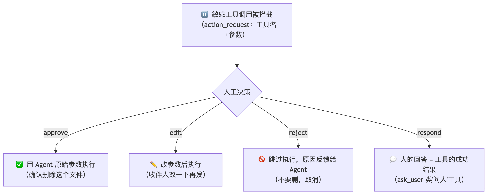
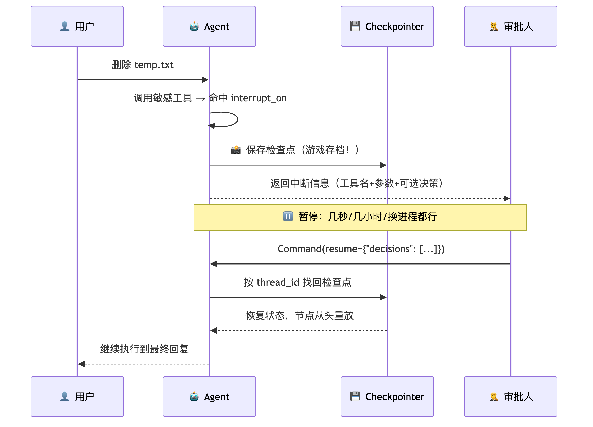
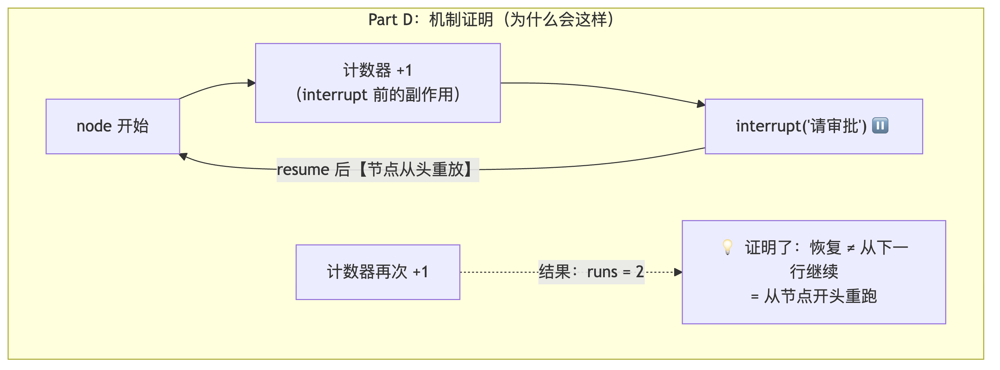
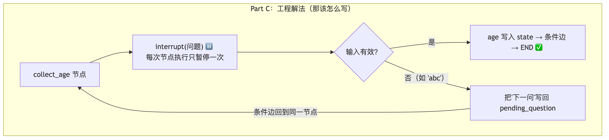
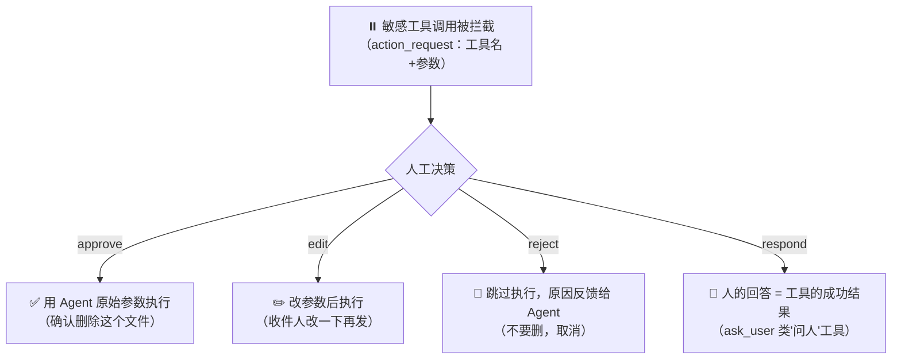
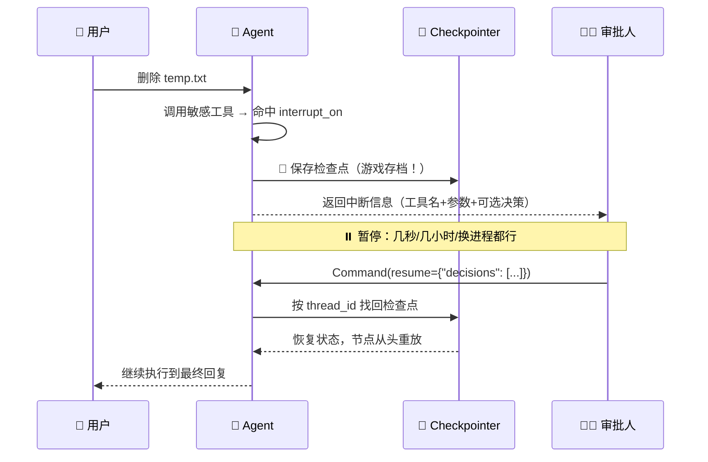
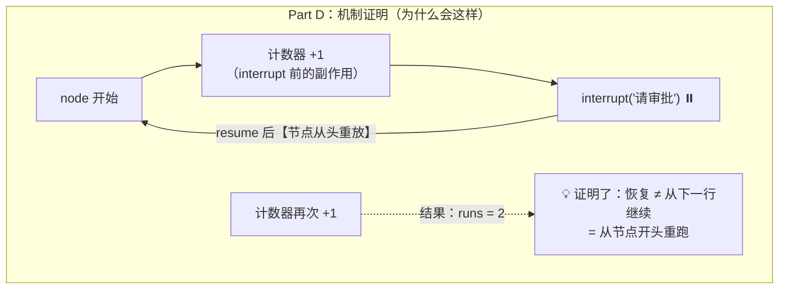
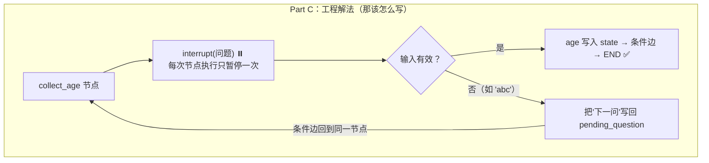

# 🧭 Human-in-the-Loop —— 给 Agent 装上"刹车与方向盘"（ch09）

> 一句话：Agent 越自主，越需要安全边界。HITL 让 Agent 在敏感操作前**暂停**，等人类**审批、修改、拒绝或直接响应**——四个决策类型就是四种"人机协作姿势"。今天四个实验全流程跑通，还把底层 `interrupt()` 的机制拆到了"重放实证"级别。

---

## 🤔 为什么需要 HITL？

Agent 的自主性是双刃剑：好处是独立完成复杂任务；风险是**删错文件、发错邮件、调了昂贵的 API**。完全自主和完全人工之间需要一个可控的中间地带：

- 删除文件前，先让用户确认
- 发送邮件前，让用户检查收件人和内容
- 修改生产配置前，必须获得审批

## 🎛️ interrupt_on：三种写法 + 四种决策

设置 `interrupt_on` 后，Deep Agents 在中间件栈加入 `HumanInTheLoopMiddleware`；如果工具在返回前被中断或取消，`PatchToolCallsMiddleware` 会自动修复消息历史——这两件套是自动的，你不用管。

**三种配置值**：

| 写法 | 含义 |
|---|---|
| `True` | 启用中断，**默认开放全部四种决策** |
| `False` | 不中断，直接执行 |
| `{"allowed_decisions": [...]}` | 启用中断，只允许列表里的决策类型 |

**四种决策类型**（今天的核心记忆点）：



> 💡 **我的理解：respond 是"人即是工具，人即是结果"**——这个决策的设计初衷就是把人当作工具链的一环，人的回答直接成为工具返回值。但要记住三条规则：**不同意执行用 `reject`**（别用 respond，它的内容会被当成成功结果，Agent 以为操作发生了！）；**同意但要改参数用 `edit`**；**工具本来就是问人的才用 `respond`**。
>
> **edit 要保守**：只改收件人、路径、SQL 条件这类参数，别大幅改写——大改会让模型重新评估整个计划。删除类操作是高危动作，能 reject 就别 edit。

## 🔄 中断与恢复：完整流程



> 💡 **游戏存档比喻**（帮我真正理解了 Checkpointer）：检查点就是存档。存档之后你做的操作，如果强制关闭游戏就全丢了——**检查点之后的动作会丢失**，恢复时从存档位置重来。所以 HITL 的本质不是"弹一个确认框"，而是**让工作流在任意时间跨度后仍能安全恢复**：几秒后、几小时后、甚至换一个进程恢复——只要 Checkpointer 还在、thread_id 还一致。

**四个必须**（少一个都恢复不了）：

1. **必须配置 Checkpointer**（没有它就没有存档）
2. **必须同一个 thread_id**（跳线程 = 读别人的存档）
3. **必须 `version="v2"`** 的 invoke 接口（才能拿到 `result.interrupts`）
4. **决策数量和顺序必须匹配**（批量场景 decisions 与 action_requests 一一对应）

**怎么排查"为什么没继续跑"？** 看线程快照：`values`（当前状态）、`next`（下一步节点）、`interrupts`（待解决的中断对象）、checkpoint 标识——`interrupts` 还在就说明缺 resume；thread_id 不对你看到的就是别的线程状态。

## 🎯 条件中断（when）：只拦真正危险的

默认只要工具名在 interrupt_on 里就**每次都拦**。加 `when` 谓词函数（接收 ToolCallRequest，True=中断 / False=放行），可以把审批界面里的噪音清掉——比如只有**写出工作区**的调用才需要人看：

```python
def writes_outside_workspace(request: ToolCallRequest) -> bool:
    path = request.tool_call["args"].get("path", "")
    return not path.startswith("/workspace/")

interrupt_on={"write_file": {
    "allowed_decisions": ["approve", "reject"],
    "when": writes_outside_workspace,   # 区内自动放行，区外才拦
}}
```

## 🏔️ 按风险等级分层配置（生产最佳实践）

| 风险等级 | 工具类型 | 配置 | 理由 |
|---|---|---|---|
| 🟢 低风险 | 读取、搜索、列表 | `False` | 只读无副作用 |
| 🟡 中风险 | 写文件、外部 API | `approve/reject` | 可审可不改参数 |
| 🔴 高风险 | 删除、发送、部署 | `approve/edit/reject` | 不可逆/影响外部，**绝不开放 respond**（防被当成成功结果） |
| 💬 人工输入型 | 询问偏好、补信息 | `respond` | 人就是工具结果 |

---

## 🔬 实验一：四种决策的完整演示

```python
# ============================================================================
# 01_four_decisions.py —— ch09 段1：interrupt_on 与四种决策类型
#
#   实验A approve：批准 → 用 Agent 原始参数执行
#   实验B edit   ：改参数后执行（收件人改掉，实际执行用的是新参数）
#   实验C reject ：跳过执行，原因反馈给 Agent（并观察 Agent 不再重试）
#   实验D respond：人的回答直接成为工具结果（ask_user 占位工具）
#
# 关键 API（0.7.13 实测）：
#   invoke(..., version="v2") → result.interrupts[0].value
#     = {"action_requests": [{name, args, description}...],
#        "review_configs":  [{action_name, allowed_decisions}...]}
#   恢复：agent.invoke(Command(resume={"decisions": [...]}), 同 config, version="v2")
#   决策数量/顺序必须与 action_requests 一一对应。
#   字段兼容：本版 action_requests 用 args；兼容代码读 arguments 再回退 args。
# ============================================================================

import uuid

from langchain.tools import tool
from langgraph.checkpoint.memory import MemorySaver
from langgraph.types import Command

from common import make_model, preview

from deepagents import create_deep_agent


@tool
def send_email(to: str, subject: str, body: str) -> str:
    """发送邮件。"""
    return f"邮件已发送至 {to}（主题：{subject}）"


@tool
def ask_user(question: str) -> str:
    """向用户提问；真实回答由 HITL 的 respond 决策提供。"""
    return "等待用户回答"


def make_agent(interrupt_on):
    return create_deep_agent(
        model=make_model(),
        tools=[send_email, ask_user],
        interrupt_on=interrupt_on,
        checkpointer=MemorySaver(),
        system_prompt="严格按用户指令执行；审批结果就是最终事实，不要重复发起已被拒绝的操作。",
    )


def fresh_cfg():
    return {"configurable": {"thread_id": str(uuid.uuid4())}}


def get_args(action_request):
    """字段兼容：arguments（LangChain 标准）回退 args（本版实际字段）。"""
    return action_request.get("arguments") or action_request.get("args")


def experiment_a_approve():
    print("=" * 60)
    print("实验A: approve —— 批准原始参数")
    print("=" * 60)
    agent = make_agent({"send_email": {"allowed_decisions": ["approve", "edit", "reject"]}})
    cfg = fresh_cfg()
    r = agent.invoke({"messages": [{"role": "user", "content":
        "给 boss@corp.com 发邮件：主题'周报'，正文'本周完成 HITL 实验'。"}]},
        config=cfg, version="v2")
    ar = r.interrupts[0].value["action_requests"][0]
    print(f"  中断动作: {ar['name']} {get_args(ar)}")
    r2 = agent.invoke(Command(resume={"decisions": [{"type": "approve"}]}), config=cfg, version="v2")
    tool_results = [m.content for m in r2.value["messages"] if m.type == "tool"]
    print(f"  实际执行: {tool_results[0][:60]}（原参数）")


def experiment_b_edit():
    print()
    print("=" * 60)
    print("实验B: edit —— 修改参数后执行")
    print("=" * 60)
    agent = make_agent({"send_email": {"allowed_decisions": ["approve", "edit", "reject"]}})
    cfg = fresh_cfg()
    r = agent.invoke({"messages": [{"role": "user", "content":
        "给 all@corp.com 发邮件：主题'通知'，正文'今晚维护'。"}]},
        config=cfg, version="v2")
    ar = r.interrupts[0].value["action_requests"][0]
    orig = get_args(ar)
    print(f"  原始参数: {orig}")
    # 审批人把收件人改成 team@corp.com，其余保持
    r2 = agent.invoke(Command(resume={"decisions": [{
        "type": "edit",
        "edited_action": {"name": ar["name"], "args": {**orig, "to": "team@corp.com"}},
    }]}), config=cfg, version="v2")
    tool_results = [m.content for m in r2.value["messages"] if m.type == "tool"]
    print(f"  实际执行: {tool_results[0][:60]}（已改为新收件人）")
    print("  提示：编辑尽量保守（只改必要参数），大幅改写可能让模型重新评估计划")


def experiment_c_reject():
    print()
    print("=" * 60)
    print("实验C: reject —— 拒绝并把原因反馈给 Agent")
    print("=" * 60)
    agent = make_agent({"send_email": {"allowed_decisions": ["approve", "reject"]}})
    cfg = fresh_cfg()
    r = agent.invoke({"messages": [{"role": "user", "content":
        "给 hr@corp.com 发邮件：主题'投诉'，正文'强烈不满'。"}]},
        config=cfg, version="v2")
    print(f"  已暂停待审批: {bool(r.interrupts)}")
    r2 = agent.invoke(Command(resume={"decisions": [{
        "type": "reject",
        "message": "用户拒绝发送。不要再次尝试发送，建议先与 HR 当面沟通。",
    }]}), config=cfg, version="v2")
    # 判据：整段历史里不应出现任何"成功发送"的工具结果（原始调用被跳过且未重试）
    never_sent = not any("邮件已发送" in str(m.content)
                         for m in r2.value["messages"] if m.type == "tool")
    print(f"  邮件从未实际发出: {never_sent}")
    print(f"  最终回复: {preview(r2.value['messages'][-1].content, 110)}")


def experiment_d_respond():
    print()
    print("=" * 60)
    print("实验D: respond —— 人的回答成为工具结果")
    print("=" * 60)
    agent = make_agent({"ask_user": {"allowed_decisions": ["respond"]}})
    cfg = fresh_cfg()
    r = agent.invoke({"messages": [{"role": "user", "content":
        "帮我生成季度报告。缺少口径信息时用 ask_user 问清楚再写。"}]},
        config=cfg, version="v2")
    print(f"  ask_user 暂停等待人工输入: {bool(r.interrupts)}")
    r2 = agent.invoke(Command(resume={"decisions": [{
        "type": "respond",
        "message": "使用季度维度，并排除测试数据。",
    }]}), config=cfg, version="v2")
    print(f"  Agent 拿到人工回答后的报告预览: {preview(r2.value['messages'][-1].content, 140)}")
    print("  规则回顾：拒绝副作用工具用 reject；ask_user 这类'问人'工具才用 respond")


if __name__ == "__main__":
    experiment_a_approve()
    experiment_b_edit()
    experiment_c_reject()
    experiment_d_respond()
```

**运行结果**（实测）：

```text
实验A: approve    → 中断动作: send_email {'to': 'boss@corp.com', ...}
                    实际执行: 邮件已发送至 boss@corp.com（主题：周报）（原参数）✅
实验B: edit       → 原始参数: {'to': 'all@corp.com', ...}
                    实际执行: 邮件已发送至 team@corp.com（主题：通知）（新参数生效）✅
实验C: reject     → 邮件从未实际发出: True ✅
                    回复: 发送已被拒绝，我不会再次尝试。建议先与 HR 当面沟通……
实验D: respond    → ask_user 暂停等待人工输入: True ✅
                    报告: 统计口径按季度维度汇总，并排除测试数据……
```

> 💡 使用建议：要么把 `allowed_decisions` 写清楚，要么基础场景直接 `True`（四种全开）再选回答方式，看你的管理粒度需求。

---

## 🔬 实验二：when 条件中断 + 批量打包

```python
# ============================================================================
# 02_when_and_batch.py —— ch09 段2：条件中断 + 批量工具调用
#
#   Part A: when 谓词 —— 只拦截真正危险的调用（工作区外写入才暂停），
#           安全调用自动放行（审批界面不出现噪音）
#   Part B: 批量打包 —— 一次任务触发多个敏感工具时，中断合并成一个批次，
#           decisions 按顺序一一对应（approve 一个、reject 一个）
# ============================================================================

import uuid

from langchain.agents.middleware import ToolCallRequest
from langchain.tools import tool
from langgraph.checkpoint.memory import MemorySaver
from langgraph.types import Command

from common import make_model, preview

from deepagents import create_deep_agent


@tool
def save_file(path: str, content: str) -> str:
    """保存文件到指定路径。"""
    return f"wrote {path}"


@tool
def delete_file(path: str) -> str:
    """删除文件。"""
    return f"已删除 {path}"


@tool
def send_email(to: str, subject: str) -> str:
    """发邮件。"""
    return f"已发送至 {to}"


def part_a_when_predicate():
    print("=" * 60)
    print("Part A: when 谓词 —— 只拦截工作区外的写入")
    print("=" * 60)

    def writes_outside_workspace(request: ToolCallRequest) -> bool:
        """只有写入工作区外的路径时才暂停。"""
        path = request.tool_call["args"].get("path", "")
        return not path.startswith("/workspace/")

    agent = create_deep_agent(
        model=make_model(),
        tools=[save_file],
        interrupt_on={
            "save_file": {
                "allowed_decisions": ["approve", "reject"],
                "when": writes_outside_workspace,
            },
        },
        checkpointer=MemorySaver(),
    )
    cfg = {"configurable": {"thread_id": str(uuid.uuid4())}}

    # 安全调用：/workspace/ 内 → when 返回 False → 自动放行，不中断
    r1 = agent.invoke({"messages": [{"role": "user", "content": "用 save_file 把 'a' 保存到 /workspace/a.txt"}]},
                      config=cfg, version="v2")
    print(f"  工作区内写入被中断: {bool(getattr(r1, 'interrupts', None))}（期望 False，直接放行）")
    done = any("wrote /workspace/a.txt" in str(m.content)
               for m in r1.value["messages"] if m.type == "tool")
    print(f"  文件已实际写入: {done}")

    # 危险调用：/etc/ 下 → when 返回 True → 中断
    r2 = agent.invoke({"messages": [{"role": "user", "content": "用 save_file 把 'x' 保存到 /etc/hosts"}]},
                      config=cfg, version="v2")
    print(f"  工作区外写入被中断: {bool(r2.interrupts)}（期望 True）")
    if r2.interrupts:
        r3 = agent.invoke(Command(resume={"decisions": [{
            "type": "reject", "message": "系统文件禁止修改",
        }]}), config=cfg, version="v2")
        never = not any("wrote /etc/hosts" in str(m.content)
                        for m in r3.value["messages"] if m.type == "tool")
        print(f"  /etc/hosts 未被写入: {never}")
        print(f"  Agent 回复: {preview(r3.value['messages'][-1].content, 90)}")


def part_b_batch_interrupts():
    print()
    print("=" * 60)
    print("Part B: 批量打包 —— 多个敏感调用合并成一个中断批次")
    print("=" * 60)
    agent = create_deep_agent(
        model=make_model(),
        tools=[delete_file, send_email],
        interrupt_on={
            "delete_file": {"allowed_decisions": ["approve", "reject"]},
            "send_email": {"allowed_decisions": ["approve", "reject"]},
        },
        checkpointer=MemorySaver(),
        system_prompt="一次任务内的多个操作并行发起；审批结果是最终事实。",
    )
    cfg = {"configurable": {"thread_id": str(uuid.uuid4())}}
    r = agent.invoke({"messages": [{"role": "user", "content": (
        "同时做两件事：删除 /tmp/old.log，然后给 admin@x.com 发主题'清理完成'的邮件。一次任务里完成。"
    )}]}, config=cfg, version="v2")

    if not r.interrupts:
        print("  ⚠ 模型未发起任何敏感调用，本次未触发中断")
        return
    ars = r.interrupts[0].value["action_requests"]
    print(f"  进入审批批次的调用: {len(ars)} → {[a['name'] for a in ars]}")

    # decisions 必须按 action_requests 动态构造、一一对应：
    # delete_file → approve；send_email → reject（附原因）
    decisions = [
        {"type": "approve"} if a["name"] == "delete_file"
        else {"type": "reject", "message": "先不发邮件，等确认后再说"}
        for a in ars
    ]
    r2 = agent.invoke(Command(resume={"decisions": decisions}), config=cfg, version="v2")
    tools_out = [str(m.content) for m in r2.value["messages"] if m.type == "tool"]
    deleted = any("已删除 /tmp/old.log" in c for c in tools_out)
    emailed = any("已发送至 admin@x.com" in c for c in tools_out)
    batched = len(ars) > 1
    print(f"  {'✅ 多调用合并为一个批次' if batched else '（本次模型串行发起，仅 1 个调用进入批次）'}")
    print(f"  删除已执行: {deleted} | 邮件未发送: {not emailed}")
    print(f"  最终回复: {preview(r2.value['messages'][-1].content, 110)}")
    print("  要点：decisions 数量/顺序必须与 action_requests 一一对应（错配直接 ValueError）")


if __name__ == "__main__":
    part_a_when_predicate()
    part_b_batch_interrupts()
```

**运行结果**（实测）：

```text
Part A: when 谓词
  工作区内写入被中断: False（直接放行，文件已实际写入 ✅）
  工作区外写入被中断: True（/etc/hosts 拦截）
  /etc/hosts 未被写入: True ✅
  Agent 回复: /etc/hosts 属于系统文件……因此被拒绝了，我没有进行写入。

Part B: 批量打包
  进入审批批次的调用: 2 → ['delete_file', 'send_email']
  ✅ 多调用合并为一个批次
  删除已执行: True | 邮件未发送: True ✅
  最终回复: 1. 删除 /tmp/old.log ✅ 已完成  2. 发送邮件 ⏸️ 未发送——你拒绝了
```

> 💡 批量的手感：**外层列表套内层字典**，按 action_requests 顺序一一回。我们的写法是用循环按工具名动态生成 decisions（delete→approve、其他→reject）——顺序不用人工数，还能把"文件管理"和"邮件管理"的策略理清楚。虽然 interrupt 是**一次**返回，但 decisions 必须是**列表**。

---

## 🔬 实验三：子 Agent 独立配置 + 权限中断合并

```python
# ============================================================================
# 03_subagent_and_permissions.py —— ch09 段3：子 Agent 独立配置 + 权限中断合并
#
#   Part A: 子 Agent 更严格 —— 主 Agent 读文件不拦（False），
#           子 Agent 读同一文件要审批（独立 interrupt_on 覆盖）
#   Part B: 文件系统权限中断 —— FilesystemPermission(mode="interrupt")
#           与 interrupt_on 合并：一次人工审查同时覆盖自定义工具 + 受保护路径
# ============================================================================

import uuid

from langchain.tools import tool
from langgraph.checkpoint.memory import MemorySaver
from langgraph.types import Command

from common import make_model, preview

from deepagents import FilesystemPermission, create_deep_agent


@tool
def read_secret(path: str) -> str:
    """读取文件内容。"""
    return f"[{path}] 的内容：SECRET-DATA-1234"


def part_a_subagent_stricter():
    print("=" * 60)
    print("Part A: 子 Agent 更严格（主宽松 / 子严格）")
    print("=" * 60)
    agent = create_deep_agent(
        model=make_model(),
        tools=[read_secret],
        interrupt_on={"read_secret": False},          # 主 Agent：读不拦
        subagents=[{
            "name": "auditor",
            "description": "读取敏感文件并汇报",
            "system_prompt": "你是审计员，用 read_secret 读取指定路径并原样汇报内容。",
            "tools": [read_secret],
            "interrupt_on": {                          # 子 Agent：读要审批
                "read_secret": {"allowed_decisions": ["approve", "reject"]},
            },
        }],
        checkpointer=MemorySaver(),
    )

    # 对照1：主 Agent 自己读 → 不中断
    cfg1 = {"configurable": {"thread_id": str(uuid.uuid4())}}
    r1 = agent.invoke({"messages": [{"role": "user", "content":
        "你自己直接读 /secrets/api.txt 并汇报（不要委派）。"}]}, config=cfg1, version="v2")
    print(f"  主 Agent 读取被中断: {bool(getattr(r1, 'interrupts', None))}（期望 False）")

    # 对照2：委派给子 Agent 读 → 中断
    cfg2 = {"configurable": {"thread_id": str(uuid.uuid4())}}
    r2 = agent.invoke({"messages": [{"role": "user", "content":
        "把这个任务委派给 auditor：读取 /secrets/api.txt 并汇报内容。"}]}, config=cfg2, version="v2")
    print(f"  子 Agent 读取被中断: {bool(r2.interrupts)}（期望 True）")
    if r2.interrupts:
        names = [a["name"] for a in r2.interrupts[0].value["action_requests"]]
        print(f"  中断动作: {names}")
        # approve 后子 Agent 完成
        r3 = agent.invoke(Command(resume={"decisions": [{"type": "approve"}]}),
                          config=cfg2, version="v2")
        ok = "SECRET-DATA-1234" in r3.value["messages"][-1].content
        print(f"  批准后拿到密文内容: {ok}")
        print(f"  汇报预览: {preview(r3.value['messages'][-1].content, 90)}")


def part_b_permission_interrupt_merged():
    print()
    print("=" * 60)
    print("Part B: 文件系统权限中断（与 interrupt_on 合并）")
    print("=" * 60)
    agent = create_deep_agent(
        model=make_model(),
        tools=[read_secret],
        # 两条防线合并：自定义工具走 interrupt_on；/secrets/** 的写入走权限 interrupt
        interrupt_on={"read_secret": False},
        permissions=[
            FilesystemPermission(operations=["write"], paths=["/secrets/**"], mode="interrupt"),
        ],
        checkpointer=MemorySaver(),
        system_prompt="你是运维助手，按指令操作文件并汇报结果。",
    )
    cfg = {"configurable": {"thread_id": str(uuid.uuid4())}}

    # 1) 读 /secrets/ 下的文件：interrupt_on=False → 不拦
    r1 = agent.invoke({"messages": [{"role": "user", "content":
        "read_file /secrets/api.txt 然后汇报内容。"}]}, config=cfg, version="v2")
    print(f"  读取 /secrets/ 被中断: {bool(getattr(r1, 'interrupts', None))}（interrupt_on=False，期望 False）")

    # 2) 写 /secrets/ 下的文件：命中权限规则 mode=interrupt → 拦
    r2 = agent.invoke({"messages": [{"role": "user", "content":
        "用 write_file 把 'rotated' 写入 /secrets/api.txt。"}]}, config=cfg, version="v2")
    print(f"  写入 /secrets/ 被中断: {bool(r2.interrupts)}（权限规则，期望 True）")
    if r2.interrupts:
        ars = r2.interrupts[0].value["action_requests"]
        print(f"  中断动作（与 interrupt_on 同格式）: {[a['name'] for a in ars]}")
        r3 = agent.invoke(Command(resume={"decisions": [{"type": "approve"}]}),
                          config=cfg, version="v2")
        written = any("Updated file /secrets/api.txt" in str(m.content)
                      for m in r3.value["messages"] if m.type == "tool")
        print(f"  批准后写入完成: {written}")


if __name__ == "__main__":
    part_a_subagent_stricter()
    part_b_permission_interrupt_merged()
```

**运行结果**（实测）：

```text
Part A: 子 Agent 更严格
  主 Agent 读取被中断: False（自己读，放行）
  子 Agent 读取被中断: True（委派即拦）→ 中断动作: ['read_secret']
  批准后拿到密文内容: True ✅

Part B: 权限中断合并
  读取 /secrets/ 被中断: False
  写入 /secrets/ 被中断: True（权限规则）→ 中断动作: ['write_file']
  批准后写入完成: True ✅
```

> 💡 **我的理解**：子 Agent 的 interrupt_on 会**顶替**主 Agent 的配置——主 Agent 写了 False 也没用，子 Agent 自己要求审批就一定要审。课程说这适合"主 Agent 可信但子 Agent 操作更敏感数据"的场景；我更愿意把它看作**一次严格管理**：不管上面多信任，到了这一层就按这层的规矩来。Part B 则证明：`FilesystemPermission(mode="interrupt")` 触发的中断与 `interrupt_on` **同格式、可共存**——读操作默认放行、写受保护路径自动进审批，等于把权限管理也封装进了 HITL 体系。

---

## 🔬 实验四：底层 interrupt() —— 灵活性的天花板

`interrupt_on` 是封装好的工具审批；`interrupt()` 是 LangGraph 的底层原语——**想写灵活逻辑就用它**。四个子实验由浅入深：

```python
# ============================================================================
# 04_low_level_interrupt.py —— ch09 段4：揭开引擎盖 —— LangGraph 的 interrupt()
#
#   Part A: 工具内 interrupt() —— request_approval 自定义审批（任意业务语义）
#   Part B: DraftApprovalMiddleware —— after_model 审稿（跨工具策略，interrupt_on 做不到）
#   Part C: 输入验证模式 —— 每节点只 interrupt 一次 + 条件边回路（避免 while True 重放坑）
#   Part D: 重放机制实证 —— 恢复时节点从头重放：interrupt() 之前的副作用会再跑一次
#           （计数器打印两次 —— 这就是"副作用必须幂等/放在 interrupt 之后"的原因）
# ============================================================================

import uuid
from typing import Any, TypedDict

from langchain.agents.middleware import AgentMiddleware, AgentState
from langchain.messages import AIMessage
from langchain.tools import tool
from langgraph.checkpoint.memory import MemorySaver
from langgraph.graph import END, START, StateGraph
from langgraph.types import Command, interrupt

from common import make_model, preview

from deepagents import create_deep_agent


def fresh_cfg():
    return {"configurable": {"thread_id": str(uuid.uuid4())}}


def part_a_tool_interrupt():
    print("=" * 60)
    print("Part A: 工具内 interrupt() —— 自定义审批语义")
    print("=" * 60)

    @tool
    def request_approval(action_description: str) -> str:
        """请求人工审批。"""
        # interrupt() 暂停执行；返回值 = Command(resume=...) 传入的数据
        approval = interrupt({
            "type": "approval_request",
            "action": action_description,
            "message": f"请审批：{action_description}",
        })
        if approval.get("approved"):
            return f"操作 '{action_description}' 已获批准。"
        return f"操作 '{action_description}' 被拒绝，原因：{approval.get('reason', '未提供')}"

    agent = create_deep_agent(model=make_model(), tools=[request_approval],
                              checkpointer=MemorySaver())
    cfg = fresh_cfg()
    r = agent.invoke({"messages": [{"role": "user", "content":
        "我想重启生产数据库，先走审批。"}]}, config=cfg, version="v2")
    print(f"  审批请求触发: {bool(r.interrupts)} | {str(r.interrupts[0].value)[:70]}")
    r2 = agent.invoke(Command(resume={"approved": False, "reason": "高峰期，延后到 22:00"}),
                      config=cfg, version="v2")
    print(f"  拒绝后回复: {preview(r2.value['messages'][-1].content, 90)}")


def part_b_draft_middleware():
    print()
    print("=" * 60)
    print("Part B: DraftApprovalMiddleware —— 发布前统一审稿")
    print("=" * 60)

    class DraftApprovalMiddleware(AgentMiddleware):
        def after_model(self, state: AgentState, runtime) -> dict[str, Any] | None:
            last = state["messages"][-1]
            # 有工具调用时让 Agent 继续；只审查最终草稿（无工具调用的 AIMessage）
            if not isinstance(last, AIMessage) or last.tool_calls:
                return None
            decision = interrupt({
                "type": "draft_review",
                "draft": str(last.content)[:80],
                "message": "是否批准向用户发布这份草稿？",
            })
            if decision.get("approved"):
                return None
            return {"messages": [AIMessage(
                content=f"草稿未发布：{decision.get('reason', '审批未通过')}")]}

    agent = create_deep_agent(model=make_model(),
                              middleware=[DraftApprovalMiddleware()],
                              checkpointer=MemorySaver())
    cfg = fresh_cfg()
    r = agent.invoke({"messages": [{"role": "user", "content": "用一句话写一条上线公告。"}]},
                     config=cfg, version="v2")
    print(f"  审稿中断触发: {bool(r.interrupts)}")
    if r.interrupts:
        print(f"  草稿内容: {preview(str(r.interrupts[0].value), 90)}")
        # 拒绝 → 草稿被替换
        r2 = agent.invoke(Command(resume={"approved": False, "reason": "语气太随意"}),
                          config=cfg, version="v2")
        print(f"  拒绝后用户看到: {r2.value['messages'][-1].content[:50]}")
    print("  要点：Node-style Hook（after_model 等）才是推荐的审批位置；")
    print("        Wrap-style 在节点内部，恢复时会连 handler 一起重放，不适合做中断边界")


def part_c_input_validation():
    print()
    print("=" * 60)
    print("Part C: 输入验证 —— 单次 interrupt + 条件边回路")
    print("=" * 60)

    class FormState(TypedDict):
        age: int | None
        pending_question: str | None

    def collect_age(state: FormState):
        question = state.get("pending_question") or "请输入你的年龄："
        answer = interrupt(question)          # 每次节点执行只暂停一次
        if isinstance(answer, int) and answer > 0:
            return {"age": answer, "pending_question": None}
        return {"pending_question": f"'{answer}' 不是有效年龄，请输入正整数。"}

    def route(state: FormState):
        return END if state.get("age") is not None else "collect_age"

    builder = StateGraph(FormState)
    builder.add_node("collect_age", collect_age)
    builder.add_edge(START, "collect_age")
    builder.add_conditional_edges("collect_age", route)
    graph = builder.compile(checkpointer=MemorySaver())

    cfg = fresh_cfg()
    # 裸 CompiledStateGraph 的 invoke 直接返回 state 字典（中断时返回暂停前的部分状态）
    r1 = graph.invoke({"age": None, "pending_question": None}, config=cfg)
    print(f"  第1问: {r1.get('pending_question') or '请输入你的年龄：'}")
    # 故意给无效输入 → 条件边回到节点重新问
    r2 = graph.invoke(Command(resume="abc"), config=cfg)
    print(f"  输入 'abc' 后: {r2['pending_question'][:40]}")
    r3 = graph.invoke(Command(resume=28), config=cfg)
    print(f"  输入 28 后: age={r3['age']}，流程结束（next={graph.get_state(cfg).next or 'END'}）")
    print("  要点：不要在节点里 while True 反复 interrupt（重放会连前几轮一起重跑）；")
    print("        把下一问写回 state，用条件边决定是否回到同一节点")


def part_d_replay_proof():
    print()
    print("=" * 60)
    print("Part D: 重放机制实证（interrupt 前的代码会再跑一次）")
    print("=" * 60)
    runs = []          # 记录节点执行次数（模拟非幂等副作用）

    class S(TypedDict):
        approved: bool | None

    def node(state: S):
        runs.append(1)                        # interrupt 之前的"副作用"
        decision = interrupt("请审批")        # 暂停点
        return {"approved": decision.get("approved")}

    g = StateGraph(S)
    g.add_node("node", node)
    g.add_edge(START, "node")
    g.add_edge("node", END)
    graph = g.compile(checkpointer=MemorySaver())

    cfg = fresh_cfg()
    graph.invoke({"approved": None}, config=cfg)                     # 第1次：跑到 interrupt 暂停
    graph.invoke(Command(resume={"approved": True}), config=cfg)     # 恢复：节点从头重放
    print(f"  节点执行次数: {len(runs)}（恢复不是从 interrupt 下一行继续，而是节点重放）")
    print(f"  approved: {graph.get_state(cfg).values['approved']}")
    print("  结论：副作用要么放 interrupt 之后，要么做成幂等（upsert）")


if __name__ == "__main__":
    part_a_tool_interrupt()
    part_b_draft_middleware()
    part_c_input_validation()
    part_d_replay_proof()
```

**运行结果**（实测）：

```text
Part A: 工具内 interrupt()
  审批请求触发: True | {'type': 'approval_request', 'action': '重启生产环境数据库……
  拒绝后回复: 审批未通过 ❌ 拒绝原因：高峰期，延后到 22:00……建议 22:00 后重新发起审批

Part B: DraftApprovalMiddleware
  审稿中断触发: True
  草稿内容: {'type': 'draft_review', 'draft': '"……新品【产品名称】今日正式上线……"'}
  拒绝后用户看到: 草稿未发布：语气太随意 ✅

Part C: 输入验证
  第1问: 请输入你的年龄：
  输入 'abc' 后: 'abc' 不是有效年龄，请输入正整数。   ← 无效 → 回路重问
  输入 28 后: age=28，流程结束（next=END）            ← 有效 → 不再回溯

Part D: 重放实证
  节点执行次数: 2    ← 恢复时从节点开头重放，interrupt 前代码再跑一次
  approved: True
```

> 💡 Part B 的精髓：在 `after_model` 里判断"这条 AI 消息**没有** tool_calls = 最终草稿"，才触发审稿——这就是课程说的"根据 hook 判断，如果是最后一条信息就做整体审批"。选不同的 hook 点（before_model / after_model / before_agent…）做不同的 middleware，比 `interrupt_on` 灵活得多。

---

## ❓ 专答：Part C 和 Part D 到底有什么区别？（我一开始也没看懂）

这两个实验其实是**同一个知识点的两面**——"恢复时节点会从头重放"。一个给你**正确写法**，一个给你**为什么必须这么写**。





**三句话说清**：

1. **Part D 回答"为什么"**：它故意把一个非幂等副作用（计数器）放在 interrupt 之前，恢复后计数 = 2——用实验**证明**了"恢复是从节点开头重放，interrupt 前的代码会再跑一次"。它是机制层面的证据，本身不是推荐写法（恰恰是反面教材的量化）。
2. **Part C 回答"怎么办"**：正因为会重放，**不能**在节点里 `while True` 循环着 interrupt（每次恢复，前面几轮的 interrupt 全部重跑，输入越多重复越夸张）。正确姿势是：**每个节点只 interrupt 一次**；输入无效时不循环，而是把"下一个问题"写回 state，由**条件边**决定是否回到同一节点再问一次。
3. **你观察到的"允许之后就不会再回溯/重新验证"是对的**：恢复时 `interrupt()` 会用已有的 resume 值**直接返回、不再暂停**（课程规则 5）。所以 Part C 里输入 28 之后流程干净地走到 END，不会再进 collect_age。

一句话总结：**D 是动机（重放机制），C 是解法（单次中断 + 条件边回路）**——把 D 的结论记住，把 C 的模式抄走。

> 💡 另外记住 interrupt() 的两条安全规则：它是**靠抛异常暂停**的（裸 try/except 会吞掉它，要捕获就捕具体异常类型）；它要求 interrupt 之前的副作用**幂等**（或干脆放到 interrupt 之后）。

---

## ⚠️ 版本坑（0.7.13 实测）

1. **`version="v2"` + `result.interrupts` 可用**；本版 action_requests 的参数字段是 **`args`**（不是 LangChain 标准的 `arguments`）——兼容写法 `ar.get("arguments") or ar.get("args")`；但 edit 的 `edited_action` 仍用 `args`。
2. **decisions 数量错配直接 ValueError**（Number of human decisions does not match）——批量场景必须按 action_requests 动态构造。
3. **自定义工具别与内置工具重名**：我们的工具起名 `write_file` 与内置文件工具冲突，模型有时走内置路径**绕开了 interrupt_on**——改名 `save_file` 后稳定（实测踩坑）。
4. **模型可能自行拒绝敏感请求**（不调工具→自然无中断）：实验时用 system_prompt 强制"必须走工具"或换中性路径。
5. **裸 CompiledStateGraph 的 invoke 返回 state 字典**（无 `.values`）；deep agent 的 v2 返回 `GraphOutput.value`——两种返回形态别搞混。

---

## ✅ 小结

1. 🎛️ **interrupt_on 三种写法**（True 全开 / False 关 / allowed_decisions 白名单），四决策各司其职——**respond 是"人即是工具"**，但拒绝副作用操作必须用 reject。
2. 💾 **Checkpointer = 游戏存档**：四个必须（checkpointer / 同 thread_id / v2 / 决策一一对应）；恢复可跨秒、跨小时、跨进程。
3. 🎯 **when 谓词**让审批界面零噪音（区内放行、区外才拦）；**批量中断**一个批次列表套字典逐个回。
4. 👥 **子 Agent 的 interrupt_on 会顶替主配置**——一层一层各管各的严格；**权限中断**（mode=interrupt）与 interrupt_on 同格式合并。
5. 🏔️ **风险分层**：低风险 False、中风险 approve/reject、高风险全控制不开放 respond、问人型 respond。
6. 🔧 **底层 interrupt() 更灵活**：工具内自定义审批、after_model 审稿、输入验证回路——Node-style Hook 是推荐位置。
7. ⚙️ **重放机制**：恢复 = 节点从头重跑（Part D 证明），所以副作用要幂等/后置；多轮输入用单次 interrupt + 条件边回路（Part C 解法）。

**复现**（ch09 目录，7/7 测试全过）：

```bash
cd ch09 && uv sync
uv run 01_four_decisions.py           # 四决策
uv run 02_when_and_batch.py           # when + 批量
uv run 03_subagent_and_permissions.py # 子 Agent + 权限合并
uv run 04_low_level_interrupt.py      # 底层 interrupt() 四部曲
RUN_LLM_TESTS=1 uv run pytest -q      # 7 例（2 确定性 + 5 LLM 集成）
```

> 下一篇：沙箱执行——让 Agent 在受控环境里安全地跑代码。

---

<details>
<summary>📦 附：文中 4 张图的 Mermaid 源码</summary>


**01-四种决策分支**




**02-中断恢复时序-存档比喻**




**03-PartD重放机制**




**04-PartC条件边回路**



</details>
